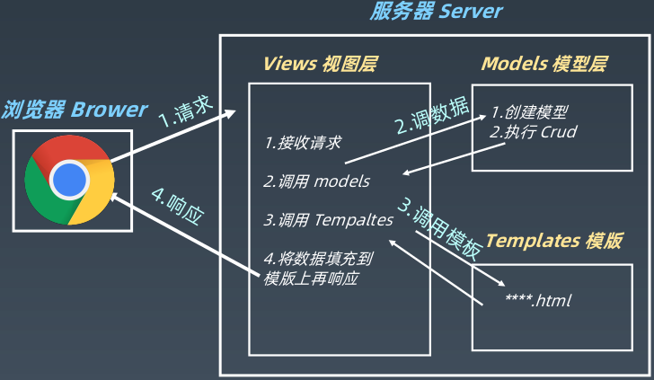
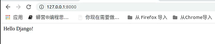
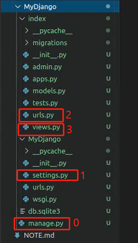

<h1>学习笔记

<h1>Django web 开发入门

## <center>第一节：开发环境配置</center>

### Django框架简介
- Django是一个开放源代码的web应用框架
- 最初用于管理劳伦斯出版集团旗下的一些以新闻内容为主的网站
- 2005年7月在BSD许可证下发布

### [Django官方文档](https://docs.djangoproject.com/zh-hans/3.0/)

### MTV框架模式
- 模型（Model）
- 模板（Template）
- 视图（Views）



### Django的特点
- 采用了MTV的框架
- 强调快速开发和代码复用DRY（Do Not Repeat Yourself）
- 组件丰富
    - ORM（对象关系映射）映射类来构建数据模型
    - URL支持正则表达式
    - 模板可继承
    - 内置用户认证，提供用户认证和权限功能
    - admin管理系统
    - 内置表单模型，cache缓存系统、国际化系统等

### Django的版本
- 目前使用比较多的是2.2.13（LTS）
- 安装

```shell
$ pip install --upgrade django==2.2.13
>>> import django
>>> django.__version__
'2.2.13'
```

> 工作中原本的版本不建议升级，除非有其他需要的需求

## <center>第二节：创建项目和目录结构</center>

### 启动
- 创建Django项目
- 创建应用程序
- 启动

### 创建Django目录

`$ django-admin startproject MyDjango`

- 目录结构如下

```shell
$ find MyDjango/
MyDjango/
MyDjango/manage.py   # 命令行工具
MyDjango/MyDjango
MyDjango/MyDjango/__init__.py
MyDjango/MyDjango/settings.py    # 项目的配置文件
MyDjango/MyDjango/urls.py
MyDjango/MyDjango/wsgi.py
```


### 创建Django应用程序

```shell
# 查看该工具的具体功能
$ python manage.py help

$ python manage.py startapp index

# index目录相关文件说明
index/migrations    # 数据库迁移文件夹
index/models.py    # 模型
index/apps.py    # 当前app配置文件
index/admin.py    # 管理后台
index/tests.py    # 自动化测试
index/views.py    # 视图
```

### 启动和停止Django应用程序

```shell
$ python manage.py runserver    # 默认是127.0.0.1:8000

$ python manage.py runserver 0.0.0.0:80
```

> 退出： `Ctrl + C`<br>
> 开发模式建议测试完成后，Ctrl + c结束掉，因为开发模式可能存在更多的漏洞，容易导致代码泄露

## <center>第三节：解析setting.py主要配置文件</center>

> Django的入口manage.py，其配置没有写到自己的.python里，而写到setting.py里

### Django的配置文件
- 目录路径
- 密钥
- 域名访问权限
- APP列表
- 静态资源，包括CSS、JavaScript图片等
- 模板文件
- 数据库配置
- 缓存
- 中间件

> 通常只需要更改setting.py文件里自己编写的app以及数据库

```python

"""
Django settings for MyDjango project.

Generated by 'django-admin startproject' using Django 2.2.13.

For more information on this file, see
https://docs.djangoproject.com/en/2.2/topics/settings/

For the full list of settings and their values, see
https://docs.djangoproject.com/en/2.2/ref/settings/
"""

import os

### 项目路径
# Build paths inside the project like this: os.path.join(BASE_DIR, ...)
BASE_DIR = os.path.dirname(os.path.dirname(os.path.abspath(__file__)))

### 秘钥
# Quick-start development settings - unsuitable for production
# See https://docs.djangoproject.com/en/2.2/howto/deployment/checklist/

## 生产环境部署的时候的秘钥设置，建议修改比较长的秘钥长度和较复杂的密码复杂度
# SECURITY WARNING: keep the secret key used in production secret!
SECRET_KEY = '%8dcw+tiimah!wk=i^@32z)ga7!)o^4cvwf&=(3wmm4fo&0px$'

### 调试模式
# SECURITY WARNING: don't run with debug turned on in production!
DEBUG = True

### 域名访问权限（一般不在这里对域名访问进行配置）
ALLOWED_HOSTS = []

### App列表，不要随意改变更改顺序，从上到下加载应用程序，不用的可以注释，不要修改，自己的app后面追加。如果自己做的功能改变
### 了model模型的元数据的话，自己写的应用程序可以加载到model上方
# Application definition

INSTALLED_APPS = [
    ### 内置的后台管理系统
    'django.contrib.admin',
    ### 内置的用户认证系统
    'django.contrib.auth',
    ### 所有的model元数据
    'django.contrib.contenttypes',
    ### 会话，表示当前访问网站的用户身份
    'django.contrib.sessions',
    ### 消息提示
    'django.contrib.messages',
    ### 静态资源路径
    'django.contrib.staticfiles',
    ### 自己注册的APP
    'index',
]
### 中间件是request和response对象之间的钩子，从上到下进行加载，从下到上返回，中间件也是有顺序问题，保存默认，不建议更改（如果对中间件不熟悉）
MIDDLEWARE = [
    'django.middleware.security.SecurityMiddleware',
    'django.contrib.sessions.middleware.SessionMiddleware',
    'django.middleware.common.CommonMiddleware',
    'django.middleware.csrf.CsrfViewMiddleware',
    'django.contrib.auth.middleware.AuthenticationMiddleware',
    'django.contrib.messages.middleware.MessageMiddleware',
    'django.middleware.clickjacking.XFrameOptionsMiddleware',
]
### HTTP请求Django接收的时候，对URL进行匹配的文件urls.py
ROOT_URLCONF = 'MyDjango.urls'
### 模板设置，默认不需要改动
TEMPLATES = [
    {
        ### 定义末班模板引擎，比如：编写前端的一个模板，这个模板由哪个应用程序来处理，处理模板的引擎，一种是Django自带的模板
        ### 引擎，还可以用第三方模板引擎，如flask web框架的Jinja2
        'BACKEND': 'django.template.backends.django.DjangoTemplates',
        ### 设置模板路径，一般不在这里设置，一般在应用程序里面放模板（index目录新建一个目录）
        'DIRS': [],
        ### 是否在App里查找模板文件
        'APP_DIRS': True,
        ### 用于RequestContext上下文的调用函数
        'OPTIONS': {
            'context_processors': [
                'django.template.context_processors.debug',
                'django.template.context_processors.request',
                'django.contrib.auth.context_processors.auth',
                'django.contrib.messages.context_processors.messages',
            ],
        },
    },
]
### 调用wsgi使用的方式
WSGI_APPLICATION = 'MyDjango.wsgi.application'

### 指定数据库，需要设置，默认是sqlite3
# Database
# https://docs.djangoproject.com/en/2.2/ref/settings/#databases

# DATABASES = {
#     ### 第一个数据库，名称可以随便起
#     'default': {
#         ### 加载数据库的引擎
#         'ENGINE': 'django.db.backends.sqlite3',
#         ### 数据库库的名称
#         'NAME': os.path.join(BASE_DIR, 'db.sqlite3'),
#     }
# }

# export PATH=$PATH:/usr/local/mysql/bin
# OSError: mysql_config not found
# pip install mysqlclient
# pip install pymysql    # 常用
DATABASES = {
    'default': {
        'ENGINE': 'django.db.backends.mysql',
        'NAME': 'test',
        'USER': 'root',
        'PASSWORD': 'rootroot',
        'HOST': '192.168.0.168',
        'PORT': '3306',
    }
}
### 生产环境有可能连接第二个数据库
# DATABASES = {
#     'db2': {
#         'ENGINE': 'django.db.backends.mysql',
#         'NAME': 'mydatabase',
#         'USER': 'mydatabaseuser',
#         'PASSWORD': 'mypassword',
#         'HOST': '127.0.0.1',
#         'PORT': '3306',
#     }
# }


### 密码验证功能，不需要去改
# Password validation
# https://docs.djangoproject.com/en/2.2/ref/settings/#auth-password-validators

AUTH_PASSWORD_VALIDATORS = [
    {
        'NAME': 'django.contrib.auth.password_validation.UserAttributeSimilarityValidator',
    },
    {
        'NAME': 'django.contrib.auth.password_validation.MinimumLengthValidator',
    },
    {
        'NAME': 'django.contrib.auth.password_validation.CommonPasswordValidator',
    },
    {
        'NAME': 'django.contrib.auth.password_validation.NumericPasswordValidator',
    },
]

### 语言编码和一些国际化的配置，修改与实际环境一致
# Internationalization
# https://docs.djangoproject.com/en/2.2/topics/i18n/

LANGUAGE_CODE = 'en-us'

TIME_ZONE = 'UTC'

USE_I18N = True

USE_L10N = True

USE_TZ = True

### 静态文件，如CSS、JavaScript、Images等
# Static files (CSS, JavaScript, Images)
# https://docs.djangoproject.com/en/2.2/howto/static-files/

STATIC_URL = '/static/'
```

## <center>第四节：urls调度器</center>

### Django如何处理一个请求
- 当一个用户请求Django站点的一个页面
    - 1、如果传入HttpRequest对象拥有 urlconf属性（通过中间件设置），它的值将被用来代替ROOT_URLCONF 设置
    - 2、Django加载URLconf模块并寻找可用的urlpatterns，Django依次匹配每个URL模式，在与请求的URL匹配的第一个模式停下来
    - 3、一旦有URL匹配成功，Django导入并调用相关的视图，视图会获得如下参数：
        - 一个HttpRequest实例
        - 一个或多个位置参数提供
    - 4、如果没有URL被匹配，或者匹配过程中出现了异常，Django会调用一个适当的错误处理视图

### 增加项目urls
```python
from django.contrib import admin
from django.urls import path,include

### 名称不可以更改
urlpatterns = [
    path('admin/', admin.site.urls),
    ### 推荐使用此方式，多个应用程序，创建多个app，如创建wiki网站，有登录功能、编辑页面的功能、评论功能等，这些应用功能建议用独立应用程序去实现
    path('',include('index.urls')),
]
```

### 增加index的urls

> **index/urls.py**

```python
from django.urls import path
from . import views

urlpatterns = [
    path('',views.index)    
```

> **index/views.py**

```python
from django.shortcuts import render
from django.http import HttpResponse
# Create your views here.

def index(request):
    return HttpResponse("Hello Django!")
```

### 运行Django

```shell
python mamage.py runserver
```

### 运行时出现报错

- 报错01
```shell
django.core.exceptions.ImproperlyConfigured: Error loading MySQLdb module.
Did you install mysqlclient?
```

> 解决方案
```shell
# 目录文件结构
MyDjango/
├── __init__.py
├── __pycache__
│   ├── __init__.cpython-37.pyc
│   ├── settings.cpython-37.pyc
│   ├── urls.cpython-37.pyc
│   └── wsgi.cpython-37.pyc
├── settings.py
├── urls.py
└── wsgi.py

# 在__init__.py文件添加如下配置
import pymysql
pymysql.install_as_MySQLdb()
```

- 报错02
```shell
  File "/venv1/lib/python3.7/site-packages/django/db/backends/mysql/operations.py", line 146, in last_executed_query
    query = query.decode(errors='replace')
AttributeError: 'str' object has no attribute 'decode'
```

> 解决方案

```shell
# 根据报错信息找到/venv1/lib/python3.7/site-packages/django/db/backends/mysql/operations.py文件第146行，将decode改成encode


        query = getattr(cursor, '_executed', None)
        if query is not None:
            query = query.encode(errors='replace')
        return query

```

### 测试运行结果


### 运行流程

> 运行MyDjango下的manage.py文件 --> 查找settings.py(ROOT_URLCONF) --> urls.py(匹配) --> index中的urls.py --> index中的views.py 



## <center>第五节：模块和包</center>

### 模块
- `.py`结尾的python程序

### 包
- 存放多个模块的目录

### __init__.py
- 包运行的初始化文件，可以是空文件

### 常见以下几种方式导入
```python
import

from ... import ...

from ... import ... as ...
```

> 导入包优先运行`__init__.py`文件

```shell
MyPackage/
├── __init__.py
├── Module1.py
└── __pycache__
    └── __init__.cpython-37.pyc
```

- 导入自定义模块

```python
>>> import MyPackage
Hello MyPackage
>>> from MyPackage import Module1 as M1
>>> M1.func1()
import func1
```

> python导入模块默认从site-packages目录去找

## <center>第六节：让URL支持变量</center>
## <center>第七节：URL正则和自定义过滤器</center>

### 带变量的URL 
- Django支持对URL设置变量，URL变量类型包括
    - str
    - int
    - slug
    - uuid
    - path
    
> path('\<int:year\>', views.myyear)


###  index/converters.py
```python
class IntConverter:
    regex = '[0-9]+'

    def to_python(self, value):
        return int(value)

    def to_url(self, value):
        return str(value)

class FourDigitYearConverter:
    regex = '[0-9]{4}'

    def to_python(self, value):
        return int(value)

    def to_url(self, value):
        return '%04d' % value
```

### templates/yearview.html
```html
<html>
<head>
    <meta charset="UTF-8">
    <title>Title</title>
</head>
<body>
<div><a href="/2020.html">2020 booklist</a></div>
<div><a href="">2020 booklist</a></div>
</body>
```

### index/urls.py

```python
from django.urls import path, re_path, register_converter
from . import views, converters

register_converter(converters.IntConverter,'myint') # 注册并绑定别名
register_converter(converters.FourDigitYearConverter, 'yyyy')

urlpatterns = [
    path('', views.index),

    ### 带变量的URL
    # path('<int:year>', views.year),  # 只接收整数，其他类型返回404
    path('<int:year>/<str:name>', views.name),

    ### 正则匹配
    re_path('(?P<year>[0-9]{4}).html', views.myyear, name='urlyear'),

    ### 自定义过滤器
    path('<yyyy:year>', views.year), 

]
```

### index/views.py

```python
from django.shortcuts import render
from django.shortcuts import redirect

# Create your views here.
from django.http import HttpResponse

def index(request):
    return HttpResponse("Hello Django!")

# path('<int:year>', views.year), 
def year(request, year):
    # return HttpResponse(year)
    return redirect('/2020.html')

# path('<int:year>/<str:name>', views.name),
def name(request, **kwargs):
    return HttpResponse(kwargs['name'])

# path('<myint:year>', views.year), 
# re_path('(?P<year>[0-9]{4}).html', views.myyear, name='urlyear'),
def myyear(request, year):
    return render(request, 'yearview.html')
```

## <center>第八节：view视图快捷方式</center>

### view视图
| 响应类型 | 说明 |
| :--- | :--- |
| HttpResponse('Hello world') | HTTP状态码200，请求已成功被服务器接收 |
| HttpResponseRedirect('/admin/') | HTTP状态码302，重定向Admin站点的URL |
| HttpResponsePermanentRedirect('/admin/') | HTTP状态码301，永久重定向Admin站点URL |
| HttpResponseRequest('BadRequest') | HTTP 状态码400，访问的页面不存在或者请求错误
| HttpResponseNotFound('NotFound') | HTTP 状态码404，页面不存在或者网页的URL失效
| HttpResponseForbidden('NotFound') | HTTP状态码403，没有访问权限
| HttpResponseNotAllowed('NotAllowedGet') | HTTP状态码405， 不允许使用该请求方式
| HttpResponseServerError('ServerError') | HTTP 状态码500， 服务器内容错误

### Django快捷函数
#### runder()
- 将给定的模板与给定的上下文字典组合在一起，并以渲染的文本返回一个HttpRestponse对象

#### redirect()
- 将一个HttpResponseRedirect 返回到传递的参数的适当URL

#### get_object_or_404()
- 在给定的模板管理器（model manager）上调用get()，但它会引发Http404而不是模型的DoesNotExist异常

## <center>第九节：使用ORM创建数据表</center>

### 模型与数据库
- 每个模型都是一个python的类，这些类继承django.db.models.Model
- 模型类的每个属性都相当于一个数据库的字段
- 利用这些，Django提供了一个自动生成访问数据库的API

```python
from django.db import models

class Person(models.Model):
    id = models.IntegerField(primary_key=True)
    first_name = models.CharField(max_length=30)
    last_name = models.CharField(max_length=30)
```

- 对应SQL
```mysql
CREATE TABLE myapp_person(
    "id" serial NOT NULL PRIMARY KEY,
    "first_name" varchar(30) NOT NULL
    "last_name" varchar(30) NOT NULL
);
```

```shell
$ python manage.py makemigrations  # 会产生中间文件
$ python manage.py migrate
```

> **index/models.py**

```python
from django.db import models

# Create your models here.
# 图书or电影
class Type(models.Model):
    # id = models.AutoField(primary_key=True)  # Django会自动创建,并设置为主键
    typename = models.CharField(max_length=20)

# 作品名称和作者(主演)
class Name(models.Model):
    # id 自动创建
    name = models.CharField(max_length=50)
    author = models.CharField(max_length=50)
    stars = models.CharField(max_length=10)
```

## <center>第十节：ORM API</center>

### [查看官方文档](https://docs.djangoproject.com/zh-hans/3.0/)

### 要求至少熟练的字段类型
- 整数
- 浮点数
- 字符
- 日期

```mysql
数据表的读写
$ python manage.py  shell
>>> from index.models import *
>>> n = Name()
>>> n.name='红楼梦'
>>> n.author='曹雪芹'
>>> n.stars=9.6
>>> n.save()

使用ORM框架api实现
增
>>> from index.models import *
>>> Name.objects.create(name='红楼梦', author='曹雪芹', stars='9.6')
>>> Name.objects.create(name='活着', author='余华', stars='9.4')


查
>>> Name.objects.get(id=2).name

改
>>> Name.objects.filter(name='红楼梦').update(name='石头记')

删 
单条数据
>>> Name.objects.filter(name='红楼梦').delete()
全部数据
>>> Name.objects.all().delete()

其他常用查询
>>> Name.objects.create(name='红楼梦', author='曹雪芹', stars='9.6')
>>> Name.objects.create(name='活着', author='余华', stars='9.4')
>>> Name.objects.all()[0].name
>>> n = Name.objects.all()
>>> n[0].name
>>> n[1].name

>>> Name.objects.values_list('name')
<QuerySet [('红楼梦',), ('活着',)]>
>>> Name.objects.values_list('name')[0]
('红楼梦’,)
filter支持更多查询条件
filter(name=xxx, id=yyy)

可以引入python的函数
>>> Name.objects.values_list('name').count()
2
```

## <center>第十一节：Django模板开发</center>

### 模板
- 模板变量{{ variables }} # 通过views传递
- 从URL获取模板变量
- 读取静态资源内容 
- for 遍历标签 
    - 当传入的数据是可迭代的变量
- if 判断标签
