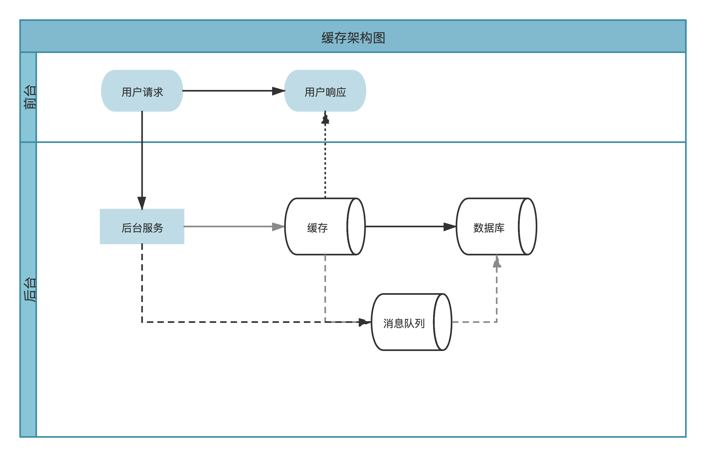
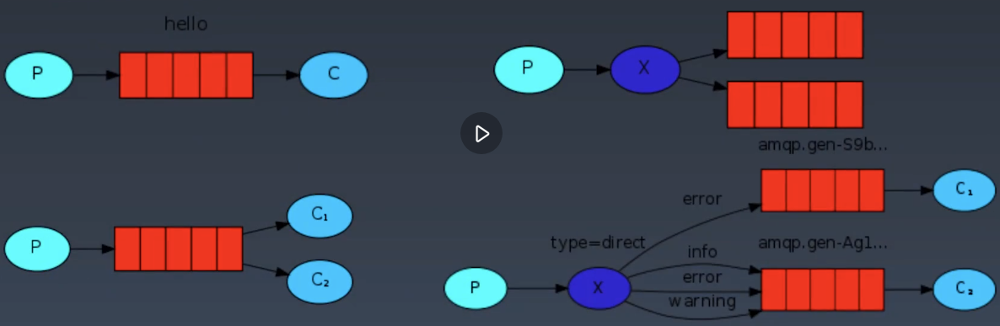

<h1>学习笔记

<h1> 中间件

## <center>第一节：为什么使用中间件&缓存的类别</center>

## 缓存

### 企业级应用为什么需要缓存和消息队列？

* 随着业务规模扩大，单体应用不再满足业务场景需求
* 用户数量剧增，单凭数据库无法抗住并发压力
* 业务场景复杂需要解耦
* 业务场景丰富造成访问热点

### 缓存分类

* 本地缓存
* 分布式缓存

> 差异：调用方式、开销<br>

* 思考
    - 1、各自存储数据的特点是什么？
        - 如访问Django，它会缓存本地内存中，如果没有要找数据，则向后端发起请求（如Redis、memcached，分布式存储）如果没有，则继续向后查找数据库
        - 本地缓存：调用在本地，本地内存，效率高。不支持分布式，本地缓存大小与物理和逻辑内存成正比
        - 分布式缓存：一般需要通过网络连接，远程调用，网络开销。可以缓存更多的数据
    - 2、各自适合的场景是什么？
        - 本地缓存：静态数据、一些配置文件
        - 分布式缓存：一般都是全局数据，需要多个业务或者多个业务模块之间进行共享 

## <center>第二节：缓存的同步方式有哪些</center>

### 缓存

#### 缓存与数据库之间的同步方式



#### 应用角度

#### 1. Cache Aside方式

* 场景：适合轻量级应用
* 工作过程：读缓存的时候有就返回数据没有就从数据库获取，然后再写入一份到缓存
* 更新数据：用户提交数据 ---> 更新数据库 ---> 清除之前的缓存（或者更新旧数据） ---> 返回用户
* 缺点：更新缓存策略的时候，会对业务代码有侵入

#### 2. Read 或 Write Through方式

* 场景：频繁访问或者更新缓存
* 工作过程：对于后台服务，就感觉没有缓存一样，也就是上图中，缓存前面加一个agent代理，缓存和数据库就是一个整体
* 缺点：缓存和数据更新逻辑，需要自己写额外代码进行维护

#### 3. Write Back方式

* 只修改缓存，不管数据库。数据库更新数据通过消息队列同步数据库
* 优点：不用考虑写持久化存储，效率高
* 缺点：从缓存到数据库，一般都是异步读写，有可能出现数据丢失的风险（如果缓存还没来得及同步到数据库的时候，缓存进程crash了，数据就可能丢失）
* 场景：对数据一致性要求不高的场景

#### 数据库角度

* 双写：数据库和Redis各一份
* 消息队列：写数据库和消息队列，消息队列再同步到Redis
* MySQL binlog：使用MySQL binlog重放同步到Redis

#### 问题：

* 1、三种策略优劣和应用场景？
* 2、各方式优劣？

> 1）数据一致性：三种方式都会存在数据不一致性的情况，如果出现数据不一致性的时候，需要通过应用程序做缓存和数据库的校对，为保证数据库的正确性，所以一般都是以数据库为准，应用程序会从数据库中抽取数据写入到缓存中<br>
> 2）数据库延迟角度： 双写方式延迟最低，其次消息队列，最后MySQL binlog方式<br>
> 3）系统耦合度：双写耦合度最高，其次消息队列，最后MySQL binlog方式<br>
> 4）复杂度来说：双写复杂度最低，其次消息队列，最后MySQL binlog方式<br>

> 场景：<br>
> 如果业务逻辑或者业务场景比较简单，可以采用耦合度较高的方案，排查问题也会更简单<br>
> 要求实时性较高的场景，可以采用双写的方式

> <font color=red>注意：具体的架构和具体的缓存方式，要基于业务特点、响应时间、以及架构复杂度来综合考量</font>

#### 1. 双写方式

* 应用程序往缓存写一份，往数据库写一份（多线程方式）
* 优点：容易实现
* 缺点：容易数据不一致，因为开启了两个线程，可能写缓存成功，写数据库不成功；或者缓存不成功，数据库成功。对业务代码依然有侵入
* 缓存和数据库哪个作为标准？
    - 以数据库作为标准
    - 在双写的时候，一般先写数据库，而后再写缓存
    - 如果是单线程，为了避免写入不一致的方式，一般引入分布式事务的方式。
        - 1、先写数据库，如果写入失败，直接回退，告诉用户请求或再次进行重试
        - 2、写MySQL数据库成功，但再去写缓存时候，Redis Crash了，此时Redis和MySQL数据库数据不一致，此时就需要定时同步缓存数据（可以增加相应的监控，及时发现，然后通过数据库更新缓存）

#### 2. 消息队列方式

* 工作过程：先写消息队列，再写缓存
* 场景：当用户请求比较大的场景，如果应用程序直接并发写入MySQL数据库的话，极有可能扛不住压力，此时通过后台服务写消息队列，然后再并行的与MySQL数据库进行同步（如：假设MySQL只能支持1000并发连接，同时有10000并发连接打过来，消息队列会把多余的请求进行队列排序，还可以进行限速，以1000连接的方式写入到数据库中）
* 优点：降低数据不一致的情况
* 缺点：与双写比起来，效率会低一些（消息队列支持持久化，然后返回用户成功，可以提高效率）

> 多线程方式<br>
> 当消息队列crash时，也保证数据不丢失

#### 3. MySQL 的binlog方式

* 优点：最稳定
* 缺点：效率最差
* 工作过程：后台服务写入数据库，通过数据库binlog日志，再去写入到缓存中
* binlog是线性来处理的，一旦binlog堵住，数据库主从的时候，经常会遇到，所有请求都会变成一个阻塞状态

## <center>第三节：缓存有可能出现的问题</center>

> 引入缓存到架构中，可以解决大量的并发请求，也会相应带来新的问题

### 架构中使用缓存有可能带来的问题？

* 缓存穿透
* 缓存并发
* 缓存雪崩

### 缓存穿透

* 引入缓存，目的是为了缓解数据库的压力，如果发现请求的某一些数据，这些数据没有在缓存中，可以利用这个数据直接请求到数据库，此时就相当于缓存没生效，压力都会落到数据库上
* 解决方案01（业界使用）
    - 应用程序和数据库约定，如果取的数据发现是没有办法返回的或者返回是空值的，把空值也进行缓存，设置为null，然后返回给Redis，保存Redis后返回给用户，请求失败。如果下次再次请求这个值时，就可以从Redis请求到空值（建议：缓存这个值，一定要用一个比较短的超时时间，如果超时时间过长，会导致内存占满，也可以通过这一点大量恶意发起大量请求）
* 解决方案02（布隆过滤器）
    - 可能出现误杀
    - 目的：设定一些过滤的规则，判断数据是不是在集合中，尽可能把所有可能的值，都录入到过滤器中，如果没有包含就返回null

### 缓存并发（缓存击穿）

* 在实际请求中，可能存在某一个key，只有一个key在某一时间点过期，恰好在过期的时间点有大量并发，请求到这个key上，其实key是过期的，此时大量的请求就会直接请求到数据库，可能会压垮数据库
* 解决方案（互斥锁方式）
    - 当缓存一旦失效，此时不立即往数据库请求，而去设置一个锁（Redis中叫SETNX的设置项），设置完后，再去查询数据库，并把值再写会缓存中。一个线程做这个事情；另外一个线程也来做这个事情，会检查有没有互斥锁，如果没有获得这个锁，则进入阻塞状态，短暂休眠。更新完数据后，再直接请求到Redis上

> 区别：缓存穿透 --> 值存在; 缓存并发 --> 值存在（正常请求）

### 缓存雪崩

* 如果Redis设置不合理，或者启动Redis时缓存大量的key之后，有可能同一时间缓存的key，同一时间过期
* 解决方案01
    - 在缓存的过期时间上，一般加一些随机的事件，比如不让同一时间让大量的key同时失效
* 解决方案02（多级缓存）
    - 难度增加
    - 每一级过期时间不同，通过不同的时间去避免缓存雪崩的情况出现

## <center>第四节：安装Redis、连接Redis</center>

### Redis特点

* 使用IO多路复用机制
* 监听多个文件描述符实现读写事件
* 单工作线程（6.0以前）

> 注意：单工作线程可能会导致多个会话相互干扰

### Redis的对象类型

* 字符串
* 列表
    - 时间复杂度换空间复杂度的简单存储，使用列表会比使用双端链表节省时间
* 哈希
* 集合
    - 一次返回大量元素的时候，有可能出现超时的情况
* 有序集合

> 使用小技巧：字符串内部编码包括三种：int（8字节）、embstr（小于39字节）、raw（大于39字节）。如果存储的字符串大于8个字节，会自动转成embstr，或转换成raw；即使修改成1个字节，它还是会占用raw格式这么大的空间（基于效率，做数据对齐）

> 建议：使用字符串的时候，尽量把key空值在8字节以内会比较高效

### Redis安装

* [官网下载稳定版](https://redis.io/)
* 安装环境
    - centos7：由于gcc版本较低，需要进行升级`sh gcc8.sh`

``` bash
#!/bin/bash
yum -y install centos-release-scl scl-utils-build
yum list all --enablerepo-'centos-sclo-rh'
yum -y install devtoolset-8-toolchain
scl enable devtoolset-8 bash
gcc --version
```

    - 验证

```bash 
[root@redis ~]# gcc --version
gcc (GCC) 8.3.1 20190311 (Red Hat 8.3.1-3)
Copyright (C) 2018 Free Software Foundation, Inc.
This is free software; see the source for copying conditions.  There is NO
warranty; not even for MERCHANTABILITY or FITNESS FOR A PARTICULAR PURPOSE.

``` 

    - 安装

```bash
[root@redis ~]# cd redis-6.0.9
[root@redis redis-6.0.9]# make ; make install
```

    - 安装完成

``` bash
[root@redis ~]# which redis-server
/usr/local/bin/redis-server
[root@redis ~]# which redis-cli
/usr/local/bin/redis-cli
[root@redis ~]# ls redis-6.0.9/redis.conf 
redis-6.0.9/redis.conf    # Redis的配置文件，可以设置修改Redis的工作方式
```

    - 开发环境，建议做以下配置

    

```bash 
[root@redis ~]# cp redis-6.0.9/redis.conf /etc/
[root@redis ~]# vim /etc/redis.conf
requirepass <passowrd>  # 建议设置足够复杂的密码，连接Redis是所需要的密码，Redis配置好后通过端口直接对外，由于Redis性能很高，会有大量的拆解工具，并高效地对Redis密码进行拆解。所以设置一个比较复杂的密码或者生产环境中不要让Redis的端口对外网开放
bind 0.0.0.0     # 监听所有IP
[root@redis ~]# redis-server /etc/redis.conf    # 启动Redis服务
[root@redis ~]# ss -ntpl |grep 6379
LISTEN     0      128          *:6379                     *:*                   users:(("redis-server", pid=7785, fd=6))

# 正确的关闭Redis服务

[root@redis ~]# redis-cli
127.0.0.1:6379> auth <password>
OK
127.0.0.1:6379> shutdown
7785: M 22 Dec 2020 03:50:55.317 # User requested shutdown...
7785: M 22 Dec 2020 03:50:55.317 * Saving the final RDB snapshot before exiting.
7785: M 22 Dec 2020 03:50:55.319 * DB saved on disk
7785: M 22 Dec 2020 03:50:55.319 * Removing the pid file.
7785: M 22 Dec 2020 03:50:55.319 # Redis is now ready to exit, bye bye...

``` 

## <center>第五节：Redis字符串使用场景</center>

```python
#!/usr/bin/env python
# 操作string
import redis

client = redis.Redis(host='192.168.0.167', password='CentOS2020@')

# nx当key值存在的时候不更新
client.set('key', 'value2', nx=True)
# 给key的值增加value4
client.append('key', 'value4')
result = client.get('key')
print(result.decode())

client.set('key2', '100')
# +1操作
client.incr('key2')
result2 = client.get('key2')
print(result2.decode())
# -1操作
client.decr('key2')
result3 = client.get('key2')
print(result3.decode())
```

> 注意：字符串一般应用在小量级的数据记录上，数据量不要超过百万级，如果超过百万级，使用哈希的方式，因为哈希结构所消耗的内存，只有字符串结构的1/4大小，查询效率和字符串相同

> 查看所有key利用keys \*这样的方式，当Redis执行此命令的时候，会造成短暂没办法响应任何请求，如果key超过百万级，失去响应的时间可能达到秒级，如果不清楚key有多少的情况下，不要贸然使用keys \* 指令，会造成Redis短暂不响应 

## <center>第六节：Redis列表</center>

> 使用列表，对遍历数据有一定要求，比如增加数据的时候，强调顺序，插入速度快

* 列表可以批量发送短信、通知、虚拟物品等等的功能

``` python
# 操作list
import redis

client = redis.Redis(host='192.168.0.167', password='CentOS2020@')

# 存入列表
# client.lpush('list_redis_demo', 'python')
# client.rpush('list_redis_demo', 'java')
# 查看长度
# print(client.llen('list_redis_demo'))

# 弹出数据
# lpop() rpop()
# data = client.lpop('list_redis_demo')
# print(data)

# 查看一定范围的list数据
# data = client.lrange('list_redis_demo', 0, -1)
# print(data)

while True:
    phone = client.rpop('list_redis_demo')
    if not phone:
        print('发送完毕')
        break
    # sendsms(phone)
    # result_times = retry_onece(phone)
    # if result_times >= 5:
    #     client.lpush('list_redis_demo', phone)

data = client.lrange('list_redis_demo', 0, -1)
print(data)
```

## <center>第七节：Redis集合</center>

* 集合的元素是唯一的

``` python
import redis

client = redis.Redis(host='192.168.0.167', password='CentOS2020@')

print(client.sadd('redis_set_demo','new_data'))
# client.spop()
# print(client.smembers('redis_set_demo'))

# 交集
client.sinter('set_a','set_b')

# 并集
client.sunion('set_a','set_b')

# 差集
client.sdiff('set_a','set_b')

# 场景：去重、两个集合的交集、并集、差集的计算
```

## <center>第八节：Redis哈希</center>

* 基于hash表实现
* 不管key有多少个，查询的时候效率是一样的

``` python
import redis

client = redis.Redis(host='192.168.0.167', password='CentOS2020@')

# 一次只能添加一个键值对
# client.hset('vip_user','1001',1)
# client.hset('vip_user','1002',1)
# client.hdel('vip_user','1002')
# print(client.hexists('vip_user','1002'))

# 添加多个键值对
# client.hmset('vip_user',{'1003':1,'1004':1})
# hkeys hget hmget hgetall
# hkeys获取所有的字段名，返回bytes类型的字列表
field = client.hkeys('vip_user')
print(field)
# 返回值永远为null，不能通过返回值做判断，只能通过执行的结果判断
print(client.hget('vip_user','1001'))
print(client.hgetall('vip_user'))
```

## <center>第九节：Redis有序集合</center>

``` python
# 操作zset
import redis

client = redis.Redis(host='192.168.0.167', password='CentOS2020@')

# 场景：一般有排序需求的时候才会用到
# 如果存储数据量越大，添加的时间越长
# 查询时，数据集越多，查询时间越长
# 排序、不重复
# client.zadd('rank', {'a': 4, 'b': 3, 'c': 1, 'd': 2, 'e': 5})

# 修改e的值
# client.zincrby('rank', -2, 'e')

# 下限为1，上限为5
print(client.zrangebyscore('rank', 1, 5))

# zrevrank 从大到小

# 基card
print(client.zcard('rank'))

# 显示评分,withscores带对应分值
print(client.zrange('rank', 0, 2, withscores=True))

print(client.zrevrange('rank', 0, 2, withscores=True))

```

## <center>第十节：Redis的重要机制</center>

### Redis的重要机制

* 生存时间
    - 定期过期：节省空间、保证数据的热一致性（主动、可以直接配置到redis配置文件中）
        * LRU：优先淘汰不是最近使用的数据
        * LFU：优先淘汰不频繁使用的数据（定期衰减机制，每个数据都需要维护一个计数器，而且需要定期衰减）
    - 惰性过期：下一次检查数据的时候，查看数据是不是有过期时间，如果过期返回空值然后删除过期数据（被动）
* 主从复制（保证redis可用性）
    - 主：读写，可能架构前面有个队列，缓解redis压力
    - 从：只读，做策略读取，一般轮询Round Robin，实际生产环境中，从服务器非常多，还会给Round Robin轮询这种方式加权重（服务器配置可能不同）
    - 只支持一主多从
* 哨兵（保证redis可用性）
    - 监控主从服务器是否正常工作
    - 通知/提醒（Notification）：当被监控的redis主机，出现问题时，哨兵可以通过API向管理员或者其他应用程序发起通知
    - 自动故障迁移：当主服务器不能工作时，哨兵会开始从一个从服务器，升级为新的主服务器还可以通知客户端
    - 仲裁：建议设置基数值
    - 故障转移技术步骤
        * 主观下线
        * 客观下线

## <center>第十一节：消息队列的用途</center>

### 队列功能

* 上下游系统相关联系
* 缓存（输入输出不对等）

### 消息队列

#### 计算机中的消息队列的用途

* 异步处理
* 流量控制：令牌生成器
* 服务解耦

#### 消息队列的模型

* 队列模型（FIFO）
* 发布-订阅模型

## <center>第十二节：RabbitMQ的主要结构</center>

### RabbitMQ

#### AMQP协议与RabbitMQ软件

* RabbitMQ是AMQP的代理服务器
* RabbitMQ提供了一套严格的通信方式，通信的各个方面几乎都采用了远程过程调用（RPC）

### 安装

``` shell
[root@redis6 ~]# yum -y update
[root@redis6 ~]# yum -y install erlang socat
[root@redis6 ~]# wget https://www.rabbitmq.com/releases/rabbitmq-server/v3.6.10/rabbitmq-server-3.6.10-1.el7.noarch.rpm
[root@redis6 ~]# rpm --import https://www.rabbitmq.com/rabbitmq-release-signing-key.asc
[root@redis6 ~]# rpm -Uvh rabbitmq-server-3.6.10-1.el7.noarch.rpm
[root@redis6 ~]# systemctl start rabbitmq-server
[root@redis6 ~]# systemctl enable rabbitmq-server
[root@redis6 ~]# rabbitmq-plugins enable rabbitmq_management
The following plugins have been enabled:
  amqp_client
  cowlib
  cowboy
  rabbitmq_web_dispatch
  rabbitmq_management_agent
  rabbitmq_management

Applying plugin configuration to rabbit@redis6... started 6 plugins.
```

## <center>第十三节：RabbitMQ的队列方式用法</center>

### RabbitMQ的常用架构



> **mod5_rabbit_publish.py**

``` python
# 生产者代码
import pika

# 用户名和密码, 不要多个业务混用
credentials = pika.PlainCredentials('guest', 'guest')

# 虚拟队列需要指定参数 virtual_host，如果是默认的可以不填
parameters = pika.ConnectionParameters(host='192.168.0.167',
                                       port=5672,
                                       virtual_host='/',
                                       credentials=credentials)

# 阻塞方法
connection = pika.BlockingConnection(parameters)

# 建立信道
channel = connection.channel()

# 声明消息队列
# 如不存在自动创建
# durable=True 队列持久化
channel.queue_declare(queue='direct_demo', durable=False)

# exchange 指定交换机
# routeing_key 指定队列名
# 工作中body一般是xml或者json格式
channel.basic_publish(exchange='', routing_key='direct_demo',
                      body='send message to rabbitmq'
                      )
# 关闭与rabbitmq server的连接
connection.close()
```

> **mod5_rabbit_subscribe.py**

``` python
# 消费者代码
import pika

credentials = pika.PlainCredentials('guest', 'guest')

parameters = pika.ConnectionParameters(host='192.168.0.167',
                                       port=5672,
                                       virtual_host='/',
                                       credentials=credentials)
connection = pika.BlockingConnection(parameters)

channel = connection.channel()

# 声明消息队列
channel.queue_declare(queue='direct_demo', durable=False)

# 定义一个回调函数来处理消息队列中的消息

def callback(ch, method, properties, body):

    # 手动发送确认消息
    # ch.basic_ack(delivery_tag=method.delivery_tag)
    # 实现如何处理消息
    print(body.decode())

# 消费者使用队列和哪个回调函数处理消息
channel.basic_consume('direct_demo', on_message_callback=callback)

# 开始接收信息，并进入阻塞状态
channel.start_consuming()
```

## <center>第十四节：RabbitMQ订阅发布模型的用法</center>

> **mode5_rabbit_taskqueue_pub.py**

``` python
# 生产者代码
import pika

# 用户名和密码
credentials = pika.PlainCredentials('guest', 'guest')

# 虚拟队列需要指定参数 virtual_host，如果是默认的可以不填。
parameters = pika.ConnectionParameters(host='192.168.0.167',
                                       port=5672,
                                       virtual_host='/',
                                       credentials=credentials)
# 阻塞方法
connection = pika.BlockingConnection(parameters)

# 建立信道
channel = connection.channel()

# 声明消息队列
# 如不存在自动创建
# durable=True 队列持久化
channel.queue_declare(queue='task_queue', durable=True)

message = 'send message to taskqueue'
channel.basic_publish(exchange='',
                      routing_key='task_queue',
                      body=message,
                      properties=pika.BasicProperties(
                         delivery_mode = 2, # 消息持久化
                      ))

# 关闭与rabbitmq server的连接
connection.close()
```

> **mod5_rabbit_taskqueue_sub.py**

``` python
# 消费者代码
import pika
import time

credentials = pika.PlainCredentials('guest', 'guest')

parameters = pika.ConnectionParameters(host='192.168.0.167',
                                       port=5672,
                                       virtual_host='/',
                                       credentials=credentials)

connection = pika.BlockingConnection(parameters)

channel = connection.channel()

# 声明消息队列
channel.queue_declare(queue='task_queue', durable=True)

# 定义一个回调函数来处理消息队列中的消息

def callback(ch, method, properties, body):

    time.sleep(1)
    print(body.decode())
    # 手动确认消息
    ch.basic_ack(delivery_tag=method.delivery_tag)

# 如果该消费者的channel上未确认的消息数达到了prefetch_count数，则不向该消费者发送消息
channel.basic_qos(prefetch_count=1)

# 消费者使用队列和哪个回调函数处理消息
channel.basic_consume('task_queue', callback)

# 开始接收信息，并进入阻塞状态
channel.start_consuming()
```

> **mod5_rabbit_fanout_pub.py**

``` python
# 生产者代码
import pika

# 用户名和密码
credentials = pika.PlainCredentials('guest', 'guest')

# 虚拟队列需要指定参数 virtual_host，如果是默认的可以不填。
parameters = pika.ConnectionParameters(host='192.168.0.167',
                                       port=5672,
                                       virtual_host='/',
                                       credentials=credentials)
# 阻塞方法
connection = pika.BlockingConnection(parameters)

# 建立信道
channel = connection.channel()

channel.exchange_declare(exchange='logs',
                         exchange_type='fanout')

message = 'send message to fanout'
channel.basic_publish(exchange='logs',
                      routing_key='',
                      body=message,
                      )

# 关闭与rabbitmq server的连接
connection.close()
```

> **mod5_rabbit_fanout_sub.py**

``` python
# 消费者代码
import pika

credentials = pika.PlainCredentials('guest', 'guest')

parameters = pika.ConnectionParameters(host='192.168.0.167',
                                       port=5672,
                                       virtual_host='/',
                                       credentials=credentials)

connection = pika.BlockingConnection(parameters)

channel = connection.channel()

# 声明交换机
channel.exchange_declare(exchange='logs',
                         exchange_type='fanout')

# 声明消息队列
# exclusive 当与消费者断开连接的时候，队列被立即删除
result = channel.queue_declare(queue='',
                               exclusive=True)
queue_name = result.method.queue

# 通过bind实现exchange将message发送到指定的queue
channel.queue_bind(exchange='logs',
                   queue=queue_name)

# 定义一个回调函数来处理消息队列中的消息
def callback(ch, method, properties, body):

    print(body.decode())
    # 手动确认消息
    # ch.basic_ack(delivery_tag=method.delivery_tag)

channel.basic_qos(prefetch_count=1)
# 消费者使用队列和哪个回调函数处理消息
channel.basic_consume(queue=queue_name,
                      on_message_callback=callback,
                      auto_ack=True)

# 开始接收信息，并进入阻塞状态
channel.start_consuming()
```

## <center>第十五节：消息队列经常遇到的三个问题</center>

### 消息队列

#### 生产级消息队列重要的三个问题

* 如何保证事务在分布式消息队列的一致性？
* 如何保证消息不会丢？
* 如何处理重复消息？

## <center>第十六节：RPC与gRPC的使用</center>

### gRPC

* gRPC是Google发布的基于HTTP2.0传输协议承载的高性能开源软件框架

### 特点

* 基于HTTP协议
* 开源
* 支持多语言
* 通过Protocol Buffers 编写proto文件，交换机与服务器建立gRPC通道

### Protocol Buffers作用

* 定义数据结构
* 定义服务接口
* 序列化和反序列化

``` python

```
