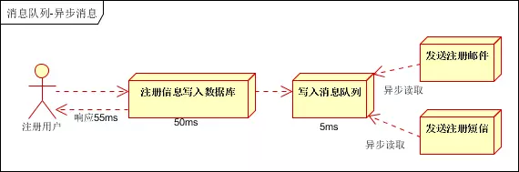
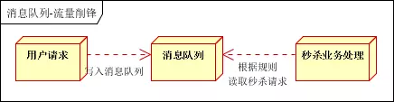
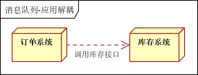

# 作业三：请用自己的语言描述如下问题

### 1、在你目前的工作场景中，哪个业务适合使用 rabbitmq？ 引入 rabbitmq 主要解决什么问题?（非相关工作可以以设计淘宝购物和结账功能为例来描述）

* 异步处理

> 场景：用户注册后，需要发送注册短信和邮件
> 将用户注册信息写入数据库，把发邮件、短信非必须的业务逻辑写入消息队列

* 流量控制

> 场景：如淘宝双十一秒杀活动，流量过大，可能会导致应用crash，需要在应用前端加入消息队列
> 用户的请求，服务接收以后，首先写入消息队列。假如消息队列长度超过最大数量，则直接抛弃用户请求并跳转到错误页面

* 应用解耦

> 场景：用户下单后，订单系统需通知库存系统
> 订单系统：用户下单后，订单系统完成持久化处理，将消息写入消息队列，返回用户订单下单成功
> 库存系统：订阅下单消息，库存系统根据下单信息，进行库存操作
> 假如库存系统不能操作时，订单系统也能正常使用

> RabbitMQ主要解决了企业中 应用解耦、流量控制以及异步处理

### 2、如何避免消息重复投递或重复消费？

* 在消息生产时，rabbitmq针对每条生产者发送的消息生成一个令牌，作为去重的依据，避免重复的消息进入队列

* 在消息消费时，要求消息中必须有一个同业务全局唯一的令牌，作为去重的依据，避免同一条消息被重复消费

> 幂等性

### 3、交换机 fanout、direct、topic 有什么区别？

* fanout

> 不处RouteKey。只需要简单的将队列绑定到交换机上，一个发送到交换机的消息都会被转发到与该交换机绑定的多有队列上

* direct

> 处理RouteKey。需要将一个队列绑定到交换机上，要求该消息与一个特定的路由键完全匹配。如果一个队列绑定到该交换机上要求路由键"x"，则只有被标记为"x"的消息才被转发

* topic

> 将RouteKey和某模式进行匹配。此时队列需要绑定一个模式上。符号"#"匹配一个或多个词，符号"*"匹配不多不少一个词。任何发送到topic的消息都会被转发到所有关系RouteKey中指定话题的队列上

### 4、架构中引入消息队列是否利大于弊？你认为消息队列有哪些缺点？

* 消息队列的使用解决的核心问题主要是：异步、解耦、流量控制
* 缺点：

> （1）系统可用性降低： 系统引入外部依赖越多，系统可用性就越差。假如有ABCD四个系统，A本来直接调用BCD系统接口完成业务流程，但引入MQ，如果MQcrash了，整套系统就变得不可用

> （2）一致性问题： 假如ABCD四个系统，本来A调用系统BCD，调用B失败就不再调用CD，直接回滚数据。引入MQ后，系统A把数据推送给BCD成功就直接返回成功了，但是只有BC消费消息成功了，系统D消费时写入失败，则无法保证数据一致性

> （3）系统复杂度提高： 假如ABCD系统，本来用的技术栈较简单，引入MQ后，再解决某些问题时，同样带来了一些新的问题，导致系统的复杂度提高
