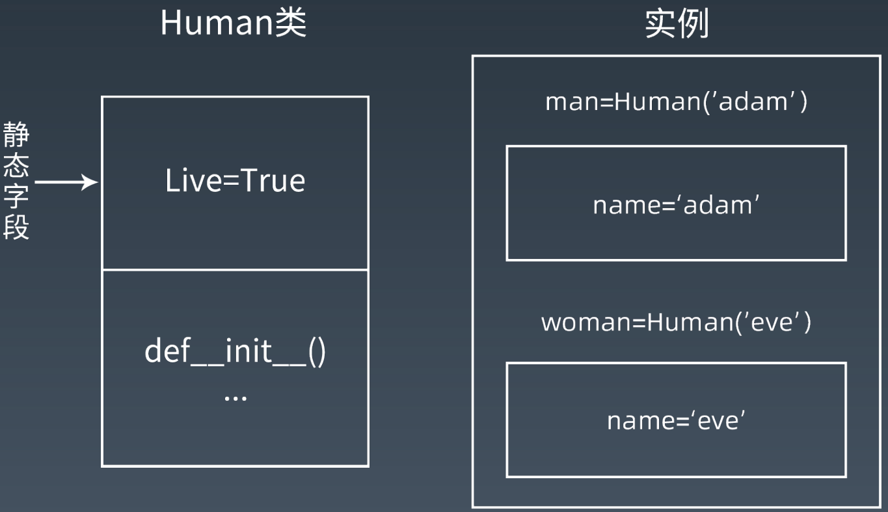
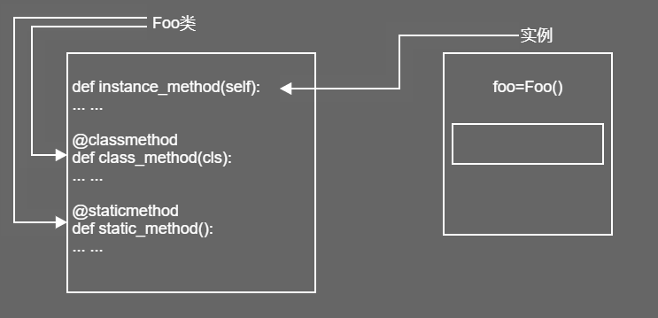
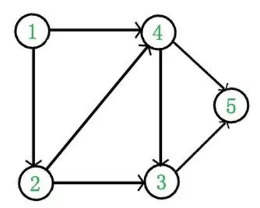

<h1>面向对象编程进阶

# <center>第一节：类属性与对象属性</center>

### 面向对象编程

* 现实世界的对象和python世界的对象
* 对象是一个数据以及相关行为的集合
* python的经典类和新式类
* 类的两大成员：属性和方法

### 属性

* 类属性与对象属性
* 类属性字段在内存中只保存一份
* 对象属性在每个对象都保存一份



### 类的静态字段和普通字段

> p1_class_obj.py

``` python
# I have a dream
class MyFirstClass:
    pass

a = MyFirstClass()
b = MyFirstClass()

# 不同内存地址，两个不同对象
type(a)
id(a)
a.__class__()
b.__class__()

# 类也是对象
c = MyFirstClass
d = c()
d.__class__()cat: echo: 没有那个文件或目录
```

> p2_class_property.py

``` python
# GOD
class Human(object):
    # 静态字段
    live = True

    def __init__(self, name):
        # 普通字段
        self.name = name

man = Human('Adam')
woman = Human('Eve')

# 有静态字段,live属性
Human.__dict__
# 有普通字段,name属性
man.__dict__

# 实例可以使用普通字段也可以使用静态字段
man.name
man.live = False
# 查看实例属性
man.__dict__ #普通字段有live变量
man.live
woman.live

# 类可以使用静态字段
Human.live

# 可以为类添加静态字段
Human.newattr = 1
dir(Human)
Human.__dict__

# 内置类型不能增加属性和方法
setattr(list, 'newattr', 'value')
# TypeError

# 显示object类的所有子类
print( ().__class__.__bases__[0].__subclasses__() )liushiju@liushiju-X99:/pythontrain/NewClass$ cat  p2_class_property.py 
liushiju@liushiju-X99:/pythontrain/NewClass$ cat  p2_class_property.py echo
# GOD
class Human(object):
    # 静态字段
    live = True

    def __init__(self, name):
        # 普通字段
        self.name = name

man = Human('Adam')
woman = Human('Eve')

# 有静态字段,live属性
Human.__dict__
# 有普通字段,name属性
man.__dict__

# 实例可以使用普通字段也可以使用静态字段
man.name
man.live = False
# 查看实例属性
man.__dict__ #普通字段有live变量
man.live
woman.live

# 类可以使用静态字段
Human.live

# 可以为类添加静态字段
Human.newattr = 1
dir(Human)
Human.__dict__

# 内置类型不能增加属性和方法
setattr(list, 'newattr', 'value')
# TypeError

# 显示object类的所有子类
print( ().__class__.__bases__[0].__subclasses__() )cat: echo: 没有那个文件或目录
```

> `__dict__` 方法查看类包含哪些属性

# <center>第二节：类的属性作用域</center>

> `dir()` 和 `__dict__` 都可以获取类属性，dir返回列表，dict返回字典

> p3_class_pro2.py

``` python
class Human2(object):
    # 人为约定不可修改
    _age = 0

    # 私有属性
    __fly = False

    # 魔术方法，不会自动改名,会随着系统的发生变化
    # 如 __init__

# 自动改名机制
Human2.__dict__cat: echo: 没有那个文件或目录
```

# <center>第三节：类方法描述器</center>

### 方法

#### 三种方法

* 普通方法：至少一个self参数，表示该方法的对象
* 类方法： 至少一个cls参数，表示该方法的类
* 静态方法：由类调用，无参数

> 三种方法在内存中都归属于类



## <center>第四节：静态方法描述器</center>

## StaticMethod

* 此函数不带任何参数，即不带self又不带cls(class)，意味着实例化StaticMethod时，不能用到类和实例的属性
* 作用

> 用来做一些功能的转化，比如：类型的转换，或者增加某些特定判断

> **p5_2staticmethod.py**

``` python
import datetime
class Story(object):
    snake = 'Python'
    def __init__(self, name):
        self.name = name
    # 静态的方法
    @staticmethod
    def god_come_go():
        if datetime.datetime.now().month % 2 :
             print('god is coming')
    
Story.god_come_go()

# 静态方法可以由类直接调用
# 因为不传入self 也不传入 cls ，所以不能使用类属性和实例属性
```

> **p5_3staticVSclass.py**

``` python
class Foo(object):
    """类三种方法语法形式"""

    def instance_method(self):
        print("是类的实例方法，只能被实例对象调用")

    @staticmethod
    def static_method():
        print("是静态方法")

    @classmethod
    def class_method(cls):
        print("是类方法")

foo = Foo()
foo.instance_method()
foo.static_method()
foo.class_method()
print('----------------')
Foo.static_method()
Foo.class_method()
```

## <center>第五节：描述器高级应用__getattribute__</center>

### 属性处理

* 在类中，需要对实例获取属性这一行为进行操作，可以使用：

> `__getattribute__()`

> `__getattr__()`

* 异同

> 1. 都可以对实例属性进行获取拦截
> 2. `__getattr__()` 适用于未定义的属性
> 3. `__getattribute__()` 对所有属性的访问都会调用该方法

> <font color=red>注意:
> 对实例获取属性，对类无效</font>

> **p6_1getattribute.py**

``` python
# GOD
class Human(object):  
    # 接收参数  
    def __init__(self, name):
        self.name = name

h1 = Human('Adam')
h2 = Human('Eve')

# 对实例属性做修改
h1.name = 'python'

# 对实例属性查询
h1.name

# 删除实例属性
del h1.name

# AttributeError，访问不存在的属性
# 由__getattribute__(self,name)抛出
h1.name

###################
class Human2(object):  
    """
    getattribute对任意读取的属性进行截获
    """  
    def __init__(self):
        self.age = 18
    def __getattribute__(self,item):
        print(f' __getattribute__ called item:{item}')

h1 = Human2()

h1.age
h1.noattr
```

> **p6_2getattribute.py**

``` python
class Human2(object):  
    """
    拦截已存在的属性
    """  
    def __init__(self):
        self.age = 18
    def __getattribute__(self,item):
        print(f' __getattribute__ called item:{item}')
        return super().__getattribute__(item)
h1 = Human2()

print(h1.age)
# 存在的属性返回取值
print(h1.noattr)
# 不存在的属性返回 AttributeError

# 思考：为什么使用super()不使用self
```

> **p6_3getattribute.py**

``` python
class Human2(object):    
    def __getattribute__(self, item):
        """
        将不存在的属性设置为100并返回,模拟getattr行为
        """
        print('Human2:__getattribute__')
        try:
            return super().__getattribute__(item)
        except Exception as e:
            self.__dict__[item] = 100
            return 100
h1 = Human2()

print(h1.noattr)

# 思考：有更简洁的写法吗？
```

## <center>第六节：描述器高级应用__getattr__</center>

> **p6_4getattr.py**

``` python
class Human2(object):  
    """
    属性不在实例的__dict__中,__getattr__被调用
    """
    def __init__(self):
        self.age = 18

    def __getattr__(self, item): 
        print(f' __getattr__ called item:{item}')
        # 不存在的属性返回默认值 'OK'
        return 'OK'

h1 = Human2()

print(h1.age)
print(h1.noattr)
```

> **p6_5getattr.py**

``` python
class Human2(object):  
    def __init__(self):
        self.age = 18

    def __getattr__(self, item): 
        # 对指定属性做处理:fly属性返回'superman',其他属性返回None
        self.item = item
        if self.item == 'fly':
            return 'superman'

h1 = Human2()

print(h1.age)
print(h1.fly)
print(h1.noattr)
```

> **p6_6both_define.py**

```python 
class Human2(object):    

    """
    同时存在的调用顺序
    """
    def __init__(self):
        self.age = 18

    def __getattr__(self, item): 

        print('Human2:__getattr__')
        return 'Err 404 ,你请求的参数不存在'

    def __getattribute__(self, item):
        print('Human2:__getattribute__')
        return super().__getattribute__(item)

h1 = Human2()

# 如果同时存在，执行顺序是 __getattribute__ > __getattr__ > __dict__

print(h1.age)
print(h1.noattr)

# 注意输出，noattr的调用顺序

``` 

> 注意：
> 1. `__getattribute__` 无论属性存在或者不存在都会调用写的 `__getattribute__` 方法，会对实例调用过程的性能有一定的损耗
> 在使用 `__getattr__` 的时候， `__dict__` 里依然没有属性，当使用 `hasattr` 判断是否有属性，即使返回 True ，通过 `dir` 方式依然看不到已存在的属性，虽然改变了它的行为，但是很多内置方法进行判断的时候，可能出现不一致的问题

## <center>第七节：描述器原理&属性描述符</center>

### 属性描述符 property

* 描述器：实现特定协议（描述符）的类

* property 类需要实现`__get__`、`__set__`、`__delete__` 方法

```python
class Teacher:
    def __init__(self, name):
        self.name = name
    # 属性读取
    def __get__(self):
        return self.name
    # 属性设置
    def __set__(self, value):
        self.name = value

pythonteacher = Teacher('yin')
```

### Django 中的 property

> **site-packages/django/db/models/base.py**

``` python
class Model(metaclass=ModelBase):
    def _get_pk_val(self, meta=None):
        meta = meta or self._meta
        return getattr(self, meta.pk.attname)
    def _set_pk_val(self, value):
        retuen setattr(self, self._meta.pk.attname, value)

pk = property(_get_pk_val, _set_pk_val)
```

> **p7_1descraptor.py**

``` python
# __getattribute__ 的底层原理是描述器
class Desc(object):
    """
    通过打印来展示描述器的访问流程
    """
    def __init__(self, name):
        self.name = name
    
    def __get__(self, instance, owner):
        print(f'__get__{instance} {owner}')
        return self.name

    def __set__(self, instance, value):
        print(f'__set__{instance} {value}')
        self.name = value

    def __delete__(self, instance):
        print(f'__delete__{instance}')
        del self.name

class MyObj(object):
    a = Desc('aaa')
    b = Desc('bbb')

my_object = MyObj()
print(my_object.a)

my_object.a = 456
print(my_object.a)
```

> **p7_2descraptor.py**

``` python
# GOD
class Human(object):
    def __init__(self, name):
        self.name = name

    # 将方法封装成属性
    @property
    def gender(self):
        return 'M'

h1 = Human('Adam')
h2 = Human('Eve')
h1.gender

# AttributeError:
h2.gender = 'F'

#################
# GOD
class Human2(object):
    def __init__(self):
        self._gender = None
    # 将方法封装成属性
    @property
    def gender2(self):
        print(self._gender)

    # 支持修改
    @gender2.setter
    def gender2(self,value):
        self._gender = value

    # 支持删除
    @gender2.deleter
    def gender2(self):
        del self._gender

h = Human2()
h.gender2 = 'F'
h.gender2
del h.gender2
# 另一种property写法
# gender  = property(get_, set_, del_, 'other property')

# 被装饰函数建议使用相同的gender2
# 使用setter 并不能真正意义上实现无法写入，gender被改名为 _Article__gender

# property本质并不是函数，而是特殊类（实现了数据描述符的类）
# 如果一个对象同时定义了__get__()和__set__()方法，则称为数据描述符，
# 如果仅定义了__get__()方法，则称为非数据描述符

# property的优点：
# 1 代码更简洁，可读性、可维护性更强。
# 2 更好的管理属性的访问。
# 3 控制属性访问权限，提高数据安全性。

# property 纯python实现

class Property(object):
    "Emulate PyProperty_Type() in Objects/descrobject.c"
    def __init__(self, fget=None, fset=None, fdel=None, doc=None):
        self.fget = fget
        self.fset = fset
        self.fdel = fdel
        if doc is None and fget is not None:
            doc = fget.__doc__
            self.__doc__ = doc
    
    def __get__(self, obj, objtype=None):
        if obj is None:
            return self
        if self.fget is None:
            raise AttributeError("unreadable attribute")
        return self.fget(obj)

    def __set__(self, obj, value):
        if self.fset is None:
            raise AttributeError("can't set attribute")
        self.fset(obj, value)

    def __delete__(self, obj):
        if self.fdel is None:
            raise AttributeError("can't delete attribute")
        self.fdel(obj)

    def getter(self, fget):
        return type(self)(fget, self.fset, self.fdel, self.__doc__)

    def setter(self, fset):
        return type(self)(self.fget, fset, self.fdel, self.__doc__)

    def deleter(self, fdel):
        return type(self)(self.fget, self.fset, fdel, self.__doc__)
```

> Property把方法封装成属性，好处：方法调用可能会更复杂，比如一个函数调用，可能需要去指定参数的多少，考虑传递的类型等。如果是一个属性，把对象进行赋值，就可以读取这个对象的取值。<font color=red>只读功能</font>

> **p8_1demo.py**

``` python
#ORM(flask.ext.sqlalchemy)
# 一个表记录一个节点的心跳更新
# 通过一个属性来获取节点是否可用，而不用写复杂的查询语句
class Node(db.Model):
    id = db.Column(db.Integer, primary_key=True)
    updated_at = db.Column(db.DateTime) # 节点最后心跳时间
    state = db.Column(db.Integer, nullable=False) # 节点是否禁用

    @property
    def is_active(self):
        if(datetime.datetime.now() - self.updated_at).secondes > 60 \
            and self.vm_state == 0:
            return False
        return True

#########################
# 限制传入的类型和范围（整数，且满足18-65）
class Age(object):
    def __init__(self, default_age = 18):
        self.age_range = range(18,66)
        self.default_age = default_age
        self.data = {}

    def __get__(self, instance, owner):
        return self.data.get(instance, self.default_age)
    
    def __set__(self, isinstance, value):
        if value not in self.age_range:
            raise ValueError('must be in (18-65)')

        self.data[isinstance] = value

class Student(object):
    age = Age()

if __name__ == '__main__':
    s1 = Student()
    s1.age = 30
    s1.age = 100

############################
# 固定部分传递的参数
def xxyun_client(apitype, ak, sk, region='cn-beijing-3'):
    s = get_session()
    client = s.create_client(
        apitype,
        region,
        user_ssl = True,
        access_key =ak,
        secret_access_key =sk
    )
    return client

class XXYunBase(object):
    def __init__(self, account):
        self.account = account
        self.ak = self.account.ak
        self.sk = self.account.sk
    
    @property
    def eip_(self):
        return partial(xxyun_client, 'eip', self.ak, self.sk)
    
    @property
    def vpc_(self):
        return partial(xxyun_client, 'vpc', self.ak, self.sk)

##################
@property
def current_state(self):
    instance_state = {
       1: '运行',
       2: '离线',
       3: '下线',

   } 
    if(time_diff.seconds) >= 300:
       return instance_state[2]

    if self.state in range(10):
        return instance_state.get(self.state, '其他')
    return None
```

> **p8_2models.py**

``` python
from sqlalchemy import Column, Integer, String, Float
from flask_sqlalchemy import SQLAlchemy
from flask_login import UserMixin
from manage import db
from werkzeug.security import generate_password_hash, check_password_hash

class User(UserMixin, db.Model):
    __tablename__ = 'users'

    id = db.Column(db.Integer, primary_key=True)
    username = db.Column(db.String(32), nullable=False, unique=True)
    password_hash = db.Column(db.String(255), nullable=False)

# 使用装饰器完成password的读取和写入功能分离
    @property
    def password(self):
        return None
    
    @password.setter
    def password(self, password):
        self.password_hash = generate_password_hash(password)
    
    def verify_password(self, password):
        return check_password_hash(self.password_hash, password)
    
  
    def is_active(self):
        return True
```

## <center>第八节：面向对象编程-继承</center>

> python面向对象编程中会涉及到各种特性，比如封装、继承、重载以及多态
> 封装：把内容封入到一个容器中，又可以把封入进去的内容取出来
> 继承：支持单继承和多继承，missing解决多继承复杂问题
> 重载：需要通过编程层面实现
> 多态：没有像强类型语言一样实现多态，python更崇尚鸭子类型

* python类
    - Python2.2以前：经典类，python内置的数据类型和自定义的class定义的类，它们父类并不相同
    - python2.2以后和python3.x：新式类，所有的类都继承自一个父类（基类：object）

    

### 新式类

#### 新式类和经典类的区别

* 当前类或者父类继承了 object 类，那么该类便是新式类，否则便是经典类

#### object 和 type 的关系

* object 和 type 都属于type 类（class 'type'）
* type 类由 type 元类自身创建的， object 类是由元类 type 创建
* object 的父类为空，没有继承任何类
* type 的父类为 object 类（class 'object'）

### 类的继承

* 单一继承
* 多重继承
* 菱形继承（钻石继承）
* 继承机制 MRO
* MRO 的 C3 算法

> **p1_inheritance.py**

``` python
# 父类
class People(object):
    def __init__(self):
        self.gene = 'XY'
    def walk(self):
        print('I can walk')

# 子类
class Man(People):
    def __init__(self,name):
        self.name = name
    def work(self):
        print('work hard')

class Woman(People):
    def __init__(self,name):
        self.name = name    
    def shopping(self):
        print('buy buy buy')

p1 = Man('Adam')
p2 = Woman('Eve')

# 问题1 gene有没有被继承？
p1.gene
# 没有被继承，__init__已经把父类继承下来的已经覆盖掉，如果需要父类的属性
# 1. 在子类重新定义（此时子类的gene和父类的gene不一样）

# 问题2 People的父类是谁？
# object

# 问题3 能否实现多重层级继承
# 可以

# 问题4 能否实现多个父类同时继承
# 可以
```

> **p2_inheritance.py**

``` python
# 父类
class People(object):
    def __init__(self, name):
        self.gene = 'XY'
        # 假设人人都有名字
        self.name = name
    def walk(self):
        print('I can walk')

# 子类
class Man(People):
    def __init__(self,name):
        # 找到Man的父类People，把类People的对象转换为类Man的对象
        super().__init__(name)

    def work(self):
        print('work hard')

class Woman(People):
    def __init__(self,name):
        super().__init__(name)
    def shopping(self):
        print('buy buy buy')

p1 = Man('Adam')
p2 = Woman('Eve')

# 问题1 gene有没有被继承？
# super(Man,self).__init__()
p1.gene

# 问题2 People的父类是谁？
# object 与 type
print('object', object.__class__, object.__bases__)
print('type', type.__class__, type.__bases__)
# type元类由type自身创建，object类由元类type创建
# type类继承了object类

# 问题3 能否实现多重层级继承

# 问题4 能否实现多个父类同时继承 
class Son(Man, Woman):
    pass

# 新的问题： 继承顺序
# 钻石继承
```

> **p3_diamond.py**

``` python 

# 钻石继承

class BaseClass(object):

    num_base_calls = 0
    def call_me(self):
        print ("Calling method on Base Class")
        self.num_base_calls += 1

class LeftSubclass(BaseClass):

    num_left_calls = 0
    def call_me(self):
        print ("Calling method on Left Subclass")
        self.num_left_calls += 1

class RightSubclass(object):

    num_right_calls = 0
    def call_me(self):
        print("Calling method on Right Subclass")
        self.num_right_calls += 1

class Subclass(LeftSubclass, RightSubclass):

    pass

a = Subclass()
a.call_me()

print(Subclass.mro())

# 广度优先， 另外Python3 中不加(object)也是新式类，但是为了代码不会误运行在python2下产生意外结果，仍然建议增加

# >>> Subclass.mro()

# [<class '__main__. Subclass'>, <class '__main__. LeftSubclass'>, <class '__main__. RightSubclass'>, <class '__main__. BaseClass'>, <class 'object'>]

#  修改RightSubclass 的 父类为 Object

# >>> Subclass.mro()

# [<class '__main__. Subclass'>, <class '__main__. LeftSubclass'>, <class '__main__. BaseClass'>, <class '__main__. RightSubclass'>, <class 'object'>]

# 深度优先：经典类的查找方法

``` 

### 多继承的顺序问题

#### 有向无环图： DAG（Directed Acyclic Graph）

* DAG 原本是一种数据结构，因为 DAG 的拓扑结构带来的优异特性，经常被用于处理动态规划、需求最短路径的场景



> 根据入度为0方式开始查找，无依赖即为入度为0
    

> **p4_overload.py**

``` python
class  Klass(object):
    def A(self):
        pass
    def A(self,a, b):
        print(f'{a},{b}')

inst = Klass()
# 没有实现重载
inst.A()
```

> python中没有实现重载功能

## <center>第九节：solid设计原则与设计模式&单例模式</center>

### SOLID 设计原则

* 单一责任原则： The Single Responsibility Principle
* 开放封闭原则： The Open Closed Principle
* 里氏替换原则： The Liskov Substitution Principle
* 依赖倒置原则： The Dependency Inversion Principle
* 接口分离原则： The Interface Segregation Principle

> 后两条针对静态语言

### 单例模式

* 1、对象只存在一个实例
* 2、`__init__` 和 `__new__` 的区别
    - `__new__` 是实例创建之前被调用，返回该实例对象，是静态方法
    - `__init__` 是实例对象创建完成后被调用，是实例方法
    - `__new__` 先被调用， `__init__`后被调用
    - `__new__` 的返回值（实例）将传递给 `__init__` 方法的第一个参数，`__init__`给这个实例设置相关参数

> **p1_single.py**

``` python
# 装饰器实现单实例模式
def singleton(cls):
    instances = {}
    def getinstance():
        if cls not in instances:
            instances[cls] = cls()
        return instances[cls]
    return getinstance

@singleton 
class MyClass:
    pass

m1 = MyClass()
m2 = MyClass()
print(id(m1))
print(id(m2))

##################
# __new__ 与 __init__ 的关系
class Foo(object):
    def __new__(cls, name):
        print('trace __new__')
        return super().__new__(cls)
    
    def __init__(self, name):
        print('trace __init__')
        super().__init__()
        self.name = name

bar = Foo('test')
bar.name

#相当于在执行下面的操作
bar = Foo.__new__(Foo, 'test')
if isinstance(bar, Foo):
    Foo.__init__(bar, 'test')

############################
# __new__ 方式实现单例模式
class Singleton2(object):
	__isinstance = False  # 默认没有被实例化
	def __new__(cls, *args, **kwargs):
		if cls.__isinstance:  
			return cls.__isinstance  # 返回实例化对象
		cls.__isinstance = object.__new__(cls)  # 实例化
		return cls.__isinstance

# object定义了一个名为Singleton的单例，它满足单例的3个需求：
# 一是只能有一个实例；
# 二是它必须自行创建这个实例；
# 三是它必须自行向整个系统提供这个实例。

class _Singleton(object):
    pass
Singleton = _Singleton()
del _Singleton 
another = Singleton.__class__() # 没用，绕过

# __new__

#方法1,实现__new__方法
#并在将一个类的实例绑定到类变量_instance上,
#如果cls._instance为None说明该类还没有实例化过,实例化该类,并返回
#如果cls._instance不为None,直接返回cls._instance
class Singleton(object):
    _instance = None
    def __new__(cls, *args, **kargs):
        if not cls._instance:
            cls._instance = super(Singleton, cls).__new__(
                                cls, *args, **kargs)
        return cls._instance

if __name__ == '__main__':
    s1 = Singleton()
    s2 = Singleton()
    assert id(s1) == id(s2)

# 解决并发，引入带锁版
import threading
class Singleton(object):
    objs = {}
    objs_locker = threading.Lock()
    def __new__(cls, *args, **kargs):
        if cls in cls.objs:
            return cls.objs[cls]
        cls.objs_locker.acquire()
        try:
            if cls in cls.objs: ## double check locking
                return cls.objs[cls]
            cls.objs[cls] = object.__new__(cls)
        finally:
            cls.objs_locker.release()

# 利用经典的双检查锁机制，确保了在并发环境下Singleton的正确实现。
# 但这个方案并不完美，至少还有以下两个问题：
# ·如果Singleton的子类重载了__new__()方法，会覆盖或者干扰Singleton类中__new__()的执行，
# 虽然这种情况出现的概率极小，但不可忽视。
# ·如果子类有__init__()方法，那么每次实例化该Singleton的时候，
# __init__()都会被调用到，这显然是不应该的，__init__()只应该在创建实例的时候被调用一次。
# 这两个问题当然可以解决，比如通过文档告知其他程序员，子类化Singleton的时候，请务必记得调用父类的__new__()方法；
# 而第二个问题也可以通过偷偷地替换掉__init__()方法来确保它只调用一次。
# 但是，为了实现一个单例，做大量的、水面之下的工作让人感觉相当不Pythonic。
# 这也引起了Python社区的反思，有人开始重新审视Python的语法元素，发现模块采用的其实是天然的单例的实现方式。
# ·所有的变量都会绑定到模块。
# ·模块只初始化一次。
# ·import机制是线程安全的（保证了在并发状态下模块也只有一个实例）。
# 当我们想要实现一个游戏世界时，只需简单地创建World.py就可以了。

# World.py
import Sun
def run():
    while True:
        Sun.rise()
        Sun.set()

# main.py
import World
World.run()

```

## <center>第十节：工厂模式</center>

> **p2_factory.py**

``` python 

# 自动生成实例，上述例子为简单工厂模式，静态的工厂模式

class Human(object):

    def __init__(self):
        self.name = None
        self.gender = None

    def getName(self):
        return self.name

    def getGender(self):
        return self.gender

class Man(Human):

    def __init__(self, name):
        print(f'Hi,man {name}')

class Woman(Human):

    def __init__(self, name):
        print(f'Hi,woman {name}')

class Factory:

    def getPerson(self, name, gender):
        if gender == 'M':
            return Man(name)
        elif gender == 'F':
            return Woman(name)
        else:
            pass

if __name__ == '__main__':

    factory = Factory()
    person = factory.getPerson("Adam", "M")

# 返回在函数内动态创建的类

def factory2(func):

    class klass: pass
    #setattr需要三个参数:对象、key、value
    setattr(klass, func.__name__, func)
    return klass

def say_foo(self): 

    print('bar')

Foo = factory2(say_foo)
foo = Foo()
foo.say_foo()

``` 

## <center>第十一节：元类</center>

### 元类

* 元类是创建类的类，是类的模板
* 元类是用来控制如何创建类的，正如类是创建对象的模板一样
* 元类的实例为类，正如类的实例为对象
* 创建元类的两种方法
    - 1、class
    - 2、type
        - type（类名，父类的元组，包含属性的字典）

> **p3_metaclass.py**

``` python
# 使用type元类创建类
def hi():
    print('Hi metaclass')

# type的三个参数:类名、父类的元组、类的成员
Foo = type('Foo',(),{'say_hi':hi})
foo = Foo
foo.say_hi()
# 元类type首先是一个类，所以比类工厂的方法更灵活多变，可以自由创建子类来扩展元类的能力

def pop_value(self,dict_value):
    for key in self.keys():
        if self.__getitem__(key) == dict_value:
            self.pop(key)
            break

# 元类要求,必须继承自type    
class DelValue(type):
    # 元类要求，必须实现new方法
    def __new__(cls,name,bases,attrs):
        attrs['pop_value'] = pop_value
        return type.__new__(cls,name,bases,attrs)
 
class DelDictValue(dict,metaclass=DelValue):
    # python2的用法，在python3不支持
    # __metaclass__ = DelValue
    pass

d = DelDictValue()
d['a']='A'
d['b']='B'
d['c']='C'
d.pop_value('C')
for k,v in d.items():
    print(k,v)
```

## <center>第十二节：mixin模式</center>

### 抽象基类

* 抽象基类（abstract base class， ABC）用来确保派生类实现了基类中的特定方法
* 使用抽象基类的好处：
    - 避免继承错误，使用类层次易于理解和维护
    - 无法实例化基类
    - 如果忘记在其中一个子类中实现接口方法，要尽早报错

    

``` python
from abc import ABC

class MyABC(ABC):
    pass

MyABC.register(tuple)

assert issubclass(tuple, MyABC)
assert isinstance((), MyABC)
```

> **p4_abc.py**

``` python
class Father(object):
    def foo(self):
        raise NotImplementedError()
    def bar(self):
        raise NotImplementedError()

class SubClass(Father):
    def foo(self):
        return 'foo() called'

a = SubClass()
a.foo()
a.bar()  # NotImplementedError

################
from abc import ABCMeta, abstractmethod
class Base(metaclass=ABCMeta):
    @abstractmethod
    def foo(self):
        pass
    @abstractmethod
    def bar(self):
        pass

class Concrete(Base):
    def foo(self):
        pass

c = Concrete() # TypeError
```

### Mixin模式

#### 在程序运行过程中，重定义类的继承，即动态继承。好处：

* 可以在不修改任何源代码的情况下，对已有类进行扩展
* 进行组件的划分

> **p5_1mixin.py**

``` python
def mixin(Klass, MixinKlass):
    Klass.__bases__ = (MixinKlass,) + Klass.__bases__

class Fclass(object):
    def text(self):
        print('in FatherClass')

class S1class(Fclass):
    pass

class MixinClass(object):
    def text(self):
        return super().text()
        # print('in MixinClass')

class S2class(S1class, MixinClass):
    pass

print(f' test1 : S1class MRO : {S1class.mro()}')
s1 = S1class()
s1.text()

mixin(S1class, MixinClass)
print(f' test2 : S1class MRO : {S1class.mro()}')
s1 = S1class()
s1.text()

print(f' test3 : S2class MRO : {S2class.mro()}')
s2 = S2class()
s2.text()
```

> **p5_2mixin.py**

``` python
# 《Python GUI Programming with Tkinter》
# Mixin类无法单独使用，必须和其他类混合使用，来加强其他类

class Displayer():
    def display(self, message):
        print(message)

class LoggerMixin():
    def log(self, message, filename='logfile.txt'):
        with open(filename, 'a') as fh:
            fh.write(message)

    def display(self, message):
        super(LoggerMixin, self).display(message)
        self.log(message)

class MySubClass(LoggerMixin, Displayer):
    def log(self, message):
        super().log(message, filename='subclasslog.txt')

subclass = MySubClass()
subclass.display("This string will be shown and logged in subclasslog.txt")
print(MySubClass.mro())
```
