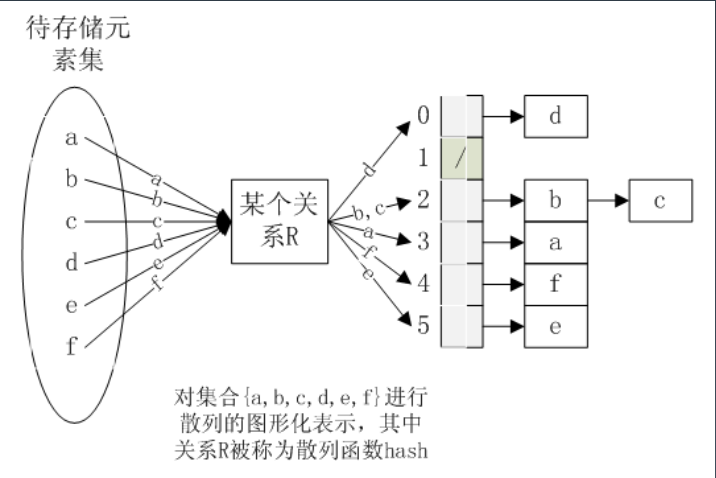

# 学习笔记

[TOC]

## <center>第一节：变量赋值</center>

### 变量赋值

* 可变数据类型
    - 列表 list
    - 字典 dict
* 不可变数据类型
    - 整型 int
    - 浮点型 float
    - 字符串型 string
    - 元组 tuple

> **p1_var.py**

``` python
# 问题1: a、b、c三个id是否相同
a = 123
b = 123
c = a
print(id(a))
print(id(b))
print(id(c))

#############
# 问题2: a、b、c的值分别是多少
a = 456
print(id(a))
c = 789
c = b = a

#############
# 问题3: x、y的值分别是什么
x = [1,2,3]
y = x
x.append(4)
print(x)
print(y)

#############
# 问题4: a、b的值分别是多少
a = [1, 2, 3]
b = a
a = [4, 5, 6]

#############
# 问题5: a、b的值分别是多少
a = [1, 2, 3]
b = a
a[0],a[1],a[2] = 4, 5, 6
```

## <center>第二节：容器序列的深浅拷贝</center>

### 序列

#### 序列分类

* 容器序列：`list`、`tuple`、`collections.deque`等，能存放下不同类型的数据。
* 扁平序列：`str`、`bytes`、`bytearray`、`memoryview（内存视图）`、`array.array`等，存放的是相同类型的数据 扁平序列只能容纳一种类型。

#### 可变类型存在深拷贝、浅拷贝问题

> <font color=red>注意：不可变类型（数字、字符串、元组）类型没有拷贝问题，只对容器序列类型有效</font>

``` python
import copy
copy.copy(object)
copy.deepcopy(object)
```

> **p2_copy.py**

``` python
# 容器序列的拷贝问题

old_list = [ i for i in range(1, 11)]

new_list1 = old_list
new_list2 = list(old_list)

# 切片操作
new_list3 = old_list[:]

# 嵌套对象
old_list.append([11, 12])

import copy
new_list4 = copy.copy(old_list)
new_list5 = copy.deepcopy(old_list)

assert new_list4 == new_list5 #True
assert new_list4 is new_list5 #False AssertionError

old_list[10][0] = 13
```

## <center>第三节：字典与扩展内置数据类型</center>

### 字典与哈希



``` PYTHON
In [29]: d = {}

In [30]: d[123]=123

In [31]: d['123']=456

In [33]: d['key'] = 'value'

In [34]: d[[1,2]] = 12
---------------------------------------------------------------------------
TypeError                                 Traceback (most recent call last)
<ipython-input-34-cbf65989b528> in <module>
----> 1 d[[1,2]] = 12

TypeError: unhashable type: 'list'

In [35]: d[(1,2)] = 12

In [36]: d[{}] = 12
---------------------------------------------------------------------------
TypeError                                 Traceback (most recent call last)
<ipython-input-36-424ca7d374a1> in <module>
----> 1 d[{}] = 12

TypeError: unhashable type: 'dict'
```

### 使用 collections 内置扩展数据类型

#### collections 提供了加强版的数据类型

* 官方文档：[collections 官方文档](https://docs.python.org/zh-cn/3.7/library/collections.html)

* **namedtuple**：带命名的元组

``` python
import collections
Point = collections.namedtuple('Point',['x','y'])
p = Point(11, y=22)
print(p[0] + p[1])
x,y = p
print(p.x + p.y)
print(p)
```

* **deque 双向队列**
* **Counter 计数器**

> **p3_collections.py**

``` python
# 命名元组
from collections import namedtuple
Point = namedtuple('Ponit', ['x','y'])
p = Point(10, y=20)
p.x + p.y
p[0] + p[1]
x, y = p

from collections import Counter
mystring = ['a','b','c','d','d','d','d','c','c','e']
# 取得频率最高的前三个值
cnt = Counter(mystring)
cnt.most_common(3)
cnt['b']

# 双向队列
from collections import deque
d = deque('uvw')
d.append('xyz')
d.appendleft('rst')
```

> **p4_abc.py**

``` python
from math import sqrt
from collections import namedtuple
import numpy as np
'''
计算欧式距离
'''

vector1 = np.array([1, 2, 3])
vector2 = np.array([4, 5, 6])

op1 = np.sqrt(np.sum(np.square(vector1 - vector2)))
op2 = np.linalg.norm(vector1-vector2)

print(op1)
print(op2)

Point = namedtuple('Point', ['x', 'y', 'z'])

class Vector(Point):
    def __init__(self, p1, p2, p3):
        # point用的nametuple是工厂函数，继承自tuple，去掉没影响，没影响是没用到tuple的init，但是不能保证所有的tuple功能都不受影响
        super(Vector).__init__()
        self.p1 = p1
        self.p2 = p2
        self.p3 = p3
    # __sub__魔术方法：实现运算符重载的功能，p1.__sub__(b)

    def __sub__(self, other):
        tmp = (self.p1 - other.p1)**2 + \
            (self.p2 - other.p2)**2+(self.p3 - other.p3)**2
        return sqrt(tmp)

p1 = Vector(1, 2, 3)
p2 = Vector(4, 5, 6)
print(p1 - p2)
```

## <center>第四节：函数的调用</center>

### 关注点

* 函数调用
    - 带括号：函数的执行的结果
    - 不带括号：传递的对象

``` python
In [4]: def func():
   ...:     pass
   ...: 

In [5]: func
Out[5]: <function __main__.func()>

In [6]: func()

In [7]: def func2():
   ...:     return 123
   ...: 

In [8]: func2
Out[8]: <function __main__.func2()>

In [9]: a = func2

In [10]: a
Out[10]: <function __main__.func2()>

In [11]: b = func2()

In [12]: b
Out[12]: 123

In [13]: a()
Out[13]: 123
In [14]: type(a)
Out[14]: function

In [15]: type(b)
Out[15]: int

In [16]: class Kls1(object):
    ...:     def __call__(self):
    ...:         return 123
    ...: 

In [17]: inst1 = Kls1()

In [18]: inst1
Out[18]: <__main__.Kls1 at 0x7f829eaf7750>

# 会使用到__call__的函数调用魔术方法
In [19]: inst1()
Out[19]: 123

In [20]: type(inst1())
Out[20]: int
```

* 作用域问题
* 参数处理
* 函数返回值

## <center>第五节：变量作用域</center>

> 变量作用域也叫命名空间：python中对变量进行创建、查找、删除等操作，会在一个名字的一段内存空间中操作完成，这段空间就是命名空间

### 变量作用域

#### 高级语言对变量的使用

* 变量生命
* 定义类型（分配内存空间大小）
* 初始化（赋值、填充内存）
* 引用（通过对象名称调用对象内存数据）

> python 和高级语言有很大差别，在模块、类、函数中定义，才有作用域的概念

> **p1_whatis_legb.py**

``` python
# 问题代码1
def func():
    var = 100
func()
print(var)

# 问题代码2
def func():
    print(var)
func()
var = 100
```

#### 变量作用域

> python作用域遵循 LEGB 规则

#### 含义解释

* L-Local(function)：函数内的名字空间
* E-Enclosing function locals：外部嵌套函数的名字空间（例如：closure）
* G-Global（module）：函数定义所在的模块（文件）的名字空间
* B-Builtin（Python）：python内置模块的名字空间

``` python
# L G
x = 'Global'
def func2():
    x = 'Enclosing'

    def func3():
        x = 'Local'
        print(x)
    func3()
print(x)
func2()

# E
# 闭包
x = 'Global'
def func4():
    x = 'Enclosing'
    def func5():
        return x
    return func5

var = func4()
print(var())

# B
print(dir (__builtins__) )
```

> **p2_why_legb.py**

``` python
# prog1 同名不同作用域问题
x = 1
def func():
    x = 2
func()
print(x)

# grog2 查找顺序问题
y = 2
def func2():
    print(y)

func2()

# prog3 error
def func3():
    z = 3
func3()
print(z)

# prog4 error
def func4():
    print(a)
func4()
a = 100
```

## <center>第六节：函数工具与高阶函数</center>

> **p1_args.py**

``` python
def func(*args, **kargs):
    print(f'{args: {args}}')
    print(f'{kargs: {kargs}}')
func(123, 'xz', name="xvalue")

# **kargs会优先获取关键字参数，剩下的参数才会传入*args
```

### 偏函数

* functools.partial：返回一个可调用的 partial 对象
* 使用方法： `partial(func, *args,**kw)`

> <font color=red>注意：  </font>
> func 是必须参数
> 至少需要一个 args 或 kw 参数

### Lambda表达式

> Lamdba 只是表达式，不是所有的函数逻辑都能封装进去

``` python
# x 就相当于函数的参数
k = lamdba x:x+1
print(k(1))

# 等价
def k(x):
    return x+1
print(k(x))
```

* Lambda 表达式后面只能有一个表达式
    - 实现简单函数的时候可以使用Lambda 表达式替代
    - 使用高阶函数的时候一般使用 Lambda 表达式

### 高阶函数

* 高阶：参数是函数、返回值是函数
* 常见的高阶函数：map、reduce、filter、apply

> apply 在 python2.3 被移除，reduce被放在functools 包中
> 推导式和生成器表达式可以替代 map 和 filter 函数

> **p4_highorderfunc.py**

``` python
# map
def square(x):
    return x**2

m = map(square, range(10))
next(m)
list(m)
[square(x) for x in range(10)]
dir(m)

# reduce
# reduce(f, [x1, x2, x3]) = f(f(x1, x2), x3)
from functools import reduce
def add(x, y):
    return x + y

reduce(add, [1, 3, 5, 7, 9])
#25

# filter
def is_odd(n):
    return n % 2 == 1

list(filter(is_odd, [1, 2, 4, 5, 6, 9, 10, 15]))

# 偏函数
def add(x, y):
    return x + y

import functools
add_1 = functools.partial(add, 1)
add_1(10)

import itertools
g = itertools.count()
next(g)
next(g)
auto_add_1 = functools.partial(next, g)
auto_add_1()

sorted(['bob', 'about', 'Zoo', 'Credit'])
sorted(['bob', 'about', 'Zoo', 'Credit'], key=str.lower)
sorted(['bob', 'about', 'Zoo', 'Credit'], key=str.lower, reverse=True)
```

#### 熟悉 [functools](https://docs.python.org/3/library/functools.html) 和 [itertools](https://docs.python.org/3/library/itertools.html) 官方文档

> `functools` 和 `itertools` 对函数操作的经常用到的两个标准库
> 需要熟练掌握常用的用法

## <center>第七节：闭包</center>

### 返回值

> 函数返回，有两个关键字

#### 返回的关键字

* return ：返回对象，对象类型函数自身不需要关注（可以返回基本数据类型的值；也可以返回函数对象，可以被继续调用）

* yield

#### 返回的对象

* 可调用对象——闭包（装饰器）

> **p3_1closure.py**

``` python
# version 1
# 函数是一个对象，所以可以作为某个函数的返回结果
def line_conf():
    def line(x):
        return 2*x+1
    return line  # return a function object
my_line = line_conf()
print(my_line(5))
```

> **p3_2closure.py**

``` python
# version 2
# 如果line()的定义中引用了外部的变量
def line_conf():

    b = 10
    def line(x):
        return 2*x+b
    return line       

my_line = line_conf()
print(my_line(5))
```

> **p3_3closure.py**

``` python
# version 3

def line_conf():
    b = 10
    def line(x):
        '''如果line()的定义中引用了外部的变量'''
        return 2*x+b
    return line       

b = -1
my_line = line_conf()
print(my_line(5))

# 编译后函数体保存的局部变量
print(my_line.__code__.co_varnames)
# 编译后函数体保存的自由变量
print(my_line.__code__.co_freevars)
# 自由变量真正的值
print(my_line.__closure__[0].cell_contents)

#####################
# 函数和对象比较有哪些不同的属性
# 函数还有哪些属性
def func(): 
    pass
func_magic = dir(func)

# 常规对象有哪些属性
class ClassA():
    pass
obj = ClassA()
obj_magic = dir(obj)

# 比较函数和对象的默认属性
set(func_magic) - set(obj_magic)
```

> **p3_4closure.py**

``` python
# version 4
def line_conf(a, b):
    def line(x):
        return a*x + b
    return line
line1 = line_conf(1, 1)
line2 = line_conf(4, 5)
print(line1(5), line2(5))
```

> 闭包特性：函数里面又定义了一个函数
> 外部函数和内部函数不太相关
> 外部函数一般作为我们想要定义某些功能初次去定义

> **p3_5closure.py**

``` python
# version 5
# 与line绑定的是line_conf()传入的a,b
a=100
b=200
def line_conf(a, b):
    def line(x):
        return a*x+b
    return line

line1 = line_conf(1, 1)
line2 = line_conf(4, 5)
print(line1(5), line2(5))
```

> **p3_6closure.py**

``` python
# 内部函数对外部函数作用域里变量的引用（非全局变量）则称内部函数为闭包

def counter(start=0):
   count=[start]
   def incr():
       count[0]+=1
       return count[0]
   return incr

c1=counter(10)

print(c1())
# 结果：11
print(c1())
# 结果：12

# nonlocal访问外部函数的局部变量
# 注意start的位置，return的作用域和函数内的作用域不同
def counter2(start=0):
    def incr():
        nonlocal start
        start+=1
        return start
    return incr
c1=counter2(5)
print(c1())
print(c1())

c2=counter2(50)
print(c2())
print(c2())

print(c1())
print(c1())

print(c2())
print(c2())
```

## <center>第八节：装饰器介绍</center>

> 底层通过闭包方式实现

### 装饰器

* 增强而不改变原有函数
* 装饰器强调函数的定义态而不是运行态
* 装饰器语法糖的展开

``` python
@decorate
def target():
    print('go something')

def target():
    print('do something')
target = decorate(target)
```

> target 表示函数
> target() 表示函数执行
> new = func 体现“一切皆对象”，函数也可以被当作对象进行赋值

### 被装饰函数

* 被修饰函数带参数
* 被修饰函数带不定长参数
* 被修饰函数带返回值

> **p1_decorate.py**

``` python
# PEP 318 装饰器  PEP-3129 类装饰器---推荐读

# 前置问题
def func1():
    pass
a=func1
b=func1()

# func1 表示函数
# func1() 表示执行函数

############################
# 装饰器, @ 语法糖
@decorate   
def func2():
    print('do sth')

# 等效于下面
def func2():
    print('do sth')
func2 = decorate(func2)

#############################

# 装饰器在模块导入的时候自动运行
# testmodule.py
def decorate(func):
    print('running in modlue')
    def inner():
        return func()
    return inner

@decorate
def func2():
    pass

# test.py
import testmodule
# from testmodule import func2
```

> **p2_how_decorate.py**

``` python
# 用在哪里
# Flask 的装饰器是怎么用的？
from flask import Flask
app = Flask(__name__)

@app.route('/')
def index():
   return '<h1>hello world </h1>'

# app.add_url_rule('/', 'index')

if __name__ == '__main__':
   app.run(debug=True)

# 注册
@route('index',methods=['GET','POST'])
def static_html():
    return  render_template('index.html')

# 等效于
static_html = route('index',methods=['GET','POST'])(static_html)()

def route(rule, **options):
    def decorator(f):
        endpoint = options.pop("endpoint", None)
        # 使用类似字典的结构以'index'为key 以 method static_html  其他参数为value存储绑定关系
        self.add_url_rule(rule, endpoint, f, **options)
        return f
    return decorator

###############################

# 包装
def html(func):
    def decorator():
        return f'<html>{func()}</html>'
    return decorator

def body(func):
    def decorator():
        return f'<body>{func()}</body>'
    return decorator

@html
@body
def content():
    return 'hello world'

content()
```

## <center>第九节：被装饰函数带参数和返回值的处理</center>

> **p3_funcion_args.py**

``` python
# 被修饰函数带参数
def outer(func):
    def inner(a,b):
        print(f'inner: {func.__name__}')
        print(a,b)
        func(a,b)
    return inner

@outer
def foo(a,b):
    print(a+b)
    print(f'foo: {foo.__name__}')
    
    
foo(1,2)
foo.__name__

############################################

# 被修饰函数带不定长参数

def outer2(func):
    def inner2(*args,**kwargs):
        func(*args,**kwargs)
    return inner2

@outer2
def foo2(a,b,c):
    print(a+b+c)
    
foo2(1,3,5)

############################################

# 被修饰函数带返回值

def outer3(func):
    def inner3(*args,**kwargs):
        ###
        ret = func(*args,**kwargs)
        ###
        return ret
    return inner3

@outer3
def foo3(a,b,c):
    return (a+b+c)
    
print(foo3(1,3,5))
```

> **p4_decorate_args.py**

``` python
# 装饰器带参数 

def outer_arg(bar):
    def outer(func):
        def inner(*args,**kwargs):
            ret = func(*args,**kwargs)
            print(bar)
            return ret
        return inner
    return outer

# 相当于outer_arg('foo_arg')(foo)()
@outer_arg('foo_arg')
def foo(a,b,c):
    return (a+b+c)
    
print(foo(1,3,5))

############################################

# 装饰器堆叠

@classmethod
@synchronized(lock)
def foo(cls):
    pass

def foo(cls):
    pass
foo2 = synchronized(lock)(foo)
foo3 = classmethod(foo2)
foo = foo3
```

## <center>第十节：python内置装饰器</center>

> **p5_wraps.py**

``` python
########################
# 内置的装饰方法函数

# functools.wraps
# @wraps接受一个函数来进行装饰
# 并加入了复制函数名称、注释文档、参数列表等等的功能
# 在装饰器里面可以访问在装饰之前的函数的属性
# @functools.wraps(wrapped, assigned=WRAPPER_ASSIGNMENTS, updated=WRAPPER_UPDATES)
# 用于在定义包装器函数时发起调用 update_wrapper() 作为函数装饰器。 
# 它等价于 partial(update_wrapper, wrapped=wrapped, assigned=assigned, updated=updated)。

from time import ctime,sleep
from functools import wraps
def outer_arg(bar):
    def outer(func):
        # 结构不变增加wraps
        @wraps(func)
        def inner(*args,**kwargs):
            print("%s called at %s"%(func.__name__,ctime()))
            ret = func(*args,**kwargs)
            print(bar)
            return ret
        return inner
    return outer

@outer_arg('foo_arg')
def foo(a,b,c):
    """  __doc__  """
    return (a+b+c)
    
print(foo.__name__)

########################
# flask 使用@wraps()的案例
from functools import wraps
 
def requires_auth(func):
    @wraps(func)
    def auth_method(*args, **kwargs):
        if not auth:
            authenticate()
        return func(*args, **kwargs)
    return auth_method

@requires_auth
def func_demo():
    pass

########################

from functools import wraps
 
def logit(logfile='out.log'):
    def logging_decorator(func):
        @wraps(func)
        def wrapped_function(*args, **kwargs):
            log_string = func.__name__ + " was called"
            print(log_string)
            with open(logfile, 'a') as opened_file:
                opened_file.write(log_string + '\n')
            return func(*args, **kwargs)
        return wrapped_function
    return logging_decorator
 
@logit()
def myfunc1():
    pass
 
myfunc1()
# Output: myfunc1 was called
 
@logit(logfile='func2.log')
def myfunc2():
    pass
 
myfunc2()

# Output: myfunc2 was called
```

> **p6_lru_cache.py**
> [timeit官方文档](https://docs.python.org/zh-cn/3.8/library/timeit.html#python-interface)

``` python
# functools.lru_cache
# 《fluent python》的例子 p169
# functools.lru_cache(maxsize=128, typed=False)有两个可选参数
# maxsize代表缓存的内存占用值，超过这个值之后，就的结果就会被释放
# typed若为True，则会把不同的参数类型得到的结果分开保存
import functools
@functools.lru_cache()
def fibonacci(n):
    if n < 2:
        return n
    return fibonacci(n-2) + fibonacci(n-1)

if __name__=='__main__':
    import timeit
    print(timeit.timeit("fibonacci(6)", setup="from __main__ import fibonacci"))
```

> 再引用《流畅的python》中一个例子

* 01、实现clock装饰器

``` python
import time
import functools

def clock(func):
    def clocked(*args, **kwargs):
        t0 = time.time()
        result = func(*args, **kwargs)
        elapsed = time.time() - t0
        name = func.__name__
        arg_lst = []
        if args:
            arg_lst.append(','.join(repr(arg) for arg in args))
        if kwargs:
            pairs = ['%s=%r' % (k, w) for k, w in sorted(kwargs.items())]
            arg_lst.append(','.join(pairs))
        arg_str = ','.join(arg_lst)
        print('[%0.8fs] %s(%s) -> %r' % (elapsed, name, arg_lst, result))
        return result
    return clocked
```

* 02、生成第 n 个斐波那契数，递归方式非常耗时，使用缓存实现，速度更快

``` python
import functools
from clockdeco import clock

@functools.lru_cache
@clock
def fibonacci(n):
    if n < 2:
        return n
    return fibonacci(n-2) + fibonacci(n-1)

if __name__ == "__main__":
    print(fibonacci(6))
```

## <center>第十一节：类装饰器</center>

> **p7_class_decorate.py**

``` python
# Python 2.6 开始添加类装饰器
from functools import wraps

class MyClass(object):
    def __init__(self, var='init_var', *args, **kwargs):
        self._v = var
        super(MyClass, self).__init__(*args, **kwargs)
    
    def __call__(self, func):
        # 类的函数装饰器
        @wraps(func)
        def wrapped_function(*args, **kwargs):
            func_name = func.__name__ + " was called"
            print(func_name)
            return func(*args, **kwargs)
        return wrapped_function

def myfunc():
    pass

MyClass(100)(myfunc)()
# 其他经常用在类装饰器的python自带装饰器
# classmethod
# staticmethod
# property

# 另一个示例
class Count(object):
    def __init__(self,func):
        self._func = func
        self.num_calls = 0
    
    def __call__(self, *args, **kargs):
        self.num_calls += 1
        print(f'num of call is {self.num_calls}')
        return self._func(*args, **kargs)

@Count
def example():
    print('hello')

example()
print(type(example))

# 其他常用的排序和计数相关用法
a = (1, 2, 3, 4)
a.sort()
# Traceback (most recent call last):
#   File "<stdin>", line 1, in <module>
# AttributeError: 'tuple' object has no attribute 'sort'
sorted(a)
# [1, 2, 3, 4]
# sorted 支持更多场景  多维list 字典混合list list混合字典

# 计数有没有更优雅、更Pythonic的解决方法呢？
# 答案是使用collections.Counter。
from collections import  Counter
Counter(some_data)
# 利用most_common()方法可以找出前N个出现频率最高的元素以及它们对应的次数
Counter(some_data).most_common(2)
```

## <center>第十二节：官方文档中的装饰器代码阅读指南</center>

## <center>第十三节：对象协议与鸭子类型</center>

> **p9_other.py**

``` python
# 官方文档装饰器的其他用途举例

# 向一个函数添加属性
def attrs(**kwds):
    def decorate(f):
        for k in kwds:
            setattr(f, k, kwds[k])
        return f
    return decorate

@attrs(versionadded="2.2",
       author="Guido van Rossum")
def mymethod(f):
    pass

##############################

# 函数参数观察器
import functools
def trace(f):
    @functools.wraps(f)
    def decorated_function(*args, **kwargs):
        print(f, args, kwargs)
        result = f(*args, **kwargs)
        print(result)
    return decorated_function
@trace
def greet(greeting, name):
    return '{}, {}!'.format(greeting, name)

greet('better','me')

############################################

# Python3.7 引入 Data Class  PEP557

class MyClass:
    def __init__(self, var_a, var_b):
        self.var_a = var_a
        self.var_b = var_b

    def __eq__(self, other):
        if self.__class__ is not other.__class__:
            return False
        return (self.var_a, self.var_b) == (other.var_a, other.var_b)
        
var3 = MyClass('x','y')
var4 = MyClass('x','y')

var3 == var4

from dataclasses import dataclass
@dataclass
class MyClass:
    var_a: str
    var_b: str

var_1 = MyClass('x','y')
var_2 = MyClass('x','y')

# 不用在类中重新封装 __eq__

var_1 == var_2
# 存在的问题: var_a var_b不能作为类属性访问

##########################

# 如下的类装饰器实现了一个用于类实例属性的Private声明
# 属性存储在一个实例上，或者从其一个类继承而来
# 不接受从装饰的类的外部对这样的属性的获取和修改访问
# 但是，仍然允许类自身在其方法中自由地访问那些名称
# 类似于Java中的private属性

traceMe = False
def trace(*args):
    if traceMe:
        print('['+ ' '.join(map(str,args))+ ']')

def Private(*privates):
    def onDecorator(aClass):
        class onInstance:
            def __init__(self,*args,**kargs):
                self.wrapped = aClass(*args,**kargs)
            def __getattr__(self,attr):
                trace('get:',attr)
                if attr in privates:
                    raise TypeError('private attribute fetch:'+attr)
                else:
                    return getattr(self.wrapped,attr)
            def __setattr__(self,attr,value):
                trace('set:',attr,value)
                if attr == 'wrapped': # 这里捕捉对wrapped的赋值
                    self.__dict__[attr] = value
                elif attr in privates:
                    raise TypeError('private attribute change:'+attr)
                else: # 这里捕捉对wrapped.attr的赋值
                    setattr(self.wrapped,attr,value)
        return onInstance
    return onDecorator

if __name__ == '__main__':
    traceMe = True

    @Private('data','size')
    class Doubler:
        def __init__(self,label,start):
            self.label = label
            self.data = start
        def size(self):
            return len(self.data)
        def double(self):
            for i in range(self.size()):
                self.data[i] = self.data[i] * 2
        def display(self):
            print('%s => %s'%(self.label,self.data))

    X = Doubler('X is',[1,2,3])
    Y = Doubler('Y is',[-10,-20,-30])
    print(X.label)
    X.display()
    X.double()
    X.display()
    print(Y.label)
    Y.display()
    Y.double()
    Y.label = 'Spam'
    Y.display()

    # 这些访问都会引发异常
    print(X.size())
    print(X.data)
    X.data = [1,1,1]
    X.size = lambda S:0
    print(Y.data)
    print(Y.size())

# 这个示例运用了装饰器参数等语法，稍微有些复杂，运行结果如下：
# [set: wrapped <__main__.Doubler object at 0x03421F10>]
# [set: wrapped <__main__.Doubler object at 0x031B7470>]
# [get: label]
# X is
# [get: display]
# X is => [1, 2, 3]
# [get: double]
# [get: display]
# X is => [2, 4, 6]
# [get: label]
# Y is
# [get: display]
# Y is => [-10, -20, -30]
# [get: double]
# [set: label Spam]
# [get: display]
```

### 对象协议

> Duck Typing 的概念

#### 容器类型协议

* `__str__` 打印对象时， 默认输出该方法的返回值
* `__getitem__`、`__setitem__`、`__delitem__`字典索引操作
* `__iter__`迭代器
* `__call__`可调用兑现该协议

#### 比较大小的协议

* `__eq__`
* `__gt__`

#### 描述符协议和属性交互协议

* `__get__`
* `__set__`

#### 可哈希对象

* `__hash__`

### 上下文管理器

#### with上下文表达式的用法

* 使用`__enter__()`、`__exit__()`实现上下文管理器

> **p1_duck.py**

``` python 

class Foo(object):

    # 用与方法返回
    def __str__(self):
        return '__str__ is called'

    # 用于字典操作
    def __getitem__(self, key):
        print(f'__getitem__ {key}') 
    
    def __setitem__(self, key, value):
        print(f'__setitem__ {key}, {value}')
    
    def __delitem__(self, key):
        print(f'__delitem__ {key}')

    # 用于迭代
    def __iter__(self):
        return iter([i for i in range(5)])

# __str__

bar = Foo()
print(bar)

# __XXitem__

bar['key1']
bar['key1']='value1'
del bar['key1']

# __iter__

for i in bar:

    print(i)

``` 

> **p2_FormatString.py**
```python 
import math
print('The value of Pi is approximately %5.3f.' % math.pi)

print('{1} and {0}'.format('spam', 'eggs'))

print('The story of {0}, {1}, and {other}.'.format(
    'Bill', 'Manfred', other='Georg'))

firstname = 'yin'
lastname = 'wilson'
print('Hello, %s %s.' % (lastname, firstname))
print('Hello, {1} {0}.'.format(firstname, lastname))
print(f'Hello, {lastname} {firstname}.')

f'{ 2 * 5 }'

class Person:
    def __init__(self, first_name, last_name):
        self.first_name = first_name
        self.last_name = last_name

    def __str__(self):
        return f'hello, {self.first_name} {self.last_name}.'

    def __repr__(self):
        return f'hello, {self.first_name} {self.last_name}.'

me = Person('yin', 'wilson')

print(f'{me}')
```

> **p3_typehint.py**

``` python
# typing 类型注解(type hint)

# 与鸭子类型相反的是静态类型，声明变量的时候就要指定类型，如果使用其他类型对变量赋值就会报错

def func(text: str, number: int) -> str:
    return text * number

func('a', 5)
```

## <center>第十四节：yield语句</center>

### 生成器——1

* 1、在函数中使用yield关键字，可以实现生成器
* 2、生成器可以让函数<font color=red>返回可迭代对象</font>
* 3、yield 和 return 不同，return 返回后，函数状态终止，yield保持函数的执行状态，返回后，函数回到之前保持的状态继续执行
* 4、函数被yield会暂停，局部变量也会保存
* 5、迭代器终止时，会抛出 Stoplteration 异常

### 生成器——2

``` python
print([i for i in range(0,11)])
```

替换为

``` python
gennumber = (i for i in range(0, 11))
print(next(gennumber))
print(next(gennumber))
print(next(gennumber))
print(next(gennumber))
print(listgennumber))
print([i for i in gennumber])
```

### 生成器——3

> `Iterables` ：包含 `__getitem__()` 或 `__iter()__` 方法的容器对象
> `Iterator` ：包含 `next()` 和 `__iter__()` 方法
> `Generator` ：包含 `yield` 语句的函数

> **p1_iter.py**

``` python
alist = [1, 2, 3, 4, 5]
hasattr( alist, '__iter__' )  # True
hasattr( alist, '__next__' )  # False

for i in  alist:
    print(i)

# 结论一  列表是可迭代对象，或称作可迭代（iterable）,
#         不是迭代器（iterator）

# __iter__方法是 iter() 函数所对应的魔法方法，
# __next__方法是 next() 函数所对应的魔法方法

###########################

g = ( i for i in range(5))
g  #<generator object>

hasattr( g, '__iter__' )  # True
hasattr( g, '__next__' )  # True

g.__next__()
next(g)
for i in g:
    print(i)

# 结论二 生成器实现完整的迭代器协议

##############################
# 类实现完整的迭代器协议

class SampleIterator:
    def __iter__(self):
        return self

    def __next__(self):
        # Not The End
        if ...:
            return ...
        # Reach The End
        else:
            raise StopIteration

# 函数实现完整的迭代器协议
def SampleGenerator():
    yield ...
    yield ...
    yield ...  # yield语句
# 只要一个函数的定义中出现了 yield 关键词，则此函数将不再是一个函数，
# 而成为一个“生成器构造函数”，调用此构造函数即可产生一个生成器对象。

###################
# check iter
def check_iterator(obj):
    if hasattr( obj, '__iter__' ):
        if hasattr( obj, '__next__' ):
            print(f'{obj} is a iterator') # 完整迭代器协议
        else:
            print(f'{obj} is a iterable') # 可迭代对象
    else:
        print(f'{obj} can not iterable') # 不可迭代

def func1():
    yield range(5)

check_iterator(func1)
check_iterator(func1())

# 结论三： 有yield的函数是迭代器，执行yield语句之后才变成生成器构造函数
```

## <center>第十五节：迭代器使用的注意事项【案例】</center>

> **p2_infinite.py**

``` python
# itertools的三个常见无限迭代器
import itertools

count = itertools.count()  # 计数器
next(count)
next(count)
next(count)

###############
cycle = itertools.cycle( ('yes', 'no') ) # 循环遍历
next(cycle)
next(cycle)
next(cycle)

###############
repeat = itertools.repeat(10, times=2)  # 重复
next(repeat)
next(repeat)
next(repeat)

################
# 有限迭代器
for j in itertools.chain('ABC',[1, 2, 3]) :
    print(j)

# Python3.3 引入了 yield from
# PEP-380
def chain(*iterables):
    for it in iterables:
        for i in it:
            yield i

s = 'ABC'
t = [1, 2, 3]
list(chain(s, t))

def chain2(*iterables):
    for i in iterables:
        yield from i   # 替代内层循环

list(chain2(s, t))
```

> **p3_destroy.py**

``` python
# 迭代器有效性测试
a_dict = {'a':1, 'b':2}
a_dict_iter = iter(a_dict)

next(a_dict_iter)

a_dict['c']=3

next(a_dict_iter)
# RuntimeError: 字典进行插入操作后，字典迭代器会立即失效

# 尾插入操作不会损坏指向当前元素的List迭代器,列表会自动变长

# 迭代器一旦耗尽，永久损坏
x = iter([ y for y in range(5)])
for i in x:
    i
x.__next__()
```

## <center>第十六节：yield表达式</center>

> **p4_yieldxp.py**

``` python
def jumping_range(up_to):
    index = 0
    while index < up_to:
        jump = yield index
        print(f'jump is {jump}')
        if jump is None:
            jump = 1   # next() 或者 send(None)
        index += jump
        print(f'index is {index}')

if __name__ == '__main__':
    iterator = jumping_range(5)
    print(next(iterator)) # 0
    print(iterator.send(2)) # 2
    print(next(iterator)) # 3
    print(iterator.send(-1)) # 2
    for x in iterator:
        print(x) # 3,
```

## <center>第十七节：协程简介</center>

> 协程通常与多线程一起使用。
> 协程：提高I/O密集型程序的工作效率，对与有I/O密集型应用，有GIL锁，如CPython可以提高效率

### 协程和线程的区别

* 协程是异步，线程是同步的
* 协程是非抢占式的，协程是抢占式的
* 协程是被动调度的，协程是主动调度的
* 协程可以暂停函数的执行，保留上一次调用的状态，是增强型生成器
* 协程是用户级的任务调度，协程是内核级的任务调度
* 协程适用于I/O密集型程序，不适用于CPU密集型程序的处理

### 异步编程

* python3.5版本引入了await取代yield from 方式

``` python
import asyncio
async def py35_coro():
    await stuff()
```

> 注意：await接收的对象必须是 awaitable 对象
> awaitable 对象定义了 `__await__()` 方法

* awaitable 对象有三类：
    - 1、协程 coroutine
    - 2、任务 Task
    - 3、未来对象 Future

> **p5_yieldfrom.py**

``` python
# Python3.3之后引入了新语法 yield from
def ex1():
    yield 1
    yield 2
    return 3

def ex2():
    ex1_result = yield from ex1()
    print(f'ex1 : {ex1_result}')
    yield None

gen1 = ex1()
gen1.send(None) # 1
gen1.send(None) # 2
gen1.send(None) # send 执行到return 返回 StopIteration: 3

for i in ex2():
    print(i)
# 1
# 2
# ex1:3
# None

##########################
def bottom():
# Returning the yield lets the value that goes up the call stack to come right back
# down.
    return (yield 42)

def middle():
    return (yield from bottom())

def top():
    return (yield from middle())

# Get the generator.
gen = top()
value = next(gen)
print(value) # Prints '42'.
try:
    value = gen.send(value * 2)
except StopIteration as exc:
    value = exc.value
print(value) # Prints '84'
```

> **p6_async_await.py**

``` python
# python3.4 支持事件循环的方法
import asyncio

@asyncio.coroutine
def py34_func():
    yield from sth()

##################
# python3.5 增加async await
async def py35_func():
    await sth()

# 注意： await 接收的对象必须是awaitable对象
# awaitable 对象定义了__await__()方法
# awaitable 对象有三类
# 1 协程 coroutine
# 2 任务 Task
# 3 未来对象 Future
#####################
import asyncio
async def main():
    print('hello')
    await asyncio.sleep(3)
    print('world')

# asyncio.run()运行最高层级的conroutine
asyncio.run(main())
# hello
# sleep 3 second
# world

#################
# 协程调用过程：
# 调用协程时，会被注册到ioloop，返回coroutine对象
# 用ensure_future 封装为Future对象
# 提交给ioloop
```

> **[asyncio官方文档](https://docs.python.org/zh-cn/3/library/asyncio-task.html)**

## <center>第十八节：aiohttp简介</center>

> **p8_aiohttp2.py**

* **[aiohttp官方文档](https://hubertroy.gitbooks.io/aiohttp-chinese-documentation/content/aiohttp%E6%96%87%E6%A1%A3/ServerTutorial.html)**

``` python
# Web Server
from aiohttp import web

# views
async def index(request):
    return web.Response(text='hello aiohttp')

# routes
def setup_routes(app):
    app.router.add_get('/', index)

# app
app = web.Application()
setup_routes(app)
web.run_app(app, host='127.0.0.1', port=8080)
```

> **p7_aiohttp1.py**

``` python
import aiohttp
import asyncio

url = 'http://httpbin.org/get'

async def fetch(client, url):
    # get 方式请求url
    async with client.get(url) as resp:
        assert resp.status == 200
        return await resp.text()

async def main():
    # 获取session对象
    async with aiohttp.ClientSession() as client:
        html = await fetch(client, url)
        print(html)

loop = asyncio.get_event_loop()
task = loop.create_task(main())
loop.run_until_complete(task)
# Zero-sleep 让底层连接得到关闭的缓冲时间
loop.run_until_complete(asyncio.sleep(0))
loop.close()
```

> **p9_mapaio.py**

``` python
import aiohttp
import asyncio

urls = [
    'http://httpbin.org',
    'http://httpbin.org/get',
    'http://httpbin.org/ip',
    'http://httpbin.org/headers'
]

async def  crawler():
    async with aiohttp.ClientSession() as session:
        futures = map(asyncio.ensure_future, map(session.get, urls))
        for task in asyncio.as_completed(futures):
            print(await task)

if __name__ == "__main__":
    ioloop = asyncio.get_event_loop()
    ioloop.run_until_complete(asyncio.ensure_future(crawler()))
```

> **p10_proc_con.py**

``` python
# 进程池和协程

from multiprocessing import Pool
import asyncio
import time

async def test(time):
    await asyncio.sleep(time)

async def main(num):
    start_time = time.time()
    tasks = [asyncio.create_task(test(1)) for proxy in range(num)]
    [await t for t in tasks]
    print(time.time() - start_time)

def run(num):
    asyncio.run(main(num))

if __name__ == "__main__":
    start_time = time.time()
    p = Pool()
    for i in range(4):
        p.apply_async(run, args=(2500,))
    p.close()
    p.join()
    print(f'total {time.time() - start_time}')
```
