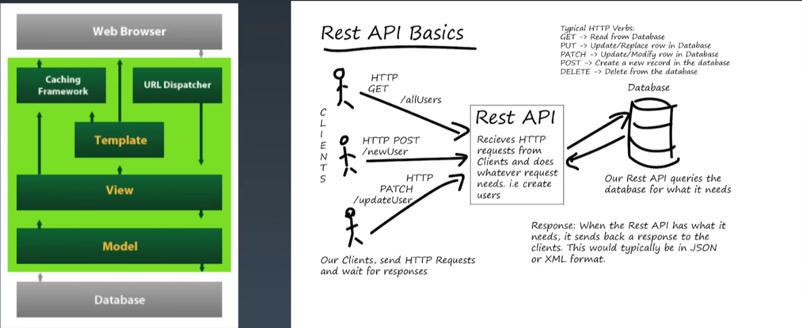
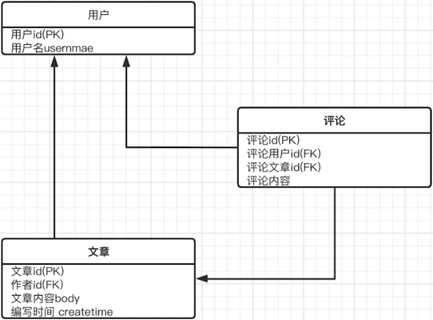

# 学习笔记

[TOC]

## <center>第一节：后端开发为什么要前后端分离模式</center>

### 前后端分离

* 前后端职责不清
* APP类应用开发模式无法和MVC/MTV兼容
* 对前端性能造成局限



## <center>第二节：REST APT用途和书写规范</center>

### REST概念

* REST(Representational State Transfer)直接翻译的意思是"表现层状态转化"
* 基本工作过程
    - 服务端将内部资源发布REST服务
    - 客户端通过URL来定位这些资源并通过HTTP协议来访问它们

### 动词

* 一共五种
    - GET：读取（Read）
    - POST：新建（Create）
    - PUT：更新（Update）
    - PATCH：更新（Update），通常是部分更新
    - DELETE：删除（Delete）

### 规范

* 系统上的一切对象都要抽象为资源；
* 每个资源对应唯一的资源标识（URI）；
* 对资源的操作不能改变资源标识（URI）本身；
* 所有的操作都是无状态的。

> 例子

``` python
    "meta":{
        "success": true,
        "message": "ok"
    },
    "data": ...
```

### 风格指引

* 尽量将API部署在专用域名之下
* 应该将API的版本号放入URL
* 路径又称“终点”(endpoint)，表示API的具体网址
* API应该提供参数，过滤返回结果
* 服务器应该向用户返回正确的状态码和提示信息
* 最好做到Hypermedia，即返回解雇欧中提供链接，连向其他API方法，使得用户不查文档，也知道下一步应该做什么

> 说明：GitHub就是一个标准的REST API的网站

## <center>第三节：使用Django快速实现REST API</center>

### [Django REST framework API 指南](https://www.bookstack.cn/read/django-rest-framework-api-guide/api-guide-serializers.md)

### Django 实现REST API

#### 实战Django实现REST API

* 安装

``` python
# Django 不支持REST API功能，需要安装djangorestframework扩展包
pip install djangorestframework
```

* 序列化

``` python
from rest_framework import serializers
```

* Views

``` python
FBV vs CBV
FBV: 函数方式
CBV：类方式
```

[工程代码](课程代码/TUTORIAL)

## <center>第四节：实现用户登录注册验证功能</center>

## <center>第五节：实现文章关联功能</center>

[工程代码](课程代码/MICROBLOG_v1)

## <center>第六节：给Django REST framework扩展文档和用户创建功能</center>

* 本节问题

1、扩展字段
2、目前用户基于admin管理界面创建的用户，用户自己注册，也需要提供相应的接口
3、开发文档自动生成
4、测试（命令行测试）

[工程代码](课程代码/MICROBLOG_v2)

## <center>第七节：如何扩展现有用户属性</center>

[工程代码](课程代码/MICROBLOG_v2)

[扩展现有的用户（User）模型——官方文档](https://docs.djangoproject.com/zh-hans/2.2/topics/auth/customizing/#extending-the-existing-user-model)

## <center>第八节：增加评论功能，实现两个自定义Model的关联屏</center>

[工程代码](课程代码/MICROBLOG_v3)

* ER图



## <center>第九节：实现搜索和站内消息</center>

[django-filter_Quickstart](https://django-filter.readthedocs.io/en/latest/guide/rest_framework.html#quickstart)

[django-notifications-hq站内消息通知](https://pypi.org/project/django-notifications-hq/)
