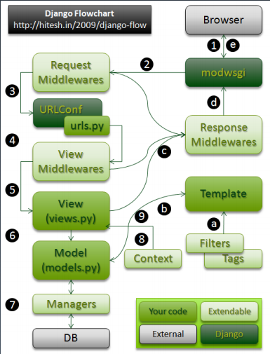

# 学习笔记

## <center>第一节：Django源码分析之URLconf的偏函数</center>

> 注意：代码不用通读，了解Django里最主要的几个逻辑代码

最常用最基本的就是主要代码，主要包括四个部分：
1、URLconf：怎么来处理用户请求路径，然后将路径转成 View 视图。

2、View 视图：关联了 Model 模型，关联了 Template 模板；view 视图怎么处理用户请求到用户返回的整个流程。

3、Template模板：编写Template时，会有不同的特殊符号，如：两个花括号括起来的就是变量，还可以括起一些特殊功能

4、Model模型：会用到查询管理器，默认叫object，用了此功能后会自动创建主键

### 查看 URLconf 源代码

#### 学习目标

1、要求看懂源代码讲述什么
2、老师是如何通过源代码学习一个软件，会去看什么、思考哪部分内容

> MyDjango/index/urls.py
> 从掩码层面对比path()、re_path()区别

``` python
... ...

urlpatterns = [
    # path 和 re_path 在实现的时候有什么差别？
    # Ctrl + 光标 跟踪查看源码
    path('', views.index),
    re_path('(?P<year>[0-9]{4}).html', views.myyear, name='urlyear'),
    ### 带变量的URL
    path('<int:year>', views.year),  # 只接收整数，其他类型返回404
    path('<int:year>/<str:name>', views.name),
    # path('<myint:year>', views.year), # 自定义过滤器
    path('books', views.books),
    path('test1', views.test1),
    path('test2', views.test2),
]
```

> path -- > partial(functiontools中标准库) --> 访问官方文档查阅标准库

\# site-packages\django\urls\conf.py
[functools 官方文档](https://docs.python.org/zh-cn/3.7/library/functools.html#functools.partial)

``` python
... ...

path = partial(_path, Pattern=RoutePattern)
re_path = partial(_path, Pattern=RegexPattern)
```

#### partial 函数的实现

partial 偏函数函数功能：固定后面所得的函数参数，用于不同场景传入不定个数参数；不必要的参数固定，只传入必要参数

``` python
# partial 函数实现
def partial(func, *args, **keywords):
    def newfunc(*fargs, **fkeywords):
        newkeywords = keywords.copy()
        newkeywords.update(fkeywords)
        return func(*args, *fargs, **newkeywords)
    newfunc.func = func
    newfunc.args = args
    newfunc.keywords = keywords
    return newfunc

# 官方文档demo
from functools import partial
basetwo = partial(int, base=2)
basetwo.__doc__ = 'Convert base 2 string to an int.'
basetwo('10010')

> 18
```

注意：
1、partial 第一个参数必须是可调用对象
2、参数传递顺序是从左到右，但不能超过原函数参数个数
3、关键字参数会覆盖 partial 中定义好的参数

思考：
1、闭包(装饰器)
2、怎么实现参数处理的
3、出了实现功能，还考虑了那些额外的功能

## <center>第二节：Django源码分析之URLconf的include</center>

path有的是正常路径，有的是正则，还有的是一个include，通过urls.py引入另外的文件

### include 函数

\# site-packages/django/urls/conf.py

``` python
def include(arg, namespace=None):
    if isinstance(arg, tuple):
        pass
    if isinstance(urlconf_-module, str):
        urlconf_module = import_module(urlconf_module)
        patterns = getattr(urlconf_module, 'urlpatterns', urlconf_module)
        app_name = getattr(urlconf_module, 'app_name', app_name)
    if isinstance(patterns, (list, tuple)):
        pass
    return (urlconf_module, app_name, namespace)
```

实际代码

``` python
def include(arg, namespace=None):
    # arg: index urls
    app_name = None
    
    # 如果是元祖类型进行拆分('douban.index','douban')
    if isinstance(arg, tuple):
        # Callable returning a namespace hint.
        try:
            urlconf_module, app_name = arg
        except ValueError:
            if namespace:
                raise ImproperlyConfigured(
                    'Cannot override the namespace for a dynamic module that '
                    'provides a namespace.'
                )
            raise ImproperlyConfigured(
                'Passing a %d-tuple to include() is not supported. Pass a '
                '2-tuple containing the list of patterns and app_name, and '
                'provide the namespace argument to include() instead.' % len(arg)
            )
    else:
        # No namespace hint - use manually provided namespace.
        urlconf_module = arg
    # 如果是字符串类型，获得两个新的属性并返回urlconf_module对象本身
    if isinstance(urlconf_module, str): 
        # 导入模块 urlconf_module, index.urls
        urlconf_module = import_module(urlconf_module)
        # print(urlconf_module)
        # <module 'index.urls' from '.../index/urls.py'>
        # <module 'Douban.urls' from '.../urls.py'>
    patterns = getattr(urlconf_module, 'urlpatterns', urlconf_module)
    app_name = getattr(urlconf_module, 'app_name', app_name)
    if namespace and not app_name:
        raise ImproperlyConfigured(
            'Specifying a namespace in include() without providing an app_name '
            'is not supported. Set the app_name attribute in the included '
            'module, or pass a 2-tuple containing the list of patterns and '
            'app_name instead.',-
        )
    namespace = namespace or app_name
    # Make sure the patterns can be iterated through (without this, some
    # testcases will break).

    # print(patterns)
    # [<URLPattern '' [name='auth_group_changelist']>, ...]
    # [<URLPattern '<id>/password/' [name='auth_user_password_change']>, ...]
    # [<URLPattern ''>,<URLPattern '(?P<year>[0-9]{4}.html' [name='urlyear']>, ...]
    # [<URLPattern 'douban'>]

    if isinstance(patterns, (list, tuple)):
        for url_pattern in patterns:
            # 获取导入的文件的url_pattern，最终会获得douban.url的urlpattern
            pattern = getattr(url_pattern, 'pattern', None)
            if isinstance(pattern, LocalePrefixPattern):
                raise ImproperlyConfigured(
                    'Using i18n_patterns in an included URLconf is not allowed.'
                )
    # 返回列表或URLconf模块，app_name、namespace可能为空
    return (urlconf_module, app_name, namespace)
```

## <center>第三节：Django源码分析之 view 视图的请求过程</center>

请求过程由 WSGI 创建

view 既可以加载模型里的数据，又可以通过render方法来渲染Template模板，功能非常强大，代码量也比较多。可以把render部分归类到Template，凡是和模型相关的都归属到模型，比如查询管理器
归类完后，还有其最核心功能：URLconf匹配了路径，然后来到view视图，view视图处理用户发过来的请求，并且把请求返回给用户

代码追踪：
HttpRequest --> 查看学习HttpRequest/QueryDict两个类 --> 查看MultiValueDict类

## <center>第四节：Django源码分析之 view 视图的响应过程</center>

返回过程由程序员创建

view 其实只关注一件事，要么返回带有内容的HttpResponse对象，要么产生错误抛出异常，如返回404。这是 view 视图返回过程要做的一个相应处理

### 响应

index/views.py

``` python
def test1(request):
    # 已经引入了HttpResponse
    # from django.http import HttpResponse
    response1 = HttpResponse()
    response2 = HttpResponse("Any Text", content_type="text/plain")

    return response2

def test2(request):
    # 使用HttpResponse的子类，官方文档查找
    from django.http import JsonResponse
    response3 = JsonResponse({'foo': 'bar'})  # response.content
    response3['Age'] = 120

    from django.http import HttpResponseNotFound
    response4 = HttpResponseNotFound('<h1>Page not found</h1>')
    return response4
```

[Django 官方文档](https://docs.djangoproject.com/zh-hans/2.2/topics/) --> 搜索 HttpResponse --> 查找例子学习

## <center>第五节：Django源码分析之 view 视图的请求响应完整流程</center>



墨绿色：Django自身代码
浅绿色：程序员实现的代码
Extendable：可扩展，中间件
External：外部工具，如浏览器、数据库

### Django完整流程详细介绍：

1、首先，通过HTTP客户端(如：浏览器、爬虫)发起请求，并且访问到 modwsgi (通过 python manager.py runserver启动， 会给每个用户生成一个Handler句柄，WSGIHandler类，控制整个请求到响应流程)

2、然后会经过请求中间件(Request Middlewares，对请求做一个全局预处理)，功能是，在这可以做反爬虫(如：请求过来判断有没有cookie、有没有特殊的http头的一些校验，如果没有就直接返回 --> 返回中间件 Response Middiewares， 好处：不用消耗计算资源，直接返回；逻辑简单)，Request Middlewares还会涉及到安全性验证，比如网上一种叫**跨站攻击**，也就是一个未授权的请求，全站都需要有这样一个保护机制，全站保护机制就可以在 Response Middiewares 中实现，叫 **CSRF** 的配置

3、请求中间件通过了，来到 URLconf，根据 urls.py 方式接受用户请求并后面进行访问

4、经过 urls.py 处理过之后，来到 View Middlewares 中间件，可以在请求 view 视图之前对 Request 做一些处理，如果有问题通过(Response Middlewares --> modwsgi 返回给HTTP客户端)

5、通过了 View Middlewares 中间件后，来到 View 视图，程序员自己编写的来调用 view 视图的函数如何定义返回(View视图views.py --> Response Middlewares --> modwsgi 返回给HTTP客户端)。

6、View 视图，如果不是直接返回，会引用到数据库中一些数据时，就来到 Model (models.py，程序员实现)， 之后来到 Managers(扩展，是模型的查询管理器)，然后访问数据库，再返回给 Managers --> Model --> Template --> Model --> View视图 --> Response Middlewares --> modwsgi 返回给HTTP客户端

7、如果 View 视图中，没有调用相应 Model ，而是直接通过 render 返回模板(程序员自己编写)，然后模板直接进行一个返回

进入和返回都通过了 WSGI 模块，Django做了一个功能，就是当产生新的请求时，通过 HttpRequest 类产生一个 request 实例，每次请求都会带着实例(每次编写view时，第一个参数是request)

字母标注的代表一些扩展

Context上下文：View视图操作之前 或 Model 操作之后，然后统一做一些事情，又不希望 View 和 Model 之前耦合太深，所以会加 context 功能，是为了进一步地让 View 和 Model 进行解耦，上下文还可以判断当前运行的一些状态

modwsgi其实就是 manager.py 中的 WSGIHandler 这个类，Django 初始化的时候就会产生这样一个实例，来去监听请求和响应的一个完成。该实例还会在当请求来了自动从 HttpRequest 类实例化一个 request 对象

注意：现在学的 request ，一般 GET 方式请求，如果使用 POST 方式请求时，特别注意，其实不包含上传文件的数据的，Django会把上传文件数据放在， _files 属性中，只有 Conten-Type 是 multipart/form-data 的时候这种情况下才会有数据

中间件会做全局性质的处理

## <center>第六节：Django源码分析之 model 模型的自增主键创建</center>

值得研究的源代码，定义模型的时候，自己定义的模型类去继承 models. Model(一定要继承)，继承之后的好处，可以让 Django 自动创建一个叫 id 的主键，还有再查询的时候，可以使用内置的查询命令(查询管理器Managers所绑定的命令)，还可以通过绑定的命令来进行简单的 CRUD (创建、读取查询、更新、删除)

## Model

为什么自定义的 Model 要继承 models. Model？

* 不需要显式定义主键
* 自动拥有查询管理器对象
* 可以使用 ORM API 对数据库、表实现 CRUD

``` python
# 作品名称和作者(主演)
class Name(models.Model):
    # id 主键
    name = models.CharField(max_length=50)
    author = models.CharField(max_length=50)
    stars = models.CharField(max_length=5)
```

Model --> site-packages/django/db/models/base.py --> ModelBase类、 \_prepare --> 点击line: 118 Options --> \_prepare函数

metaclass元类: 在去创建类的时候，不希望默认这种 new 的方式去创建，创建类的时候希望增加一些，我自身额外功能，这种情况下才会使用元类。
metaclass元类的父类必须是 type ，而不能是 object ，还有就是实现 `__new__` 魔术方法，在这个方法中，返回的必须是一个类

## <center>第七节：Django源码分析之 model 模型的查询管理器</center>

### 查询管理器

``` python
def books_short(request):
    ### 从 models 取数据传给 template ###
    shorts = T1.objects.all()
```

* 如何让查询管理器的名称不叫做 objects？
* 如何利用 Manager(objects) 实现对 Model 的 CRUD？
* 为什么查询管理器返回 QuerySet 对象？

\# site-packages/django/db/models/manager.py

``` python
class Manager(BaseManager.from_queryset(QuerySet)):
    pass
```

Manager 继承自 BaseManagerFromeQuerySet 类，拥有 QuerySet 的大部分方法，get、create、filter 等方法都来自 QuerySet

Manager --> BaseManager
views.py --> object -->  objects: ClassVar[BaseManager[Any]]

## <center>第八节：Django源码分析之template模板的加载文件</center>

render函数：模板渲染，也对Django底层进行大量封装

### 主要关注两个功能

1、render怎么找到template目录
2、在setting.py中定义了模板的一系列配置，这些配置在模板查找的时候起到什么样的功能？在使用模板的时候不单单把HTML进行展现，还对里面带花括号的过滤器、以及变量替换，都替换成Django或者说python中的变量

### 模板引擎

* 模板引擎怎么通过 render() 加载 HTML 文件？
* 模板引擎怎么对模板进行渲染？

``` python
def books_short(request):
    return render(request, 'result.html', locals())
```

\# site-packages/django/shortcuts.py

``` python
def render(request, template_name, context=None, content_type=None, status=None, using=None):
    """
    Return a HttpResponse whose content is filled with the result of calling
    django.template.loader.render_to_string() with the passed arguments.
    """
    content = loader.render_to_string(template_name, context, request, using=using)
    return HttpResponse(content, content_type, status)
```

views.py --> render --> render_to_string --> get_template

### 模板引擎

``` python
class EngineHandler:
    @cached_property
    def templates(self):
        if self._templates is None:
            self._templates = settings.TEMPLATES

        templates = OrderedDict()
        backend_names = []
        for tpl in self._templates:
            try:
                # This will raise an exception if 'BACKEND' doesn't exist or
                # isn't a string containing at least one dot.
                default_name = tpl['BACKEND'].rsplit('.', 2)[-2]
            except Exception:
                invalid_backend = tpl.get('BACKEND', '<not defined>')
                raise ImproperlyConfigured(
                    "Invalid BACKEND for a template engine: {}. Check "
                    "your TEMPLATES setting.".format(invalid_backend))

            tpl = {
                'NAME': default_name,
                'DIRS': [],
                'APP_DIRS': False,
                'OPTIONS': {},
                **tpl,
            }

            templates[tpl['NAME']] = tpl
            backend_names.append(tpl['NAME'])
    return templates
```

### 加载模板文件

\# site-packages/django/template/loder.py

``` python
def get_template(template_name, using=None):
    ...
    # engine 定义在初始化函数中，是Engine类的实例
    # Engine类在 site-packages/django/template/engine.py 文件中
    return engine.get_template(template_name)
```

\# site-packages/django/template/engine.py

``` python
class Engine:
    def get_template(self, template_name):
        """
        Return a compiled Template object for the given template name,
        handling template inheritance recursively.
        """
        template, origin = self.find_template(template_name)
        if not hasattr(template, 'render'):
            # template needs to be compiled
            template = Template(template, origin, template_name, engine=self)
        return template
```

## <center>第九节：Django源码分析之template模板的渲染</center>

\# site-packages/django/template/backends/django.py

``` python
class Template:
    def __init__(self, template, backend):

    def render(self, context=None, request=None):
        return self.template.render(context)
```

其实调用了下面这个template，需要从这个template开始分析
\# site-packages/django/template/base.py

``` python
... ...
class Template:
    def __init__(self, template_string, origin=None, name=None, engine=None):
        # If Template is instantiated directly rather than from an Engine and
        # exactly one Django template engine is configured, use that engine.
        # This is required to preserve backwards-compatibility for direct use
        # e.g. Template('...').render(Context({...}))
        if engine is None:
            from .engine import Engine
            engine = Engine.get_default()
        if origin is None:
            origin = Origin(UNKNOWN_SOURCE)
        self.name = name
        self.origin = origin
        self.engine = engine
        # source存储的是模板文件中的内容
        self.source = str(template_string)  # May be lazy.
        # 模板会把内容分割成tokens这样的东西，tokens方法把文件内容按照预定义好的
        # 正则表达式分割成一个一个的列表，每个元素都叫做token类型，token类型会对
        # 对应内容进行解析，解析好之后会做一个实例化，实例化就叫做node，compile_nodelist()
        # 返回一个对象叫nodelist
        self.nodelist = self.compile_nodelist()

    def __iter__(self):
        for node in self.nodelist:
            yield from node

    def _render(self, context):
        return self.nodelist.render(context)

    def render(self, context):
        "Display stage -- can be called many times"
        with context.render_context.push_state(self):
            if context.template is None:
                with context.bind_template(self):
                    context.template_name = self.name
                    return self._render(context)
            else:
                return self._render(context)
... ...
```

### 模板渲染

如果是 Node 类型，则会调用 render_annotated 方法获取渲染结果，否则直接将元素本身作为结果，继续跟踪 bit = node.render_annotated(context)

``` python
# Node 类的两个子类
class TextNode(Node):
    def render(self, context):
        # 返回对象(字符串)本身
        return self.s

class VariableNode(Node):
    def render(self, context):
        try:
            # 使用resolve()解析后返回
            output = self.filter_expression.resolve(context)

class FilterExpression:
    def resolve(self, context, ignore_failures=False):

# 如何解析引用类 class Lexer
class Lexer:
    def tokenize(self):
        # split 分割匹配的字串并返回列表
        # tag_re 是正则表达式模式对象
        for bit in tag_re.split(self.template_string):
            ... ...
        return result

    # 定义四种 token 类型
    def create_token(self, token_string, position, lineno, in_tag):
        if in_tag and not self.verbatim:
            # 1 变量类型， 开头为{{
            if token_string.startswith(VARIABLE_TAG_START):
                return Token(TokenType.VAR, token_string[2:-2].strip(), position, lineno)
            # 2 块类型，开头为%
            elif token_string.startswith(BLOCK_TAG_START):
                if block_content[:9] in ('varbatim', 'verbatim '):
                    self.verbatim = 'end%s' % block_content
                    return Token(TokenType.BLOCK, block_content, position, lineno)
            # 3 注释类型，开头为{#
            elif token_string.startswith(COMMENT_TAG_START):
                content = "
                if token_string.find(TRANSLATOR_COMMENT_MARK):
                    content = token_string[2:-2].strip()
                    return Token(TokenType.COMMENT, content, position, lineno)
            else:
                # 0 文本类型， 字符串字面值
                return Token(TokenType.TEXT, token_string, position, lineno)
```
