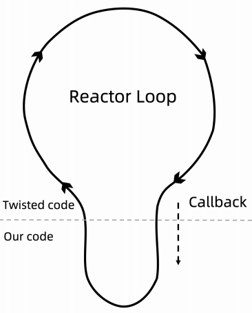

# 学习笔记

## 第一节：Scrapy并发参数优化原理

### 学习参考文档

[Twisted 学习参考文档](https://pypi.org/project/Twisted/)
[asyncio — 异步 I/O 学习文档](https://docs.python.org/zh-cn/3.7/library/asyncio.html)

requests: 同步请求数据

### Scarapy 参数优化

settings.py 参数调优

``` python
# Configure maximum concurrent requests performed by Scrapy (default: 16)
# CONCURRENT_REQUESTS = 32

# Configure a delay for requests for the same website (default: 0)
# 下载延时，3秒
DOWNLOAD_DELAY = 3

# The download delay setting will honor only one of:
# 域名 和 ip 进行设置
# CONCURRENT_REQUESTS_PER_DOMAIN = 16
# CONCURRENT_REQUESTS_PER_IP = 16
```

### 基于 twisted 的异步 IO 框架

多任务模型分为同步模型和异步模型
Scrapy 使用的是 Twisted 模型

Twisted 是异步编程模型，任务之间互相独立，用于大量 I/O 密集操作



[twisted_demo](twisted_demo.py)

``` python
from twisted.internet import defer
from twisted.web.client import getPage
from twisted.internet import reactor

def response(*args, **kwargs):
    # print(args, kwargs)
    print('返回网页的内容')

def callback(*args):
    print('执行了一个回调',args)

@defer.inlineCallbacks
def start(url):
    d = getPage(url.encode('utf-8'))
    d.addCallback(response)
    d.addCallback(callback)
    yield d

def stop(*args, **kwargs):
    reactor.stop()

urls = ['http://www.baidu.com','http://www.sougou.com']
li = []

for url in urls:
    ret = start(url)
    li.append(ret)
print(li)

d = defer.DeferredList(li)
d.addBoth(stop)
reactor.run()
```

## 第二节：多进程：进程的创建

### 多进程模型

多进程、多线程、协程的目的都是希望尽可能多处理任务

产生新的进程可以使用以下方式：

``` python
os.fork()
multiprocessing.Process()
```

多进程的第一个问题：进程的父子关系

[p1_firstproc.py](1进程/p1_firstproc.py)

``` python
# only for linux mac

# fork()
import os

os.fork()
print('1111111111')
# 执行结果：
# 1111111111
# 1111111111
# # fork函数一旦运行就会生出一条新的进程，2个进程一起执行导致输出了2行
```

[p2_fork.py](1进程/p2_fork.py)

``` python
# 区分父子进程
import os
import time

res = os.fork()
print(f'res == {res}')

if res == 0:
    print(f'我是子进程,我的pid是:{os.getpid()}我的父进程id是:{os.getppid()}')
else:
    print(f'我是父进程,我的pid是: {os.getpid()}')

# fork()运行时，会有2个返回值，返回值为大于0时，此进程为父进程，且返回的数字为子进程的PID；当返回值为0时，此进程为子进程。
# 注意：父进程结束时，子进程并不会随父进程立刻结束。同样，父进程不会等待子进程执行完。
# 注意：os.fork()无法在windows上运行。
```

[p3_process.py](1进程/p3_process.py)

``` python
# 参数
# multiprocessing.Process(group=None, target=None, name=None, args=(), kwargs={})

# - group：分组，实际上很少使用
# - target：表示调用对象，你可以传入方法的名字
# - name：别名，相当于给这个进程取一个名字
# - args：表示被调用对象的位置参数元组，比如target是函数a，他有两个参数m，n，那么args就传入(m, n)即可
# - kwargs：表示调用对象的字典

from multiprocessing import Process

def f(name):
    print(f'hello {name}')

if __name__ == '__main__':
    p = Process(target=f, args=('john',))
    p.start()
    p.join()
# join([timeout])
# 如果可选参数 timeout 是 None （默认值），则该方法将阻塞，
# 直到调用 join() 方法的进程终止。如果 timeout 是一个正数，
# 它最多会阻塞 timeout 秒。
# 请注意，如果进程终止或方法超时，则该方法返回 None 。
# 检查进程的 exitcode 以确定它是否终止。
# 一个进程可以合并多次。
# 进程无法并入自身，因为这会导致死锁。
# 尝试在启动进程之前合并进程是错误的。
```

> os.fork()用于研究多进程
> multiprocessing.Process()用于实际场景

## 第三节：多进程：多进程程序调试技巧

[p4_advfork.py](1进程/p4_advfork.py)

``` python
import time
from multiprocessing import Process
import os
def run():
    print("子进程开启")
    time.sleep(2)
    print("子进程结束")


if __name__ == "__main__":
    print("父进程启动")
    p = Process(target=run)
    p.start()
    p.join()  
    print("父进程结束")
# # 输出结果
# 父进程启动
# 父进程结束
# 子进程开启
# 子进程结束
```

[p5_debug.py](1进程/p5_debug.py)

``` python
# 显示所涉及的各个进程ID，这是一个扩展示例

from multiprocessing import Process
import os
import multiprocessing

def debug_info(title):
    print('-'*20)
    print(title)
    print('模块名称:', __name__)
    print('父进程:', os.getppid())
    print('当前进程:', os.getpid())
    print('-'*20)

def f(name):
    debug_info('function f')
    print('hello', name)

if __name__ == '__main__':
    debug_info('main')
    p = Process(target=f, args=('bob',))
    p.start()

    for p in multiprocessing.active_children():
        print(f'子进程名称: {p.name}  id: { str(p.pid) }' )
    print('进程结束')
    print(f'CPU核心数量: { str(multiprocessing.cpu_count()) }')
    
    p.join()
```

[p6_class.py](1进程/p6_class.py)

``` python
# multiprocessing.Process的run()方法
import os
import time
from multiprocessing import Process

class NewProcess(Process): #继承Process类创建一个新类
    def __init__(self,num):
        self.num = num
        super().__init__()

    def run(self):  #重写Process类中的run方法.
        while True:
            print(f'我是进程 {self.num} , 我的pid是: {os.getpid()}')
            time.sleep(1)

for i in range(2):
    p = NewProcess(i)
    p.start()
# 当不给Process指定target时，会默认调用Process类里的run()方法。
# 这和指定target效果是一样的，只是将函数封装进类之后便于理解和调用。
```

## 第四节：多进程：使用队列实现进程间的通信

[进程之间的两种通信通道](https://docs.python.org/zh-cn/3.7/library/multiprocessing.html#exchanging-objects-between-processes)

### 进程间的通信

为什么不能再使用变量作为进程间共享数据？

多进程可以充分发挥机器的性能，但引入新的特性后会带来新的问题，单进程传递数据的时候可以使用变量赋值，多进程中通信就不行了

变量赋值是在每个进程的堆栈中，跨了进程，堆栈信息是不会传递过去的，所以引入新的通信方式

#### 主要共享方式

* 队列
* 管道
* 共享内存

#### 资源的抢占

* 加锁机制

[p7_var.py](1进程/p7_var.py)

``` python
# 全局变量在多个进程中不能共享
# 在子进程中修改全局变量对父进程中的全局变量没有影响。
# 因为父进程在创建子进程时对全局变量做了一个备份，
# 父进程中的全局变量与子进程的全局变量完全是不同的两个变量。
# 全局变量在多个进程中不能共享

from multiprocessing import Process
from time import sleep

num = 100


def run():
    print("子进程开始")
    global num
    num += 1
    print(f"子进程num：{num}" )
    print("子进程结束")


if __name__ == "__main__":
    print("父进程开始")
    p = Process(target=run)
    p.start()
    p.join()
  # 在子进程中修改全局变量对父进程中的全局变量没有影响
    print("父进程结束。num：%s" % num)

# # 输出结果
# 父进程开始
# 子进程开始
# 子进程num：101
# 子进程结束
# 父进程结束。num：100
```

[p8_queue1.py](1进程/p8_queue1.py)

``` python
# multiprocessing 支持进程之间的两种通信通道
# 队列
# 来自官方文档的一个简单demo
# Queue 类是一个近似 queue.Queue 的克隆
# 现在有这样一个需求：我们有两个进程，一个进程负责写(write)一个进程负责读(read)。
# 当写的进程写完某部分以后要把数据交给读的进程进行使用
# write()将写完的数据交给队列，再由队列交给read()

from multiprocessing import Process, Queue

def f(q):
    q.put([42, None, 'hello'])

if __name__ == '__main__':
    q = Queue()
    p = Process(target=f, args=(q,))
    p.start()
    print(q.get())    # prints "[42, None, 'hello']"
    p.join()

# 队列是线程和进程安全的
```

[p9_queue2.py](1进程/p9_queue2.py)

``` python
from multiprocessing import Process, Queue
import os, time

def write(q):
    print("启动Write子进程：%s" % os.getpid())
    for i in ["A", "B", "C", "D"]:
        q.put(i)  # 写入队列
        time.sleep(1)
    print("结束Write子进程：%s" % os.getpid())

def read(q):
    print("启动Read子进程：%s" % os.getpid())
    while True:  # 阻塞，等待获取write的值
        value = q.get(True)
        print(value)
    print("结束Read子进程：%s" % os.getpid())  # 不会执行

if __name__ == "__main__":
    # 父进程创建队列，并传递给子进程
    q = Queue()
    pw = Process(target=write, args=(q,))
    pr = Process(target=read, args=(q,))
    pw.start()
    pr.start()

    pw.join()
    # pr进程是一个死循环，无法等待其结束，只能强行结束
    # （写进程结束了，所以读进程也可以结束了）
    pr.terminate()
    print("父进程结束")

# 输出结果：
# 启动Write子进程：29564
# 启动Write子进程：22852
# A
# B
# C
# D
# 结束Write子进程：22852
# 父进程结束
```

## 第五节：多进程：管道共享内存

[管道和队列参考文档](https://docs.python.org/zh-cn/3.7/library/multiprocessing.html#pipes-and-queues)

[p10_pipe.py](1进程/p10_pipe.py)

``` python
# 管道
# 官方文档
# Pipe() 函数返回一个由管道连接的连接对象，默认情况下是双工（双向）
from multiprocessing import Process, Pipe
def f(conn):
    conn.send([42, None, 'hello'])
    conn.close()

if __name__ == '__main__':
    parent_conn, child_conn = Pipe()
    p = Process(target=f, args=(child_conn,))
    p.start()
    print(parent_conn.recv())   # prints "[42, None, 'hello']"
    p.join()
# 返回的两个连接对象 Pipe() 表示管道的两端。
# 每个连接对象都有 send() 和 recv() 方法（相互之间的）。
# 请注意，如果两个进程（或线程）同时尝试读取或写入管道的 同一 端，
# 则管道中的数据可能会损坏。当然，同时使用管道的不同端的进程不存在损坏的风险。
```

[p11_sharemem.py](1进程/p11_sharemem.py)

``` python
# 在进行并发编程时，通常最好尽量避免使用共享状态。
# 共享内存 shared memory 可以使用 Value 或 Array 将数据存储在共享内存映射中
# 这里的Array和numpy中的不同，它只能是一维的，不能是多维的。
# 同样和Value 一样，需要定义数据形式，否则会报错
from multiprocessing import Process, Value, Array

def f(n, a):
    n.value = 3.1415927
    for i in a:
        a[i] = -a[i]

if __name__ == '__main__':
    num = Value('d', 0.0)
    arr = Array('i', range(10))

    p = Process(target=f, args=(num, arr))
    p.start()
    p.join()

    print(num.value)
    print(arr[:])

# 将打印
# 3.1415927
# [0, -1, -2, -3, -4, -5, -6, -7, -8, -9]
# 创建 num 和 arr 时使用的 'd' 和 'i' 
# 参数是 array 模块使用的类型的 typecode ： 'd' 表示双精度浮点数， 'i' 表示有符号整数。
# 这些共享对象将是进程和线程安全的。
```

## 第六节：多进程：锁机制解决资源抢占

[进程间的同步学习文档](https://docs.python.org/zh-cn/3.7/library/multiprocessing.html#synchronization-between-processes)

[p12_nolock.py](1进程/p12_nolock.py)

``` python
# 进程锁Lock
# 不加进程锁
# 让我们看看没有加进程锁时会产生什么样的结果。
import multiprocessing as mp
import time

def job(v, num):
    for _ in range(5):
        time.sleep(0.1) # 暂停0.1秒，让输出效果更明显
        v.value += num # v.value获取共享变量值
        print(v.value, end="|")

def multicore():
    v = mp.Value('i', 0) # 定义共享变量
    p1 = mp.Process(target=job, args=(v,1))
    p2 = mp.Process(target=job, args=(v,3)) # 设定不同的number看如何抢夺内存
    p1.start()
    p2.start()
    p1.join()
    p2.join()

if __name__ == '__main__':
    multicore()

# 在上面的代码中，我们定义了一个共享变量v，两个进程都可以对它进行操作。 
# 在job()中我们想让v每隔0.1秒输出一次累加num的结果，
# 但是在两个进程p1和p2 中设定了不同的累加值。
# 所以接下来让我们来看下这两个进程是否会出现冲突。

# 结论：进程1和进程2在相互抢着使用共享内存v。
```

[p13_lock.py](1进程/p13_lock.py)

``` python
# 加进程锁
# 为了解决不同进程抢共享资源的问题，我们可以用加进程锁来解决。
import multiprocessing as mp
import time

# 在job()中设置进程锁的使用，保证运行时一个进程的对锁内内容的独占
def job(v, num, l):
    l.acquire() # 锁住
    for _ in range(5):
        time.sleep(0.1) 
        v.value += num # 获取共享内存
        print(v.value, end="|")
    l.release() # 释放

def multicore():
    l = mp.Lock() # 定义一个进程锁
    v = mp.Value('i', 0) # 定义共享内存
    # 进程锁的信息传入各个进程中
    p1 = mp.Process(target=job, args=(v,1,l)) 
    p2 = mp.Process(target=job, args=(v,3,l)) 
    p1.start()
    p2.start()
    p1.join()
    p2.join()

if __name__ == '__main__':
    multicore()

# 运行一下，让我们看看是否还会出现抢占资源的情况
# 显然，进程锁保证了进程p1的完整运行，然后才进行了进程p2的运行

# 在某些特定的场景下要共享string类型，方式如下：
from ctypes import c_char_p
str_val = mp.Value(c_char_p, b"Hello World")
```

## 第七节：多进程：进程池

[进程池学习文档](https://docs.python.org/zh-cn/3.7/library/multiprocessing.html#module-multiprocessing.pool)

[迭代器学习文档](https://docs.python.org/zh-cn/3.7/library/stdtypes.html#iterator-types)

[p15_pool.py](1进程/p15_pool.py)

``` python
# Pool 类表示一个工作进程池
# 如果要启动大量的子进程，可以用进程池的方式批量创建子进程
from multiprocessing.pool import Pool
from time import sleep, time
import random
import os

def run(name):
    print("%s子进程开始，进程ID：%d" % (name, os.getpid()))
    start = time()
    sleep(random.choice([1, 2, 3, 4]))
    end = time()
    print("%s子进程结束，进程ID：%d。耗时%0.2f" % (name, os.getpid(), end-start))


if __name__ == "__main__":
    print("父进程开始")
    # 创建多个进程，表示可以同时执行的进程数量。默认大小是CPU的核心数
    p = Pool(4)
    for i in range(10):
        # 创建进程，放入进程池统一管理
        p.apply_async(run, args=(i,))
    # 如果我们用的是进程池，在调用join()之前必须要先close()，
    # 并且在close()之后不能再继续往进程池添加新的进程
    p.close()
    # 进程池对象调用join，会等待进程池中所有的子进程结束完毕再去结束父进程
    p.join()
    print("父进程结束。")
    p.terminate()

# 
# close()：如果我们用的是进程池，在调用join()之前必须要先close()，
# 并且在close()之后不能再继续往进程池添加新的进程
# join()：进程池对象调用join，会等待进程池中所有的子进程结束完毕再去结束父进程
# terminate()：一旦运行到此步，不管任务是否完成，立即终止。
```

[p18_deadlock.py](1进程/p18_deadlock.py)

``` python
# join dead lock
from multiprocessing import Process, Queue

def f(q):
    q.put('X' * 1000000)

if __name__ == '__main__':
    queue = Queue()
    p = Process(target=f, args=(queue,))
    p.start()
    p.join()                    # this deadlocks
    obj = queue.get()

#  交换最后两行可以修复这个问题（或者直接删掉 p.join()）
```

[p16_timeout.py](1进程/p16_timeout.py)

``` python
from multiprocessing import Pool
import time

def f(x):
    return x*x

if __name__ == '__main__':
    with Pool(processes=4) as pool:         # 进程池包含4个进程
        result = pool.apply_async(f, (10,)) # 执行一个子进程
        print(result.get(timeout=1))        # 显示执行结果

        result = pool.apply_async(time.sleep, (10,))
        print(result.get(timeout=1))        # raises multiprocessing.TimeoutError
```

[p17_map.py](1进程/p17_map.py)

``` python
from multiprocessing import Pool
import time

def f(x):
    return x*x

if __name__ == '__main__':
    with Pool(processes=4) as pool:         # 进程池包含4个进程

        print(pool.map(f, range(10)))       # 输出 "[0, 1, 4,..., 81]"
                    
        it = pool.imap(f, range(10))        # map输出列表，imap输出迭代器
        print(it)               
        print(next(it))                     #  "0"
        print(next(it))                     #  "1"
        print(it.next(timeout=1))           #  "4" 
```

## 第八节：多进程：进程的创建

[基于线程的并行学习文档](https://docs.python.org/zh-cn/3.7/library/threading.html)

[基于进程的并行学习文档](https://docs.python.org/zh-cn/3.7/library/multiprocessing.html)

[底层多线程 API](https://docs.python.org/zh-cn/3.7/library/_thread.html)

<!-- ## 第九节：多进程：进程的创建
## 第十节：多进程：进程的创建
## 第十一节：多进程：进程的创建
## 第十二节：多进程：进程的创建
## 第十三节：多进程：进程的创 -->