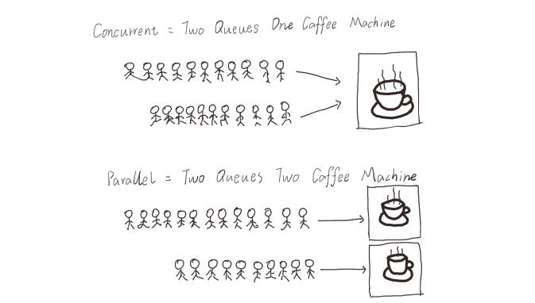
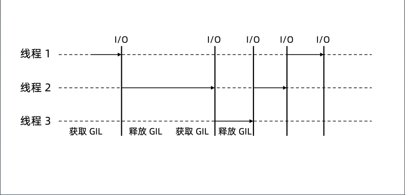
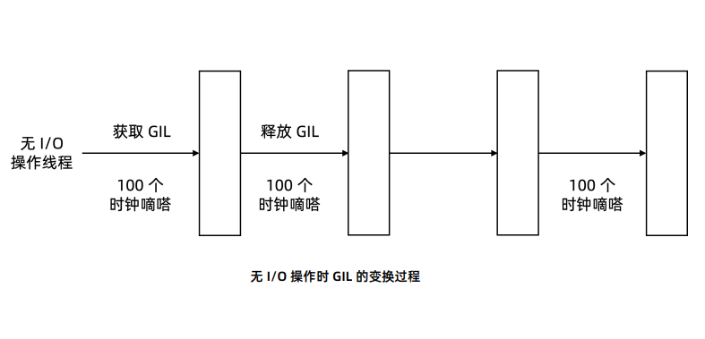

# 学习笔记

## 第一节：Scrapy并发参数优化原理

### 学习参考文档

[Twisted 学习参考文档](https://pypi.org/project/Twisted/)
[asyncio — 异步 I/O 学习文档](https://docs.python.org/zh-cn/3.7/library/asyncio.html)

requests: 同步请求数据

### Scarapy 参数优化

settings.py 参数调优

``` python
# Configure maximum concurrent requests performed by Scrapy (default: 16)
# CONCURRENT_REQUESTS = 32

# Configure a delay for requests for the same website (default: 0)
# 下载延时，3秒
DOWNLOAD_DELAY = 3

# The download delay setting will honor only one of:
# 域名 和 ip 进行设置
# CONCURRENT_REQUESTS_PER_DOMAIN = 16
# CONCURRENT_REQUESTS_PER_IP = 16
```

### 基于 twisted 的异步 IO 框架

多任务模型分为同步模型和异步模型
Scrapy 使用的是 Twisted 模型

Twisted 是异步编程模型，任务之间互相独立，用于大量 I/O 密集操作


[twisted_demo](twisted_demo.py)

``` python
from twisted.internet import defer
from twisted.web.client import getPage
from twisted.internet import reactor

def response(*args, **kwargs):
    # print(args, kwargs)
    print('返回网页的内容')

def callback(*args):
    print('执行了一个回调',args)

@defer.inlineCallbacks
def start(url):
    d = getPage(url.encode('utf-8'))
    d.addCallback(response)
    d.addCallback(callback)
    yield d

def stop(*args, **kwargs):
    reactor.stop()

urls = ['http://www.baidu.com','http://www.sougou.com']
li = []

for url in urls:
    ret = start(url)
    li.append(ret)
print(li)

d = defer.DeferredList(li)
d.addBoth(stop)
reactor.run()
```

## 第二节：多进程：进程的创建

### 多进程模型

多进程、多线程、协程的目的都是希望尽可能多处理任务

产生新的进程可以使用以下方式：

``` python
os.fork()
multiprocessing.Process()
```

多进程的第一个问题：进程的父子关系

[p1_firstproc.py](1进程/p1_firstproc.py)

``` python
# only for linux mac

# fork()
import os

os.fork()
print('1111111111')
# 执行结果：
# 1111111111
# 1111111111
# # fork函数一旦运行就会生出一条新的进程，2个进程一起执行导致输出了2行
```

[p2_fork.py](1进程/p2_fork.py)

``` python
# 区分父子进程
import os
import time

res = os.fork()
print(f'res == {res}')

if res == 0:
    print(f'我是子进程,我的pid是:{os.getpid()}我的父进程id是:{os.getppid()}')
else:
    print(f'我是父进程,我的pid是: {os.getpid()}')

# fork()运行时，会有2个返回值，返回值为大于0时，此进程为父进程，且返回的数字为子进程的PID；当返回值为0时，此进程为子进程。
# 注意：父进程结束时，子进程并不会随父进程立刻结束。同样，父进程不会等待子进程执行完。
# 注意：os.fork()无法在windows上运行。
```

[p3_process.py](1进程/p3_process.py)

``` python
# 参数
# multiprocessing.Process(group=None, target=None, name=None, args=(), kwargs={})

# - group：分组，实际上很少使用
# - target：表示调用对象，你可以传入方法的名字
# - name：别名，相当于给这个进程取一个名字
# - args：表示被调用对象的位置参数元组，比如target是函数a，他有两个参数m，n，那么args就传入(m, n)即可
# - kwargs：表示调用对象的字典

from multiprocessing import Process

def f(name):
    print(f'hello {name}')

if __name__ == '__main__':
    p = Process(target=f, args=('john',))
    p.start()
    p.join()
# join([timeout])
# 如果可选参数 timeout 是 None （默认值），则该方法将阻塞，
# 直到调用 join() 方法的进程终止。如果 timeout 是一个正数，
# 它最多会阻塞 timeout 秒。
# 请注意，如果进程终止或方法超时，则该方法返回 None 。
# 检查进程的 exitcode 以确定它是否终止。
# 一个进程可以合并多次。
# 进程无法并入自身，因为这会导致死锁。
# 尝试在启动进程之前合并进程是错误的。
```

> os.fork()用于研究多进程
> multiprocessing.Process()用于实际场景

## 第三节：多进程：多进程程序调试技巧

[p4_advfork.py](1进程/p4_advfork.py)

``` python
import time
from multiprocessing import Process
import os
def run():
    print("子进程开启")
    time.sleep(2)
    print("子进程结束")


if __name__ == "__main__":
    print("父进程启动")
    p = Process(target=run)
    p.start()
    p.join()  
    print("父进程结束")
# # 输出结果
# 父进程启动
# 父进程结束
# 子进程开启
# 子进程结束
```

[p5_debug.py](1进程/p5_debug.py)

``` python
# 显示所涉及的各个进程ID，这是一个扩展示例

from multiprocessing import Process
import os
import multiprocessing

def debug_info(title):
    print('-'*20)
    print(title)
    print('模块名称:', __name__)
    print('父进程:', os.getppid())
    print('当前进程:', os.getpid())
    print('-'*20)

def f(name):
    debug_info('function f')
    print('hello', name)

if __name__ == '__main__':
    debug_info('main')
    p = Process(target=f, args=('bob',))
    p.start()

    for p in multiprocessing.active_children():
        print(f'子进程名称: {p.name}  id: { str(p.pid) }' )
    print('进程结束')
    print(f'CPU核心数量: { str(multiprocessing.cpu_count()) }')
    
    p.join()
```

[p6_class.py](1进程/p6_class.py)

``` python
# multiprocessing.Process的run()方法
import os
import time
from multiprocessing import Process

class NewProcess(Process): #继承Process类创建一个新类
    def __init__(self,num):
        self.num = num
        super().__init__()

    def run(self):  #重写Process类中的run方法.
        while True:
            print(f'我是进程 {self.num} , 我的pid是: {os.getpid()}')
            time.sleep(1)

for i in range(2):
    p = NewProcess(i)
    p.start()
# 当不给Process指定target时，会默认调用Process类里的run()方法。
# 这和指定target效果是一样的，只是将函数封装进类之后便于理解和调用。
```

## 第四节：多进程：使用队列实现进程间的通信

[进程之间的两种通信通道](https://docs.python.org/zh-cn/3.7/library/multiprocessing.html#exchanging-objects-between-processes)

### 进程间的通信

为什么不能再使用变量作为进程间共享数据？

多进程可以充分发挥机器的性能，但引入新的特性后会带来新的问题，单进程传递数据的时候可以使用变量赋值，多进程中通信就不行了

变量赋值是在每个进程的堆栈中，跨了进程，堆栈信息是不会传递过去的，所以引入新的通信方式

#### 主要共享方式

* 队列
* 管道
* 共享内存

#### 资源的抢占

* 加锁机制

[p7_var.py](1进程/p7_var.py)

``` python
# 全局变量在多个进程中不能共享
# 在子进程中修改全局变量对父进程中的全局变量没有影响。
# 因为父进程在创建子进程时对全局变量做了一个备份，
# 父进程中的全局变量与子进程的全局变量完全是不同的两个变量。
# 全局变量在多个进程中不能共享

from multiprocessing import Process
from time import sleep

num = 100


def run():
    print("子进程开始")
    global num
    num += 1
    print(f"子进程num：{num}" )
    print("子进程结束")


if __name__ == "__main__":
    print("父进程开始")
    p = Process(target=run)
    p.start()
    p.join()
  # 在子进程中修改全局变量对父进程中的全局变量没有影响
    print("父进程结束。num：%s" % num)

# # 输出结果
# 父进程开始
# 子进程开始
# 子进程num：101
# 子进程结束
# 父进程结束。num：100
```

[p8_queue1.py](1进程/p8_queue1.py)

``` python
# multiprocessing 支持进程之间的两种通信通道
# 队列
# 来自官方文档的一个简单demo
# Queue 类是一个近似 queue.Queue 的克隆
# 现在有这样一个需求：我们有两个进程，一个进程负责写(write)一个进程负责读(read)。
# 当写的进程写完某部分以后要把数据交给读的进程进行使用
# write()将写完的数据交给队列，再由队列交给read()

from multiprocessing import Process, Queue

def f(q):
    q.put([42, None, 'hello'])

if __name__ == '__main__':
    q = Queue()
    p = Process(target=f, args=(q,))
    p.start()
    print(q.get())    # prints "[42, None, 'hello']"
    p.join()

# 队列是线程和进程安全的
```

[p9_queue2.py](1进程/p9_queue2.py)

``` python
from multiprocessing import Process, Queue
import os, time

def write(q):
    print("启动Write子进程：%s" % os.getpid())
    for i in ["A", "B", "C", "D"]:
        q.put(i)  # 写入队列
        time.sleep(1)
    print("结束Write子进程：%s" % os.getpid())

def read(q):
    print("启动Read子进程：%s" % os.getpid())
    while True:  # 阻塞，等待获取write的值
        value = q.get(True)
        print(value)
    print("结束Read子进程：%s" % os.getpid())  # 不会执行

if __name__ == "__main__":
    # 父进程创建队列，并传递给子进程
    q = Queue()
    pw = Process(target=write, args=(q,))
    pr = Process(target=read, args=(q,))
    pw.start()
    pr.start()

    pw.join()
    # pr进程是一个死循环，无法等待其结束，只能强行结束
    # （写进程结束了，所以读进程也可以结束了）
    pr.terminate()
    print("父进程结束")

# 输出结果：
# 启动Write子进程：29564
# 启动Write子进程：22852
# A
# B
# C
# D
# 结束Write子进程：22852
# 父进程结束
```

## 第五节：多进程：管道共享内存

[管道和队列参考文档](https://docs.python.org/zh-cn/3.7/library/multiprocessing.html#pipes-and-queues)

[p10_pipe.py](1进程/p10_pipe.py)

``` python
# 管道
# 官方文档
# Pipe() 函数返回一个由管道连接的连接对象，默认情况下是双工（双向）
from multiprocessing import Process, Pipe
def f(conn):
    conn.send([42, None, 'hello'])
    conn.close()

if __name__ == '__main__':
    parent_conn, child_conn = Pipe()
    p = Process(target=f, args=(child_conn,))
    p.start()
    print(parent_conn.recv())   # prints "[42, None, 'hello']"
    p.join()
# 返回的两个连接对象 Pipe() 表示管道的两端。
# 每个连接对象都有 send() 和 recv() 方法（相互之间的）。
# 请注意，如果两个进程（或线程）同时尝试读取或写入管道的 同一 端，
# 则管道中的数据可能会损坏。当然，同时使用管道的不同端的进程不存在损坏的风险。
```

[p11_sharemem.py](1进程/p11_sharemem.py)

``` python
# 在进行并发编程时，通常最好尽量避免使用共享状态。
# 共享内存 shared memory 可以使用 Value 或 Array 将数据存储在共享内存映射中
# 这里的Array和numpy中的不同，它只能是一维的，不能是多维的。
# 同样和Value 一样，需要定义数据形式，否则会报错
from multiprocessing import Process, Value, Array

def f(n, a):
    n.value = 3.1415927
    for i in a:
        a[i] = -a[i]

if __name__ == '__main__':
    num = Value('d', 0.0)
    arr = Array('i', range(10))

    p = Process(target=f, args=(num, arr))
    p.start()
    p.join()

    print(num.value)
    print(arr[:])

# 将打印
# 3.1415927
# [0, -1, -2, -3, -4, -5, -6, -7, -8, -9]
# 创建 num 和 arr 时使用的 'd' 和 'i' 
# 参数是 array 模块使用的类型的 typecode ： 'd' 表示双精度浮点数， 'i' 表示有符号整数。
# 这些共享对象将是进程和线程安全的。
```

## 第六节：多进程：锁机制解决资源抢占

[进程间的同步学习文档](https://docs.python.org/zh-cn/3.7/library/multiprocessing.html#synchronization-between-processes)

[p12_nolock.py](1进程/p12_nolock.py)

``` python
# 进程锁Lock
# 不加进程锁
# 让我们看看没有加进程锁时会产生什么样的结果。
import multiprocessing as mp
import time

def job(v, num):
    for _ in range(5):
        time.sleep(0.1) # 暂停0.1秒，让输出效果更明显
        v.value += num # v.value获取共享变量值
        print(v.value, end="|")

def multicore():
    v = mp.Value('i', 0) # 定义共享变量
    p1 = mp.Process(target=job, args=(v,1))
    p2 = mp.Process(target=job, args=(v,3)) # 设定不同的number看如何抢夺内存
    p1.start()
    p2.start()
    p1.join()
    p2.join()

if __name__ == '__main__':
    multicore()

# 在上面的代码中，我们定义了一个共享变量v，两个进程都可以对它进行操作。 
# 在job()中我们想让v每隔0.1秒输出一次累加num的结果，
# 但是在两个进程p1和p2 中设定了不同的累加值。
# 所以接下来让我们来看下这两个进程是否会出现冲突。

# 结论：进程1和进程2在相互抢着使用共享内存v。
```

[p13_lock.py](1进程/p13_lock.py)

``` python
# 加进程锁
# 为了解决不同进程抢共享资源的问题，我们可以用加进程锁来解决。
import multiprocessing as mp
import time

# 在job()中设置进程锁的使用，保证运行时一个进程的对锁内内容的独占
def job(v, num, l):
    l.acquire() # 锁住
    for _ in range(5):
        time.sleep(0.1) 
        v.value += num # 获取共享内存
        print(v.value, end="|")
    l.release() # 释放

def multicore():
    l = mp.Lock() # 定义一个进程锁
    v = mp.Value('i', 0) # 定义共享内存
    # 进程锁的信息传入各个进程中
    p1 = mp.Process(target=job, args=(v,1,l)) 
    p2 = mp.Process(target=job, args=(v,3,l)) 
    p1.start()
    p2.start()
    p1.join()
    p2.join()

if __name__ == '__main__':
    multicore()

# 运行一下，让我们看看是否还会出现抢占资源的情况
# 显然，进程锁保证了进程p1的完整运行，然后才进行了进程p2的运行

# 在某些特定的场景下要共享string类型，方式如下：
from ctypes import c_char_p
str_val = mp.Value(c_char_p, b"Hello World")
```

## 第七节：多进程：进程池

[进程池学习文档](https://docs.python.org/zh-cn/3.7/library/multiprocessing.html#module-multiprocessing.pool)

[迭代器学习文档](https://docs.python.org/zh-cn/3.7/library/stdtypes.html#iterator-types)

[p15_pool.py](1进程/p15_pool.py)

``` python
# Pool 类表示一个工作进程池
# 如果要启动大量的子进程，可以用进程池的方式批量创建子进程
from multiprocessing.pool import Pool
from time import sleep, time
import random
import os

def run(name):
    print("%s子进程开始，进程ID：%d" % (name, os.getpid()))
    start = time()
    sleep(random.choice([1, 2, 3, 4]))
    end = time()
    print("%s子进程结束，进程ID：%d。耗时%0.2f" % (name, os.getpid(), end-start))


if __name__ == "__main__":
    print("父进程开始")
    # 创建多个进程，表示可以同时执行的进程数量。默认大小是CPU的核心数
    p = Pool(4)
    for i in range(10):
        # 创建进程，放入进程池统一管理
        p.apply_async(run, args=(i,))
    # 如果我们用的是进程池，在调用join()之前必须要先close()，
    # 并且在close()之后不能再继续往进程池添加新的进程
    p.close()
    # 进程池对象调用join，会等待进程池中所有的子进程结束完毕再去结束父进程
    p.join()
    print("父进程结束。")
    p.terminate()

# 
# close()：如果我们用的是进程池，在调用join()之前必须要先close()，
# 并且在close()之后不能再继续往进程池添加新的进程
# join()：进程池对象调用join，会等待进程池中所有的子进程结束完毕再去结束父进程
# terminate()：一旦运行到此步，不管任务是否完成，立即终止。
```

[p18_deadlock.py](1进程/p18_deadlock.py)

``` python
# join dead lock
from multiprocessing import Process, Queue

def f(q):
    q.put('X' * 1000000)

if __name__ == '__main__':
    queue = Queue()
    p = Process(target=f, args=(queue,))
    p.start()
    p.join()                    # this deadlocks
    obj = queue.get()

#  交换最后两行可以修复这个问题（或者直接删掉 p.join()）
```

[p16_timeout.py](1进程/p16_timeout.py)

``` python
from multiprocessing import Pool
import time

def f(x):
    return x*x

if __name__ == '__main__':
    with Pool(processes=4) as pool:         # 进程池包含4个进程
        result = pool.apply_async(f, (10,)) # 执行一个子进程
        print(result.get(timeout=1))        # 显示执行结果

        result = pool.apply_async(time.sleep, (10,))
        print(result.get(timeout=1))        # raises multiprocessing.TimeoutError
```

[p17_map.py](1进程/p17_map.py)

``` python
from multiprocessing import Pool
import time

def f(x):
    return x*x

if __name__ == '__main__':
    with Pool(processes=4) as pool:         # 进程池包含4个进程

        print(pool.map(f, range(10)))       # 输出 "[0, 1, 4,..., 81]"
                    
        it = pool.imap(f, range(10))        # map输出列表，imap输出迭代器
        print(it)               
        print(next(it))                     #  "0"
        print(next(it))                     #  "1"
        print(it.next(timeout=1))           #  "4" 
```

## 第八节：多线程：创建线程

[基于线程的并行学习文档](https://docs.python.org/zh-cn/3.7/library/threading.html)

[基于进程的并行学习文档](https://docs.python.org/zh-cn/3.7/library/multiprocessing.html)

[底层多线程 API](https://docs.python.org/zh-cn/3.7/library/_thread.html)

### 多线程模型

#### 进程与线程的区别是什么？

进程是一个比较重的概念，除了传递进程资源之外，进程也有它自己的一个结构存在，使用的程序，如果是一个多进程并发完成多任务的话，对计算机会有一个很重的资源开销，所以在这种情况下才会产生多线程编程。（多个线程是跑在一个进程中的）

好处：多线程同步数据比多进程同步数据方便很多

#### 经常提到的阻塞和非阻塞、同步和异步是什么意思？

阻塞和非阻塞是调用方看到的结果，同步和异步是被调用方看到的结果

例子：

阻塞：比如给你打电话，按了你的电话号码，然后直接按了拨号，之后就一直拿起电话等待着你来接听电话，等你接完电话才能进行通话。我是发起方，一直在等待，就是阻塞。

非阻塞：比如拨了电话之后，直接把电话开启了免提，然后把它放在旁边，然后做别的事情，不管接不接听，我是发起方，不管对方的状态，叫做非阻塞状态

同步：比如打电话过来，看到后马上接听电话，然后问了一声你好，这就是同步（被发起方的一个操作行为）

异步：比如打电话过来，你那边可能并不能马上接听电话，然后回了一条短信，可能隔很长时间才收到，所以为异步响应（被发起方的一个操作行为）

#### 为什么有多进程还要有多线程？反过来也是？

多线程可以用来做我们CPU消耗资源，而线程则用来共享数据

#### 为什么要产生协程？

多进程多线程程序整个过程是由系统控制，希望进程切换的时候可以由我们用户来进行把控，这种方式进程和线程无法做到

### 并行和并发



### threading 模块

使用函数创建多线程模型

``` python
threading.Thread(target=run, args=("thread 1", ))
```

使用类创建多线程模型

``` python
class MyThread(threading.Thread)
```

函数方式：

[p1_func.py](2线程/p1_func.py)

``` python
import threading

# 这个函数名可随便定义
def run(n):
    print("current task：", n)

if __name__ == "__main__":
    t1 = threading.Thread(target=run, args=("thread 1",))
    t2 = threading.Thread(target=run, args=("thread 2",))
    t1.start()
    t2.start()

    
# 调用方
# 阻塞  得到调用结果之前，线程会被挂起
# 非阻塞 不能立即得到结果，不会阻塞线程

# 被调用方 
# 同步 得到结果之前，调用不会返回
# 异步 请求发出后，调用立即返回，没有返回结果，通过回调函数得到实际结果
```

面向对象方式

[p2_class.py](2线程/p2_class.py)

``` python
import threading

class MyThread(threading.Thread):
    def __init__(self, n):
        super().__init__() # 重构run函数必须要写
        self.n = n

    def run(self):
        print("current task：", self.n)

if __name__ == "__main__":
    t1 = MyThread("thread 1")
    t2 = MyThread("thread 2")

    t1.start()
    t2.start()
    # 将 t1 和 t2 加入到主线程中
    t1.join()
    t2.join()
```

多线程调试工具

[p3_alive.py](2线程/p3_alive.py)

``` python
import threading
import time
def start():
    time.sleep(5)


thread1 = threading.Thread(target=start)
print(thread1.is_alive())

thread1.start()

print(thread1.getName())
print(thread1.is_alive())

thread1.join()

print(thread1.is_alive())
```

## 第九节：多线程：线程锁

[锁对象学习文档](https://docs.python.org/zh-cn/3.7/library/threading.html#lock-objects)

[递归锁对象](https://docs.python.org/zh-cn/3.7/library/threading.html#rlock-objects)

没有加锁

[p4_nolock.py](2线程/p4_nolock.py)

``` python
import threading
import time
num = 0
def addone():
    global num
    num += 1
    time.sleep(1)  #  必须休眠，否则观察不到脏数据
    print(f'num value is {num}')

for i in range(10):
    t = threading.Thread(target = addone)
    t.start()

print('main thread stop')
```

加锁

[p5_lock.py](2线程/p5_lock.py)

``` python
import threading
import time

num = 0
mutex = threading.Lock()

class MyThread(threading.Thread):
    def run(self):
        global num
        time.sleep(1)

        if mutex.acquire(1):    # 加锁 
            num = num + 1
            print(f'{self.name} : num value is  {num}')
        mutex.release()   #解锁

if __name__ == '__main__':
    for i in range(5):
        t = MyThread()
        t.start()
```

lock和rlock都是普通锁，但是lock是不可以嵌套的，而rlock可以，如果lock嵌套会出现死锁的情况

[p6_rlock.py](2线程/p6_rlock.py)

``` python
import threading
import time
# Lock普通锁不可嵌套，RLock普通锁可嵌套
mutex = threading.RLock()

class MyThread(threading.Thread):
    def run(self):
        if mutex.acquire(1):
            print("thread " + self.name + " get mutex")
            time.sleep(1)
            mutex.acquire()
            mutex.release()
        mutex.release()

if __name__ == '__main__':
    for i in range(5):
        t = MyThread()
        t.start()
```

条件锁

[p7_condition.py](2线程/p7_condition.py)

``` python
# 条件锁：该机制会使线程等待，只有满足某条件时，才释放n个线程
import threading
 
def condition():
    ret = False
    r = input(">>>")
    if r == "yes":
        ret = True
    return ret
 
def func(conn,i):
    # print(i)
    conn.acquire()
    conn.wait_for(condition)  # 这个方法接受一个函数的返回值
    print(i+100)
    conn.release()
 
c = threading.Condition()
for i in range(10):
    t = threading.Thread(target=func,args=(c,i,))
    t.start()

# 条件锁的原理跟设计模式中的生产者／消费者（Producer/Consumer）模式类似
```

信号量

[p8_semaphore.py](2线程/p8_semaphore.py)

``` python
# 信号量：内部实现一个计数器，占用信号量的线程数超过指定值时阻塞
import time
import threading
 
def run(n):
    semaphore.acquire()
    print("run the thread: %s" % n)
    time.sleep(1)
    semaphore.release()

num = 0
semaphore = threading.BoundedSemaphore(5)  # 最多允许5个线程同时运行
for i in range(20):
    t = threading.Thread(target=run,args=(i,))
    t.start()
```

事件

[p9_event.py](2线程/p9_event.py)

``` python
# 事件： 定义一个flag，set设置flag为True ，clear设置flag为False
import threading
 
def func(e,i):
    print(i)
    e.wait()  # 检测当前event是什么状态，如果是红灯，则阻塞，如果是绿灯则继续往下执行。默认是红灯。
    print(i+100)
 
event = threading.Event()
for i in range(10):
    t = threading.Thread(target=func,args=(event,i))
    t.start()
 
event.clear()  # 主动将状态设置为红灯
inp = input(">>>")
if inp == "1":
    event.set()# 主动将状态设置为绿灯


# 练习： 使用redis实现分布式锁
```

定时器

[p10_timer.py](2线程/p10_timer.py)

``` python
# 定时器： 指定n秒后执行
from threading import Timer
def hello():
    print("hello, world")
t = Timer(1,hello)  # 表示1秒后执行hello函数
t.start()
```

## 第十节：多线程：队列

[queue 学习文档](https://docs.python.org/zh-cn/3.7/library/queue.html)

生产者消费者模型

[p11_queue.py](2线程/p11_queue.py)

``` python
import queue
q = queue.Queue(5)
q.put(111)        # 存队列
q.put(222)
q.put(333)
 
print(q.get())    # 取队列
print(q.get())
q.task_done()     # 每次从queue中get一个数据之后，当处理好相关问题，最后调用该方法，
                  # 以提示q.join()是否停止阻塞，让线程继续执行或者退出
print(q.qsize())  # 队列中元素的个数， 队列的大小
print(q.empty())  # 队列是否为空
print(q.full())   # 队列是否满了

###############

import queue
import threading
import random
import time

writelock = threading.Lock()

class Producer(threading.Thread):
    def __init__(self, q, con, name):
        super(Producer, self).__init__()
        self.q = q
        self.name = name
        self.con =con
        print(f'Producer {self.name} Started')
    
    def run(self):
        while 1:
            global writelock
            self.con.acquire()  # 获得锁对象

            if self.q.full():   # 队列满
                with writelock:
                    print('Queue is full , producer wait')
                self.con.wait()  # 等待资源
            
            else:
                value = random.randint(0,10)
                with  writelock:
                    print(f'{self.name} put value {self.name} {str(value)} in queue')
                self.q.put( (f'{self.name} : {str(value)}') ) # 放入队列
                self.con.notify()   # 通知消费者
                time.sleep(1)
        self.con.release()


class Consumer(threading.Thread):
    def __init__(self, q, con, name):
        super(Consumer, self).__init__()
        self.q = q
        self.name = name
        self.con =con
        print(f'Consumer {self.name} Started')

    def run(self):
        while 1:
            global writelock
            self.con.acquire()
            if self.q.empty():   # 队列空
                with writelock:
                    print('Queue is empty , consumer wait')
                self.con.wait()  # 等待资源
            else:
                value = self.q.get()
                with writelock:
                    print(f'{self.name} get value {value} from queue')              
                self.con.notify()   # 通知生产者
                time.sleep(1)
        self.con.release()


if __name__ == '__main__':
    q = queue.Queue(10)
    con = threading.Condition()   # 条件变量锁

    p1 = Producer(q, con, 'P1')
    p1.start()
    p2 = Producer(q, con, 'P2')
    p2.start()
    c1 = Consumer(q, con, 'C1')
    c1.start()

# 练习使用列表实现队列
```

优先级队列

[p12_priorityQ.py](2线程/p12_priorityQ.py)

``` python
import queue
q = queue.PriorityQueue()
# 每个元素都是元组
# 数字越小优先级越高
# 同优先级先进先出
q.put((1,"work"))
q.put((-1,"life"))
q.put((1,"drink"))
q.put((-2,"sleep"))
print(q.get())
print(q.get())
print(q.get())
print(q.get())

# queue.LifoQueue 后进先出队列,类似堆栈
# q.deque 双向队列
```

[p13_downQ.py](2线程/p13_downQ.py)

``` python
import os
import queue
import threading
import requests
from fake_useragent import UserAgent

class DownloadThread(threading.Thread):
    def __init__(self, q):
        super().__init__()
        self.q = q
    
    def run(self):
        while True:
            url = self.q.get()  # 从队列取出一个元素
    
            print(f'{self.name} begin download {url}')
            self.download_file(url)  # 下载文件
            self.q.task_done()   # 下载完成发送信号
            print(f'{self.name} download completed')            

    def download_file(self, url):
        ua = UserAgent()
        headers={"User-Agent":ua.random}
        r = requests.get(url, stream=True, headers=headers)
        fname = os.path.basename(url) + '.html'
        with open(fname, 'wb') as f:
            for chunk in r.iter_content(chunk_size=1024):
                if not chunk: break
                f.write(chunk)

if __name__ == '__main__':
    urls = ['http://www.baidu.com',
            'http://www.python.org',
            'http://www.douban.com']
    
    q = queue.Queue()

    for i in range(5):
        t = DownloadThread(q) # 启动5个线程
        t.setDaemon(True)
        t.start()
    
    for url in urls:
        q.put(url)
    
    q.join()
```

## 第十一节：多线程：线程池

[concurrent.futures - 线程池执行器](https://docs.python.org/zh-cn/3.7/library/concurrent.futures.html#threadpoolexecutor)

[concurrent.futures - 进程池执行器](https://docs.python.org/zh-cn/3.7/library/concurrent.futures.html#processpoolexecutor)

### 线程池

#### 一般的线程池

``` python
from multiprocessing.dummy import Pool as ThreadPool
```

#### 并行任务的高级封装(python3.2 版本以后支持)

``` python
from concurrent.futures import ThreadPoolExecutor
```

#### 示例

[p14_pool.py](2线程/p14_pool.py)

``` python
import requests
from multiprocessing.dummy import Pool as ThreadPool

urls = [
   'http://www.baidu.com',
   'http://www.sina.com.cn',
   'http://www.163.com',
   'http://www.qq.com',
   'http://www.taobao.com',            
   ]

# 开启线程池
pool = ThreadPool(4)
# 获取urls的结果
results = pool.map(requests.get, urls)
# 关闭线程池等待任务完成退出
pool.close()
pool.join()

for  i in results:
    print(i.url)
```

[p15_threadpoolExecutor.py](2线程/p15_threadpoolExecutor.py)

``` python
# Python3.2 中引入了 concurrent.futures 库，利用这个库可以非常方便的使用多线程、多进程
from concurrent.futures import ThreadPoolExecutor
import time

def func(args):
    print(f'call func {args}')
    
if __name__ == "__main__":
    seed = ['a', 'b', 'c', 'd']

    with ThreadPoolExecutor(3) as executor:
        executor.submit(func, seed)
    
    time.sleep(1)

    with ThreadPoolExecutor(3) as executor2:
        executor2.map(func, seed)
    
    time.sleep(1)

    with ThreadPoolExecutor(max_workers=1) as executor:
        future = executor.submit(pow, 2, 3)
        print(future.result())
```

死锁

[p16_deadlock.py](2线程/p16_deadlock.py)

``` python
import time
from concurrent.futures import ThreadPoolExecutor

def wait_on_b():
    time.sleep(5)
    print(b.result())  # b will never complete because it is waiting on a.
    return 5

def wait_on_a():
    time.sleep(5)
    print(a.result())  # a will never complete because it is waiting on b.
    return 6

executor = ThreadPoolExecutor(max_workers=2)
a = executor.submit(wait_on_b)
b = executor.submit(wait_on_a)

# 当回调已关联了一个 Future 然后再等待另一个 Future 的结果时就会发产死锁情况
# https://docs.python.org/zh-cn/3.7/library/concurrent.futures.html#threadpoolexecutor
```

## 第十二节：多线程：GIL锁与多线程的性能瓶颈

[p18_pvt.py](2线程/p18_pvt.py)

``` python
# process vs thread
import multiprocessing as mp

def job(q):
    res = 0
    for i in range(1000000):
        res += i+i**2+i**3
    q.put(res) # queue

# 多核
def multicore():
    q = mp.Queue()
    p1 = mp.Process(target=job, args=(q,))
    p2 = mp.Process(target=job, args=(q,))
    p1.start()
    p2.start()
    p1.join()
    p2.join()
    res1 = q.get()
    res2 = q.get()
    print('multicore:',res1 + res2)

# 创建多线程mutithread
# 接下来创建多线程程序，创建多线程和多进程有很多相似的地方。
# 首先import threading然后定义multithread()完成同样的任务
import threading as td

def multithread():
    q = mp.Queue() # thread可放入process同样的queue中
    t1 = td.Thread(target=job, args=(q,))
    t2 = td.Thread(target=job, args=(q,))
    t1.start()
    t2.start()
    t1.join()
    t2.join()
    res1 = q.get()
    res2 = q.get()
    print('multithread:', res1 + res2)

# 创建普通函数
def normal():
    res = 0
    for _ in range(2):
        for i in range(1000000):
            res += i + i**2 + i**3
    print('normal:', res)
# 在上面例子中我们建立了两个进程或线程，均对job()进行了两次运算，
# 所以在normal()中我们也让它循环两次
# 运行时间
import time

if __name__ == '__main__':
    st = time.time()
    normal()
    st1 = time.time()
    print('normal time:', st1 - st)
    multithread()
    st2 = time.time()
    print('multithread time:', st2 - st1)
    multicore()
    print('multicore time:', time.time() - st2)

# 普通/多线程/多进程的运行时间分别是1.41，1.47和0.75秒。 
# 我们发现多核/多进程最快，说明在同时间运行了多个任务。 
# 而多线程的运行时间居然比什么都不做的程序还要慢一点，
# 说明多线程还是有一定的短板的（GIL）。
```

### 多线程 与 GIL

进程与线程性能对比

GIL 全局解释锁(Global Interpreter Lock)

* 每个进程只有一个 GIL 锁
* 拿到 GIL 锁可以使用 CPU
* CPython 解释器不是真正意义的多线程，属于伪并发

每一个进程只有一个GIL锁，CPython默认是单独的一个进程，即使多线程，也是在一个进程里运行

### I/O 操作中 GIL 的变换过程

一旦遇到I/O操作，GIL锁就会被释放，其他线程再去抢夺锁的运行权限



多线程在 I/O 密集型的场景下适用
多进程在 CPU 密集型的场景下适用

### 无 I/O 操作中 GIL 的变换过程



## 第十三节：迷你Scrapy项目实践

多线程适合 I/O 密集型应用，比如爬虫

Thread + requests + queue 根据理解实现一个 mini 的 Scrapy

[miniScrapy.py](miniScrapy.py)

``` python
import requests
from lxml import etree
from queue import Queue
import threading
import json

class CrawlThread(threading.Thread):
    '''
    爬虫类
    '''
    def __init__(self,thread_id,queue):
        super().__init__() 
        self.thread_id = thread_id  
        self.queue = queue

    def run(self):
        '''
        重写run方法
        '''
        print(f'启动线程：{self.thread_id}')
        self.scheduler()
        print(f'结束线程：{self.thread_id}')

    # 模拟任务调度
    def scheduler(self):
        while True:
            if self.queue.empty(): #队列为空不处理
                break
            else:
                page = self.queue.get()
                print('下载线程为：',self.thread_id," 下载页面：",page)
                url = f'https://book.douban.com/top250?start={page*25}'
                headers = {
                    'User-Agent':'Mozilla/5.0 (Macintosh; Intel Mac OS X 10_15_4) AppleWebKit/537.36 (KHTML, like Gecko) Chrome/83.0.4103.61 Safari/537.36'
                }
                try:
                    # downloader 下载器
                    response = requests.get(url,headers=headers) 
                    dataQueue.put(response.text)
                except Exception as e:
                    print('下载出现异常',e)

class ParserThread(threading.Thread):
    '''
    页面内容分析
    '''
    def __init__(self,thread_id,queue,file):
        threading.Thread.__init__(self)      # 上面使用了super()
        self.thread_id = thread_id
        self.queue = queue
        self.file = file

    def run(self):
        print(f'启动线程：{self.thread_id}')
        while not flag:                      # 这里有什么优化思路？
            try:
                item = self.queue.get(False) # 参数为false时队列为空，抛出异常
                if not item:                 # 为什么要判断？
                    continue
                self.parse_data(item)
                self.queue.task_done() # get之后检测是否会阻塞
            except Exception as e:
                pass
        print(f'结束线程：{self.thread_id}')

    def parse_data(self,item):
        '''
        解析网页内容的函数
        :param item:
        :return:
        '''
        try:
            html = etree.HTML(item)
            books = html.xpath('//div[@class="pl2"]')
            for book in books:
                try:
                    title = book.xpath('./a/text()')
                    link = book.xpath('./a/@href')
                    response={
                        'title':title,
                        'link':link
                    } 
                    #解析方法和scrapy相同，再构造一个json
                    json.dump(response,fp=self.file,ensure_ascii=False) 
                except Exception as e:
                    print('book error', e)

        except Exception as e:
            print('page error',e)


dataQueue = Queue() # 存放解析数据的queue
flag = False

if __name__ == '__main__':
    # 将结果保存到一个json文件中
    output = open('book.json','a',encoding='utf-8') 

    # 任务队列，存放网页的队列
    pageQueue = Queue(20) 
    for page in range(0,11): 
        pageQueue.put(page) 
    
    # 爬虫线程
    crawl_threads = []
    crawl_name_list = ['crawl_1','crawl_2','crawl_3'] 
    for thread_id in crawl_name_list:
        thread = CrawlThread(thread_id,pageQueue)
        thread.start() 
        crawl_threads.append(thread)
    
    # 解析线程
    parse_thread = []
    parser_name_list = ['parse_1','parse_2','parse_3']
    for thread_id in parser_name_list: 
        thread = ParserThread(thread_id,dataQueue,output)
        thread.start() 
        parse_thread.append(thread)

    # 结束crawl线程
    for t in crawl_threads:
        t.join()
    
    # 结束parse线程
    flag = True
    for t in parse_thread:
        t.join() 

    output.close()
    print('退出主线程')
```

[miniScrapy2.py](miniScrapy2.py)

``` python
import asyncio

@asyncio.coroutine
def task():
    print('request')
    yield from asyncio.sleep(3)
    print('response')


scheduler = [task(), task(), task()]

loop = asyncio.get_event_loop()
loop.run_until_complete(asyncio.gather(*scheduler))
loop.close()
```
