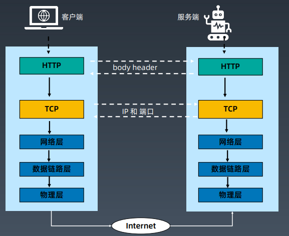

# 学习笔记

## 第一节：用requests写一个最简单的爬虫

[requests 官方文档链接](https://requests.readthedocs.io/zh_CN/latest/)

### 开发的四步骤

1、提出需求
2、编码
3、代码run起来
4、修复和完善

### 需求分析

获取《豆瓣电影 Top 250》的内容
https://movie.douban.com/top250?start=0

要求：

* 获取电影名称、上映日期、评分
* 写入文本文件

[1a_requests.py](课程代码/1a_requests.py)

``` python
# 使用requests库获取豆瓣影评

import requests

user_agent = 'Mozilla/5.0 (Macintosh; Intel Mac OS X 10_15_1) AppleWebKit/537.36 (KHTML, like Gecko) Chrome/78.0.3904.108 Safari/537.36'

header = {'user-agent':user_agent}

myurl = 'https://movie.douban.com/top250'

response = requests.get(myurl,headers=header)

print(response.text)
print(f'返回码是: {response.status_code}')
```

[1a_urllib.py](课程代码/1a_urllib.py)

``` python
from urllib import request

# GET 方法
resp = request.urlopen('http://httpbin.org/get')
print(resp.read().decode())

# POST 方法
resp = request.urlopen('http://httpbin.org/post', data=b'key=value', timeout=10)
print(resp.read().decode())

# cookie

from http import cookiejar
# 创建一个cookiejar对象
cookie = cookiejar.CookieJar()

# 创建cookie处理器
handler = request.HTTPCookieProcessor(cookie)

# 创建Opener对象
opener = request.build_opener(handler)

# 使用opener来发起请求
resp = opener.open('http://www.baidu.com')

# 查看之前的cookie对象，则可以看到访问百度获得的cookie
for i in cookie:
    print(i)

# 之后使用urlopen方法发起请求时，都会带上这个cookie
```

## 第二节：使用BeautifulSoup解析爬取到的网页

[Beautiful Soup 官方文档链接](https://www.crummy.com/software/BeautifulSoup/bs4/doc.zh/)

[1b_bs4.py](课程代码/1b_bs4.py)

``` python
# 使用BeautifulSoup解析网页

import requests
from bs4 import BeautifulSoup as bs
# bs4是第三方库需要使用pip命令安装

user_agent = 'Mozilla/5.0 (Macintosh; Intel Mac OS X 10_15_1) AppleWebKit/537.36 (KHTML, like Gecko) Chrome/78.0.3904.108 Safari/537.36'

header = {'user-agent':user_agent}

myurl = 'https://movie.douban.com/top250'

response = requests.get(myurl,headers=header)

bs_info = bs(response.text, 'html.parser')

# Python 中使用 for in 形式的循环,Python使用缩进来做语句块分隔
for tags in bs_info.find_all('div', attrs={'class': 'hd'}):
    for atag in tags.find_all('a'):
        print(atag.get('href'))
        # 获取所有链接
        print(atag.find('span').text)
        # 获取电影名字
```

## 第三节：使用XPath解析网页

[1c_movie.py](课程代码/1c_movie.py)

``` python
import requests
import lxml.etree

# 爬取页面详细信息

# 电影详细页面
url = 'https://movie.douban.com/subject/1292052/'

user_agent = 'Mozilla/5.0 (Macintosh; Intel Mac OS X 10_15_1) AppleWebKit/537.36 (KHTML, like Gecko) Chrome/78.0.3904.108 Safari/537.36'

# 声明为字典使用字典的语法赋值
header = {}
header['user-agent'] = user_agent
response = requests.get(url, headers=header)

# xml化处理
selector = lxml.etree.HTML(response.text)

# 电影名称
film_name = selector.xpath('//*[@id="content"]/h1/span[1]/text()')
print(f'电影名称: {film_name}')

# 上映日期
plan_date = selector.xpath('//*[@id="info"]/span[10]/text()')
print(f'上映日期: {plan_date}')

# 评分
rating = selector.xpath('//*[@id="interest_sectl"]/div[1]/div[2]/strong/text()')
print(f'评分：{rating}')

mylist = [film_name, plan_date, rating]

import pandas as pd

movie1 = pd.DataFrame(data = mylist)

# windows需要使用gbk字符集
movie1.to_csv('./movie1.csv', encoding='utf8', index=False, header=False)
```

## 第四节：实现爬虫的自动翻页功能

[1c_PageTurn.py](课程代码/1c_PageTurn.py)

``` python
# 翻页的处理

import requests
from bs4 import BeautifulSoup as bs
# bs4是第三方库需要使用pip命令安装

# Python 使用def定义函数，myurl是函数的参数
def get_url_name(myurl):
    user_agent = 'Mozilla/5.0 (Macintosh; Intel Mac OS X 10_15_1) AppleWebKit/537.36 (KHTML, like Gecko) Chrome/78.0.3904.108 Safari/537.36'

    header = {'user-agent':user_agent}
    response = requests.get(myurl,headers=header)
    bs_info = bs(response.text, 'html.parser')

    # Python 中使用 for in 形式的循环,Python使用缩进来做语句块分隔
    for tags in bs_info.find_all('div', attrs={'class': 'hd'}):
        for atag in tags.find_all('a'):
            # 获取所有链接
            print(atag.get('href'))
            # 获取电影名字
            print(atag.find('span').text)

# 生成包含所有页面的元组
urls = tuple(f'https://movie.douban.com/top250?start={ page * 25 }&filter=' for page in range(10))

print(urls)

# 控制请求的频率，引入了time模块
from time import sleep

sleep(10)

for page in urls:
    get_url_name(page)
    sleep(5)
```

## 第五节：Python基础语法回顾

[Python 简介](https://docs.python.org/zh-cn/3.7/tutorial/introduction.html)
[Python 数据结构](https://docs.python.org/zh-cn/3.7/tutorial/datastructures.html)
[Python 其他流程控制工具](https://docs.python.org/zh-cn/3.7/tutorial/controlflow.html)
[Python 中的类](https://docs.python.org/zh-cn/3.7/tutorial/classes.html)
[Python 定义函数](https://docs.python.org/zh-cn/3.7/tutorial/controlflow.html#defining-functions)

``` python
>>> 1+3
4
>>> 'a' + 'b'
'ab'
>>> type('a')
<class 'str'>
>>> type('b')
<class 'str'>
>>> type(1)
<class 'int'>
>>> import math
>>> dir(math)
['__doc__', '__file__', '__loader__', '__name__', '__package__', '__spec__', 'acos', 'acosh', 'asin', 'asinh', 'atan', 'atan2', 'atanh', 'ceil', 'copysign', 'cos', 'cosh', 'degrees', 'e', 'erf', 'erfc', 'exp', 'expm1', 'fabs', 'factorial', 'floor', 'fmod', 'frexp', 'fsum', 'gamma', 'gcd', 'hypot', 'inf', 'isclose', 'isfinite', 'isinf', 'isnan', 'ldexp', 'lgamma', 'log', 'log10', 'log1p', 'log2', 'modf', 'nan', 'pi', 'pow', 'radians', 'remainder', 'sin', 'sinh', 'sqrt', 'tan', 'tanh', 'tau', 'trunc']
>>> help(math)
```

### Python 的关键字

| False  | True     | None   | class   | type     | and    |
|--------|----------|--------|---------|----------|--------|
| def    | del      | if     | elif    | else     | as     |
| break  | continue | for    | from    | import   | in     |
| pass   | not      | is     | or      | return   | try    |
| except | while    | assert | finally | nonlocal | lambda |
| raise  | with     | yield  |         |          |        |

变量赋值的时候不要用关键字

### 基本数据类型

| 数据类型      | 举例                                                     |
|--------------|----------------------------------------------------------|
| 整型(int)    | -1、0、4                                                   |
| 浮点型(float) | 5.2、3.145                                                |
| 布尔值(bool)  | True、False                                               |
| 空值         | NULL                                                     |
| 字符串(str)   | 'geekbang'、"3.8"                                         |
| 列表(list)   | [1, 4, 9, 16, 25]                                        |
| 元组(tuple)  | (1, 4, 9, 16, 25)                                        |
| 字典(dict)   | {'a':1, 'b':2}                                           |
| 集合         | {'apple', 'orange', 'apple', 'pear', 'orange', 'banana'} |

### 推导式

#### 推导式写法

``` python
tuple(f'https://movie.douban.com/top250?start={page * 25}&filter='for page in range(10))
```

#### 展开写法

``` python
a = []
for page in range(10):
    pages=f'https://movie.douban.com/top250?start={ page * 25 }&filter='
    a.append(pages)
tuple(a)
```

## 第六节: 前端基础: HTML基本结构

[W3C 标准官方文档](https://www.w3.org/standards/)

### 爬虫工程师必备的 HTML 基础

1. HTTP 协议与浏览器的关系
2. HTTP 协议请求与返回头部
3. HTTP 请求方式 get post delete head put
4. HTTP 状态码
5. W3C 标准
6. HTML 常用标签和属性
7. CSS、JavaScript、JSON 简介

### 浏览器

HTTP 服务端与 HTTP 客户端
浏览器的调试功能

### HTTP 协议

HTTP 协议请求与返回头部
HTTP 请求方式 get post delete head put
HTTP 状态码



## 第七节: 前端基础：HTTP协议

HTTP 状态码（响应码）

| 1xx | 信息响应  |
|-----|----------|
| 2xx | 成功响应  |
| 3xx | 重定向    |
| 4xx | 客户端响应 |
| 5xx | 服务端响应 |

## 第八节: Scrapy框架结构解析

[Scrapy 架构官方文档介绍](https://docs.scrapy.org/en/latest/topics/architecture.html)


### Scrapy 核心组件

| Scrapy 核心组件                     | 简介                                                                                           |
|------------------------------------|------------------------------------------------------------------------------------------------|
| 引擎(Engine)                       | "大脑"，指挥其他组件协同工作                                                                        |
| 调度器(Scheduler)                   | 调度器接收引擎发过来的请求，按照先后顺序，压入队列中，同时去除重复的请求。                                    |
| 下载器（Downloader）                  | 下载器用于下载网页内容，并返回给爬虫。                                                                |
| 爬虫（Spiders）                      | 用于从特定的网页中提取需要的信息，即所谓的实体（Item）<br>用户也可以从中提取出链接，让 Scrapy 继续抓取下一个页面。 |
| 项目管道（Item Pipelines）            | 项目管道负责处理爬虫从网页中抽取的实体。<br>主要的功能是持久化实体、验证实体的有效性、清除不需要的信息等         |
| 下载器中间件（Downloader Middlewares） |                                                                                                |
| 爬虫中间件（Spider Middlewares）      |                                                                                                |

### Scrapy 架构


| 组件       | 对应爬虫三大流程              | Scrapy 项目是否需要修改 |
|------------|-----------------------------|----------------------|
| 引擎       |                             | 无需修改，框架已写好     |
| 调度器      |                             | 无需修改，框架已写好     |
| 下载器      | 获取网页（request 库）         | 无需修改，框架已写好     |
| 爬虫器      | 解析网页（BeautifulSoup 库）   | 需要                 |
| 管道       | 存储数据（存入csv/txt/MySQL 等） | 需要                 |
| 下载器中间件 | 获取网页 – 个性化部分          | 一般不用              |
| 爬虫器中间件 | 解析网页 – 个性化部分          | 一般不用              |

## 第九节: Scrapy爬虫目录结构解析

安装

``` python
pip install scrapy
```

创建工程

``` python
scrapy startproject spiders
cd spiders
scrapy genspider example example.com
```

Scrapy 目录结构

| 实现爬虫的Python文件   | spiders 目录 |
|----------------------|--------------|
| 项目的设置文件         | settings.py  |
| 项目的配置文件         | scrapy.cfg   |
| 定义所爬取记录的数据结构 | items.py     |
| 编写爬虫逻辑           | pachong.py   |
| 设置保持位置           | pipelines.py |

## 第十节: 将requests爬虫改写为Scrapy爬虫

启动爬虫

``` python
scrapy crawl douban
```
