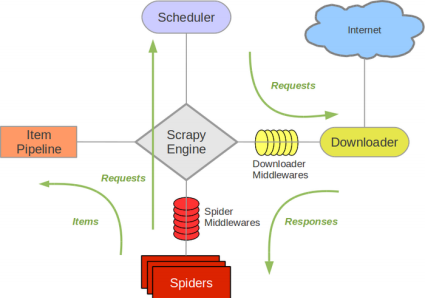

# 学习笔记

## 第一节：异常捕获与处理

课程源码： `git checkout 2d`

[pretty_errors 官方文档链接](https://pypi.org/project/pretty-errors/)

[try 语句官方文档](https://docs.python.org/zh-cn/3.7/reference/compound_stmts.html#the-try-statement)

[with 语句官方文档](https://docs.python.org/zh-cn/3.7/reference/compound_stmts.html#the-with-statement)

[with 语句上下文管理器官方文档](https://docs.python.org/zh-cn/3.7/reference/datamodel.html#with-statement-context-managers)

### 异常捕获

参考 https://docs.python.org/zh-cn/3.6/library/exceptions.html
所有内置的非系统退出的异常都派生自 Exception 类

StopIteration 异常示例：

``` python
gennumber = ( i for i in range(0,2))
print(next(gennumber))
print(next(gennumber))

try:
    print(next(gennumber))
except StopIteration:
    print('最后一个元素')
```

[exception_demo.py](课程代码/exception_demo.py)

``` python
def a():
    return b()

def b():
    return c()

def c():
    return d()

def d():
    x = 0
    return 100/x

a()
```

### 异常处理机制的原理

异常也是一个类

异常捕获过程：

* 异常类把错误消息打包到一个对象
* 然后该对象会自动查找到调用栈
* 直到运行系统找到明确声明如何处理这些类异常的位置

所有异常继承自 BaseException

Traceback 显示了出错的位置，显示的顺序和异常信息对象

### 异常信息与异常捕获

异常信息在 Traceback 信息的最后一行，有不同的类型

捕获异常可以使用 try…except 语法

try…except 支持多重异常处理

常见的异常类型主要有：

* 1. LookupError 下的 IndexError 和 KeyError
* 2. IOError
* 3. NameError
* 4. TypeError
* 5. AttributeError
* 6. ZeroDivisionError

[exception_demo/p1_dive0.py](课程代码/exception_demo/p1_dive0.py)

``` python
1/0
# 发生异常后面的程序不再执行
print('never see me')
```

[exception_demo/p2_try.py](课程代码/exception_demo/p2_try.py)

``` python
try:
    1/0
except Exception as e:
    try:
        1/0
    except Exception as f:
        pass
    print(e)    # 输出异常信息
```

[exception_demo/p3_chain.py](课程代码/exception_demo/p3_chain.py)

``` python
def f1():
    1/0

def f2():
    list1 = []
    list1[1]    
    f1()
    

def f3():
    f2()

try:
    f3()
except (ZeroDivisionError,Exception) as e:
    print(e)  
```

自己定义抛出异常
[exception_demo/p4_inputerror.py](课程代码/exception_demo/p4_inputerror.py)

``` python
class UserInputError(Exception):
    def __init__(self, ErrorInfo):
        super().__init__(self, ErrorInfo)
        self.errorinfo = ErrorInfo
    def __str__(self):
        return self.errorinfo

userinput = 'a'

try:
    if (not userinput.isdigit()):
        raise UserInputError('用户输入错误')
except UserInputError as ue:
    print(ue)
finally:
    del userinput
```

对异常结果优化，可以使用第三方库 pretty库
[exception_demo/p5_pretty.py](课程代码/exception_demo/p5_pretty.py)

``` python
import pretty_errors
def foo():
    1/0

foo()

# pip install pretty_errors
# 美化异常输出
```

[exception_demo/p6_with.py](课程代码/exception_demo/p6_with.py)

``` python
file1 = open('a.txt', encoding='utf8')
try:
    data = file1.read()
finally:
    file1.close()

with open('a.txt', encoding='utf8') as file2:
    data = file2.read()
```

[exception_demo/p7_custom_with.py](课程代码/exception_demo/p7_custom_with.py)

``` python
class Open:
    def __enter__(self):
        print("open")

    def __exit__(self, type, value, trace):
        print("close")
 
    def __call__(self):
        pass

with Open() as f:
    pass
# 上下文协议
```

## 第二节：使用PyMySQL进行数据库操作

获取课程源码: `git checkout 2d`

[MySQL 官方文档手册](https://dev.mysql.com/doc/)

[MySQL 官方下载连接](https://dev.mysql.com/downloads/mysql/)

[PyMySQL 官方文档](https://pypi.org/project/PyMySQL/)

[pymysql/p1_pymysql.py](课程代码/pymysql/p1_pymysql.py)

``` python
# Python 3.7连接到MySQL数据库的模块推荐使用PyMySQL模块
# pip install pymysql
#  /usr/local/mysql/support-files/mysql.server start
# 一般流程
# 开始-创建connection-获取cursor-CRUD(查询并获取数据)-关闭cursor-关闭connection-结束
import pymysql

dbInfo = {
    'host' : 'localhost',
    'port' : 3306,
    'user' : 'root',
    'password' : 'rootroot',
    'db' : 'test'
}

sqls = ['select 1', 'select VERSION()']

result = []

class ConnDB(object):
    def __init__(self, dbInfo, sqls):
        self.host = dbInfo['host']
        self.port = dbInfo['port']
        self.user = dbInfo['user']
        self.password = dbInfo['password']
        self.db = dbInfo['db']
        self.sqls = sqls

        # self.run()

    def run(self):
        conn = pymysql.connect(
            host = self.host,
            port = self.port,
            user = self.user,
            password = self.password,
            db = self.db
        )
        # 游标建立的时候就开启了一个隐形的事物
        cur = conn.cursor()
        try:
            for command in self.sqls:
                cur.execute(command)
                result.append(cur.fetchone())
            # 关闭游标
            cur.close()
            conn.commit()
        except:
            conn.rollback()
        # 关闭数据库连接
        conn.close()

if __name__ == "__main__":
    db = ConnDB(dbInfo, sqls)
    db.run()
    print(result)
```

[pymysql/p2_select.py](课程代码/pymysql/p2_select.py)

``` python
import pymysql

conn = pymysql.connect(host = 'localhost',
                       port = 3306,
                       user = 'root',
                       password = 'rootroot',
                       database = 'test',
                       charset = 'utf8mb4'
                        )

# 获得cursor游标对象
con1 = conn.cursor()

# 操作的行数
count = con1.execute('select * from tb1;')
print(f'查询到 {count} 条记录')

# 获得一条查询结果
result = con1.fetchone()
print(result)

# 获得所有查询结果
print(con1.fetchall())

con1.close()
conn.close()

# 执行批量插入
# values = [(id,'testuser'+str(id)) for id in range(4, 21) ]
# cursor.executemany('INSERT INTO '+ TABLE_NAME +' values(%s,%s)' ,values)
```

## 第三节：反爬虫：模拟浏览器的头部信息

切换分支： `git checkout 2e`

[User-Agent 参考文档](https://developer.mozilla.org/zh-CN/docs/Web/HTTP/Headers/User-Agent)

### 浏览器基本行为

1、带 http 头信息：如 User-Agent、Referer等

2、带 cookies (包含加密的用户名、密码验证信息)

[p1_useragent.py](课程代码/p1_useragent.py)

``` python 

# pip install fake-useragent

from fake_useragent import UserAgent

# verify_ssl不去ssl的验证

ua = UserAgent(verify_ssl=False)

# 模拟不同的浏览器

print(f'Chrome浏览器: {ua.chrome}')

# print(ua.safari)

# print(ua.ie)

# 随机返回头部信息，推荐使用

print(f'随机浏览器: {ua.random}')

``` 

## 第四节：反爬虫：cookies验证

切换分支： `git checkout 2e`

[httpbin 网址](https://httpbin.org)

[p2_GetandPost.py](课程代码/p2_GetandPost.py)

``` python
# http 协议的 GET 方法
import requests
r = requests.get('https://github.com')
r.status_code
r.headers['content-type']
# r.text
r.encoding
# r.json()

# http 协议的 POST 方法
import requests
r = requests.post('http://httpbin.org/post', data = {'key':'value'})
r.json()
```

[p3_cookies.py](课程代码/p3_cookies.py)

``` python
import requests

# 在同一个 Session 实例发出的所有请求之间保持 cookie
s = requests.Session()

s.get('http://httpbin.org/cookies/set/sessioncookie/123456789')
r = s.get("http://httpbin.org/cookies")

print(r.text)
# '{"cookies": {"sessioncookie": "123456789"}}'

# 会话可以使用上下文管理器
with requests.Session() as s:
    s.get('http://httpbin.org/cookies/set/sessioncookie/123456789')
```

[p4_cookie_requests.py](课程代码/p4_cookie_requests.py)

``` python
import time
import requests
from fake_useragent import UserAgent

ua = UserAgent(verify_ssl=False)
headers = {
'User-Agent' : ua.random,
'Referer' : 'https://accounts.douban.com/passport/login_popup?login_source=anony'
}

s = requests.Session()
# 会话对象：在同一个 Session 实例发出的所有请求之间保持 cookie， 
# 期间使用 urllib3 的 connection pooling 功能。
# 向同一主机发送多个请求，底层的 TCP 连接将会被重用，从而带来显著的性能提升。
login_url = 'https://accounts.douban.com/j/mobile/login/basic'
form_data = {
'ck':'',
'name':'15055495@qq.com',
'password':'',
'remember':'false',
'ticket':''
}

# post数据前获取cookie
pre_login = 'https://accounts.douban.com/passport/login'
pre_resp = s.get(pre_login, headers=headers)

response = s.post(login_url, data=form_data, headers=headers, cookies=s.cookies)

# 登陆后可以进行后续的请求
# url2 = 'https://accounts.douban.com/passport/setting'

# response2 = s.get(url2,headers = headers)
# response3 = newsession.get(url3, headers = headers, cookies = s.cookies)

# with open('profile.html','w+') as f:
    # f.write(response2.text)
```

## 第五节：反爬虫：使用WebDriver模拟浏览器行为

切换分支： `git checkout 2e`

WebDriver 文档

https://www.w3.org/TR/webdriver/

https://www.selenium.dev/selenium/docs/api/py/

[ChromeDriver 下载地址](https://chromedriver.storage.googleapis.com/index.html)

[p5_cookie_webdriver.py](课程代码/p5_cookie_webdriver.py)

``` python
from selenium import webdriver
import time

try:
    browser = webdriver.Chrome()
    # 需要安装chrome driver, 和浏览器版本保持一致
    # http://chromedriver.storage.googleapis.com/index.html
    
    browser.get('https://www.douban.com')
    time.sleep(1)

    browser.switch_to_frame(browser.find_elements_by_tag_name('iframe')[0])
    btm1 = browser.find_element_by_xpath('/html/body/div[1]/div[1]/ul[1]/li[2]')
    btm1.click()

    browser.find_element_by_xpath('//*[@id="username"]').send_keys('15055495@qq.com')
    browser.find_element_by_id('password').send_keys('test123test456')
    time.sleep(1)
    browser.find_element_by_xpath('//a[contains(@class,"btn-account")]').click()

    cookies = browser.get_cookies() # 获取cookies
    print(cookies)
    time.sleep(3)

except Exception as e:
    print(e)
finally:    
    browser.close()
```

分块下载

[p7_filedownload.py](课程代码/p7_filedownload.py)

``` python

########## 小文件下载：

import requests
image_url = "https://www.python.org/static/community_logos/python-logo-master-v3-TM.png"
r = requests.get(image_url)
with open("python_logo.png",'wb') as f:
    f.write(r.content)

############# 大文件下载：

# 如果文件比较大的话，那么下载下来的文件先放在内存中，内存还是比较有压力的。
# 所以为了防止内存不够用的现象出现，我们要想办法把下载的文件分块写到磁盘中。
import requests
file_url = "http://python.xxx.yyy.pdf"
r = requests.get(file_url, stream=True)
with open("python.pdf", "wb") as pdf:
    for chunk in r.iter_content(chunk_size=1024):
        if chunk:
            pdf.write(chunk)
```

## 第六节：反爬虫：验证码识别

切换分支： `git checkout 2e`

[各种语言识别库](https://github.com/tesseract-ocr/tessdata)

[captcha_pil.py](课程代码/p8_captcha/验证码识别/captcha_pil.py)

``` python

# 先安装依赖库libpng, jpeg, libtiff, leptonica
# brew install leptonica
# 安装tesseract
# brew install  tesseract
# 与python对接需要安装的包
# pip3 install Pillow
# pip3 install pytesseract

import requests
import os
from PIL import Image
import pytesseract

# 下载图片
# session = requests.session()
# img_url = 'https://ss1.bdstatic.com/70cFuXSh_Q1YnxGkpoWK1HF6hhy/it/u=1320441599,4127074888&fm=26&gp=0.jpg'
# agent = 'Mozilla/5.0 (Windows NT 10.0; WOW64) AppleWebKit/537.36 (KHTML, like Gecko) Chrome/78.0.3904.108 Safari/537.36'
# headers = {'User-Agent': agent}
# r = session.get(img_url, headers=headers)

# with open('cap.jpg', 'wb') as f:
#     f.write(r.content)

# 打开并显示文件
im = Image.open('cap.jpg')
im.show()

# 灰度图片
gray = im.convert('L')
gray.save('c_gray2.jpg')
im.close()

# 二值化
threshold = 100
table = []

for i in range(256):
    if i < threshold:
        table.append(0)
    else:
        table.append(1)

out = gray.point(table, '1')
out.save('c_th.jpg')

th = Image.open('c_th.jpg')
print(pytesseract.image_to_string(th,lang='chi_sim+eng'))

# 各种语言识别库 https://github.com/tesseract-ocr/tessdata
# 放到 /usr/local/Cellar/tesseract/版本/share/tessdata
```

## 第七节：爬虫中间件&系统代理IP

切换分支： `git checkout 3a`



[项目样例](课程代码/proxyspider/)

## 第八节：自定义中间件&随机代理IP

切换分支： `git checkout 3a`

### 下载中间件

#### 如何编写一个下载中间件？一般需要重写下面四个主要方法

 `process_request(request, spider)`

request 对象经过下载中间件时会被调用，优先级高先调用

 `process_response(request, response, spider)`

response 对象经过下载中间件时会被调用，优先级高后调用

 `process_exception(request, exception, spider)`

当 process_response() 和 process_request() 抛出异常时会被调用

 `from_craler(cls, crawler)`

使用 crawler 来创建中间器对象，并（必须）返回一个中间件对象
