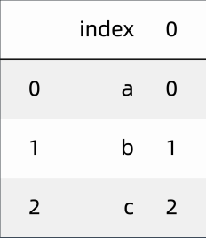

# 学习笔记

## 第一节：pandas简介

切换分支： `git checkout 4a`

[pandas 中文文档](https://www.pypandas.cn/)

[sklearn-pandas安装参考文档](https://pypi.org/project/sklearn-pandas/1.5.0/)

[Numpy 学习文档](https://numpy.org/doc/)

[matplotlib 学习文档](https://matplotlib.org/contents.html)

[1pandas/p1_dataset.py](课程代码/1pandas/p1_dataset.py)

``` python
from sklearn import datasets #引入数据集
# 鸢尾花数据集
iris = datasets.load_iris()
X, y = iris.data, iris.target

# 查看特征
iris.feature_names

# 查看标签
iris.target_names

# 按照3比1的比例划分训练集和测试集
from sklearn.model_selection import train_test_split
X_train, X_test, y_train, y_test = train_test_split(X, y, test_size = 0.25)

# load_xxx 各种数据集
# load_boston Boston房屋价格 回归
# load_digits 手写体  分类
# load_iris   鸢尾花 分类聚类
```

[1pandas/p2_pdfirst.py](课程代码/1pandas/p2_pdfirst.py)

``` python
import pandas as pd
import numpy as np
import matplotlib as plt
import os
pwd = os.path.dirname(os.path.realpath(__file__))
book = os.path.join(pwd,'book_utf8.csv')
# df = pd.read_csv('book_utf8.csv')
df = pd.read_csv(book)
# 输出全部内容
print(df)

# 筛选标题为"还行"这一列
df['还行']

# 切片方式筛选
# 显示前3行
df[1:3]

# 增加列名
df.columns = ['star', 'vote', 'shorts']

# 显示特定的行、列
df.loc[1:3, ['star']]

# 过滤数据
df['star'] == '力荐'
df [ df['star'] == '力荐' ]

# 缺失数据
df.dropna()

# 数据聚合
df.groupby('star').sum()

# 创建新列
star_to_number = {
    '力荐' : 5,
    '推荐' : 4,
    '还行' : 3,
    '较差' : 2,
    '很差' : 1
}
df['new_star'] = df['star'].map(star_to_number)

print(df)
```

## 第二节：pandas基本数据类型

切换分支： `git checkout 4a`

### Series 数据结构

* 两个基本属性：index 和 value


### DataFrame 数据结构



[1pandas/p3_series.py](课程代码/1pandas/p3_series.py)

``` python
import pandas as pd
import numpy as np

# 从列表创建Series
pd.Series(['a', 'b', 'c'])
# 0    a
# 1    b
# 2    c
# dtype: object
# 自动创建索引

# 通过字典创建带索引的Series
s1 = pd.Series({'a':11, 'b':22, 'c':33})
# 通过关键字创建带索引的Series
s2 = pd.Series([11, 22, 33], index = ['a', 'b', 'c'])
s1
s2

# 获取全部索引
s1.index
# 获取全部值
s1.values

# 类型
type(s1.values)    # <class 'numpy.ndarray'>
type(np.array(['a', 'b']))

# 转换为列表
s1.values.tolist()

# 使用index会提升查询性能
#    如果index唯一，pandas会使用哈希表优化，查询性能为O(1)
#    如果index有序不唯一，pandas会使用二分查找算法，查询性能为O(logN)
#    如果index完全随机，每次查询都要扫全表，查询性能为O(N)

# 取出email
emails = pd.Series(['abc at amazom.com', 'admin1@163.com', 'mat@m.at', 'ab@abc.com'])
import re
pattern ='[A-Za-z0-9._]+@[A-Za-z0-9.-]+\\.[A-Za-z]{2,5}'
mask = emails.map(lambda x: bool(re.match(pattern, x)))
emails[mask]
```

[1pandas/P4_dataframe.py](课程代码/1pandas/P4_dataframe.py)

``` python
import pandas as pd

# 列表创建dataframe
df1 = pd.DataFrame(['a', 'b', 'c', 'd'])
# 嵌套列表创建dataframe
df2 = pd.DataFrame([
                     ['a', 'b'], 
                     ['c', 'd']
                    ])
# 自定义列索引
df2.columns= ['one', 'two']
# 自定义行索引
df2.index = ['first', 'second']

df2
# 可以在创建时直接指定 DataFrame([...] , columns='...', index='...' )
# 查看索引
df2.columns, df2.index
type(df2.values)
```

## 第三节：pandas数据导入

切换分支： `git checkout 4a`

### 数据的导入

pandas 支持大量格式的导入，使用的是 read_*() 的形式

如：

``` python
import pandas as pd
pd.read_excel(r'1.xlsx')

pd.read_csv(r'c:\file.csv',sep=' ', nrows=10, encoding='utf-8')

pd.read_sql(sql,conn)
```

[1pandas/p5_importdata.py](课程代码/1pandas/p5_importdata.py)

``` python
import pandas as pd
# pip install xlrd
# 导入excel文件
excel1 = pd.read_excel(r'1.xlsx')
excel1
# 指定导入哪个Sheet
pd.read_excel(r'1.xlsx',sheet_name = 0)

# 支持其他常见类型
pd.read_csv(r'c:\file.csv',sep=' ', nrows=10, encoding='utf-8')

pd.read_table( r'file.txt' , sep = ' ')

import pymysql
sql  =  'SELECT *  FROM mytable'
conn = pymysql.connect('ip','name','pass','dbname','charset=utf8')
df = pd.read_sql(sql,conn)


# 熟悉数据
# 显示前几行
excel1.head(3)

# 行列数量
excel1.shape

# 详细信息
excel1.info()
excel1.describe()
```

## 第四节：pandas数据预处理

切换分支： `git checkout 4b`

[Series 学习文档](https://pandas.pydata.org/pandas-docs/stable/reference/series.html)

[1pandas/p6_pre.py](课程代码/1pandas/p6_pre.py)

``` python
import pandas as pd
import numpy as np

x = pd.Series([ 1, 2, np.nan, 3, 4, 5, 6, np.nan, 8])
#检验序列中是否存在缺失值
x.hasnans

# 将缺失值填充为平均值
x.fillna(value = x.mean())

# 前向填充缺失值

df3=pd.DataFrame({"A":[5,3,None,4], 
                 "B":[None,2,4,3], 
                 "C":[4,3,8,5], 
                 "D":[5,4,2,None]}) 
                 
df3.isnull().sum() # 查看缺失值汇总
df3.ffill() # 用上一行填充
df3.ffill(axis=1)  # 用前一列填充

# 缺失值删除
df3.info()
df3.dropna()

# 填充缺失值
df3.fillna('无')

# 重复值处理
df3.drop_duplicates()
```

## 第五节：pandas数据调整

切换分支： `git checkout 4b`

[DataFrame 学习文档](https://pandas.pydata.org/pandas-docs/stable/reference/frame.html)

## 第六节：pandas基本操作

切换分支： `git checkout 4b`

[Pandas 计算功能操作文档](https://pandas.pydata.org/docs/user_guide/computation.html#method-summary)

## 第七节：pandas分组聚合

切换分支： `git checkout 4b`

## 第八节：pandas多表拼接

切换分支： `git checkout 4b`

[MySQL 数据库多表连接学习文档](https://dev.mysql.com/doc/refman/8.0/en/join.html)

## 第九节：pandas输出和绘图

切换分支： `git checkout 4b`

[plot 学习文档](https://pandas.pydata.org/pandas-docs/stable/reference/api/pandas.DataFrame.plot.html)

[seaborn 学习文档](http://seaborn.pydata.org/tutorial.html)

## 第十节： jieba分词与提取关键词

切换分支： `git checkout 4c`

[jieba 学习文档](https://github.com/fxsjy/jieba/blob/master/README.md)

## 第十一节：SnowNLP情感倾向分析

切换分支： `git checkout 4c`

[snowNLP 参考学习地址](https://github.com/isnowfy/snownlp/blob/master/README.md)